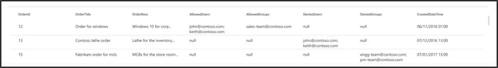
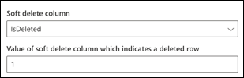
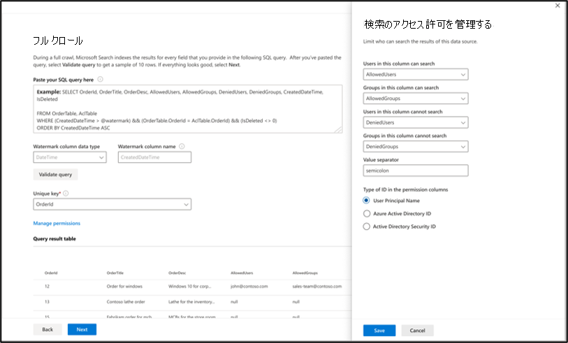
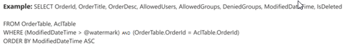

# Microsoft SQL server コネクタMicrosoft SQL server connector

Microsoft SQL server コネクタを使用すると、組織は社内の SQL Server データベースからデータを検出し、インデックスを作成できます。With a Microsoft SQL server connector, your organization can discover and index data from an on-premises SQL Server database. コネクタは、指定されたコンテンツを Microsoft Search にインデックス付けします。The connector indexes specified content into Microsoft Search. ソースデータのインデックスを最新の状態に保つために、フルクロールと増分クロールを定期的に行います。To keep the index up to date with source data, it supports periodic full and incremental crawls. SQL Server コネクタを使用すると、特定のユーザーに対する検索結果へのアクセスを制限することもできます。With the SQL Server connector, you can also restrict access to search results for certain users.

この記事は、Microsoft 365 管理者または Microsoft SQL server コネクタを構成、実行、および監視するユーザーを対象としています。This article is for Microsoft 365 administrators or anyone who configures, runs, and monitors a Microsoft SQL server connector. コネクタとコネクタの機能、制限事項、およびトラブルシューティングの手法を構成する方法について説明します。It explains how to configure your connector and connector capabilities, limitations, and troubleshooting techniques.

## Data gateway をインストールするInstall a data gateway
サードパーティのデータにアクセスするためには、Microsoft Power BI ゲートウェイをインストールして構成する必要があります。In order to access your third-party data, you must install and configure a Microsoft Power BI gateway. 詳細について[は、「オンプレミスゲートウェイをインストール](https://docs.microsoft.com/data-integration/gateway/service-gateway-install)する」を参照してください。See [Install an on-premises gateway](https://docs.microsoft.com/data-integration/gateway/service-gateway-install) to learn more.  

## データソースへの接続Connect to a data source
Microsoft SQL server コネクタをデータソースに接続するには、クロールするデータベースサーバーとオンプレミスゲートウェイを構成する必要があります。To connect your Microsoft SQL server connector to a data source, you must configure the database server you want crawled and the on-premises gateway. その後、必要な認証方法を使用してデータベースに接続できます。You can then connect to the database with the required authentication method.

> [!NOTE]
> データベースでは、SQL server バージョン2008以降を実行する必要があります。Your database must run SQL server version 2008 or later.

データベースコンテンツを検索するには、コネクタを構成するときに SQL クエリを指定する必要があります。To search your database content, you must specify SQL queries when you configure the connector. これらの SQL クエリは、すべての列を取得するために実行する必要があるすべての SQL 結合を含む、インデックスを作成するすべてのデータベース列に名前を付ける必要があります (つまり、ソースプロパティ)。These SQL queries need to name all the database columns that you want to index (i.e. source properties), including any SQL joins that need to be performed to get all the columns. 検索結果へのアクセスを制限するには、Microsoft SQL server コネクタを構成するときに、SQL クエリでアクセス制御リスト (Acl) を指定する必要があります。To restrict access to search results, you must specify Access Control Lists (ACLs) with SQL queries when you configure the Microsoft SQL server connector.

## フルクロール (必須)Full crawl (Required)
この手順では、データベースのフルクロールを実行する SQL クエリを構成します。In this step, you configure the SQL query that runs a full crawl of the database. フルクロールでは、**クエリ**可能、**検索**可能、または取得可能にするすべての列またはプロパティが選択**されます。**The full crawl selects all the columns or properties you want to be made **queryable**, **searchable**, or **retrievable**. また、ACL 列を指定して、検索結果のアクセスを特定のユーザーまたはグループに制限することもできます。You can also specify ACL columns to restrict access of search results to specific users or groups.

> [!Tip]
> 必要なすべての列を取得するには、複数のテーブルに結合することができます。To get all the columns that you need, you can join multiple tables.

### データ列の選択 (必須) と ACL 列 (省略可能)Select data columns (Required) and ACL columns (Optional)
この例では、検索のデータを保持する5つのデータ列 (OrderId、OrderTitle、Ordertitle、Htmldatetime、および IsDeleted) の選択例を示します。The example demonstrates selection of five data columns that hold the data for the search: OrderId, OrderTitle, OrderDesc, CreatedDateTime, and IsDeleted. データの各行に対して表示権限を設定するには、必要に応じて、次の ACL 列を選択できます。 AllowedUsers、Allowedusers、DeniedUsers、および DeniedGroups。To set view permissions for each row of data, you can optionally select these ACL columns: AllowedUsers, AllowedGroups, DeniedUsers, and DeniedGroups. これらのすべてのデータ列は、**クエリ**可能、**検索**可能 **、または**取得可能にすることができます。All these data columns can be made **queryable**, **searchable**, or **retrievable**.

次のクエリ例に示すように、データ列を選択します。`SELECT OrderId, OrderTitle, OrderDesc, AllowedUsers, AllowedGroups, DeniedUsers, DeniedGroups, CreatedDateTime, IsDeleted`Select data columns as shown in this example query: `SELECT OrderId, OrderTitle, OrderDesc, AllowedUsers, AllowedGroups, DeniedUsers, DeniedGroups, CreatedDateTime, IsDeleted`
 
検索結果へのアクセスを管理するには、クエリで1つ以上の ACL 列を指定できます。To manage access to the search results, you can specify one or more ACL columns in the query. SQL コネクタを使用すると、レコードレベルごとにアクセスを制御できます。The SQL connector allows you to control access at per record level. テーブル内のすべてのレコードに対して同じアクセス制御を行うことを選択できます。You can choose to have the same access control for all records in a table. ACL 情報が別のテーブルに格納されている場合は、クエリでそれらのテーブルを使用して結合する必要があります。If the ACL information is stored in a separate table, you might have to do a join with those tables in your query.

以下では、上記のクエリで各 ACL 列を使用する方法について説明します。The use of each of the ACL columns in the above query is described below. 次のリストでは、4つの**アクセス制御メカニズム**について説明します。The following list explains the 4 **access control mechanisms**. 
* **Allowedusers**: これにより、検索結果にアクセスできるユーザー id のリストを指定します。**AllowedUsers**: This specifies the list of user IDs who will be able to access the search results. 次の例では、ユーザーのリスト: john@contoso.com、keith@contoso.com、および lisa@contoso.com には、OrderId = 12 のレコードへのアクセスのみが許可されています。In the following example, list of users: john@contoso.com , keith@contoso.com, and lisa@contoso.com would only have access to a record with OrderId = 12. 
* **Allowedgroups**: これにより、検索結果にアクセスできるユーザーのグループが指定されます。**AllowedGroups**: This specifies the group of users who will be able to access the search results. 次の例では、グループ sales-team@contoso.com は OrderId = 12 のレコードにのみアクセスできます。In the following example, group sales-team@contoso.com would only have access to record with OrderId = 12.
* **DeniedUsers**: 検索結果への**アクセス権を持たない**ユーザーのリストを指定します。**DeniedUsers**: This specifies the list of users who do **not** have access to the search results. 次の例では、ユーザー john@contoso.com および keith@contoso.com は OrderId = 13 のレコードにアクセスできませんが、他のすべてのユーザーはこのレコードにアクセスできます。In the following example, users john@contoso.com and keith@contoso.com do not have access to record with OrderId = 13, whereas everyone else has access to this record. 
* **DeniedGroups**: 検索結果への**アクセス権を持たない**ユーザーのグループを指定します。**DeniedGroups**: This specifies the group of users who do **not** have access to the search results. 次の例では、groups engg-team@contoso.com および pm-team@contoso.com には OrderId = 15 のレコードへのアクセス権がありませんが、他のユーザーはこのレコードにアクセスできます。In the following example, groups engg-team@contoso.com and pm-team@contoso.com do not have access to record with OrderId = 15, whereas everyone else has access to this record.  

### ウォーターマーク (必須)Watermark (Required)
データベースが過負荷にならないようにするために、コネクタはフルクロールのウォーターマーク列を使用して、フルクロールクエリをバッチ処理および再開します。To prevent overloading the database, the connector batches and resumes full-crawl queries with a full-crawl watermark column. [すかし] 列の値を使用すると、以降の各バッチが取得され、最後のチェックポイントからクエリが再開されます。By using the value of the watermark column, each subsequent batch is fetched, and querying is resumed from the last checkpoint. 基本的には、フルクロールのデータ更新を制御するメカニズムを示します。Essentially this is a mechanism to control data refresh for full crawls.

次の例に示すように、ウォーターマークに対してクエリスニペットを作成します。Create query snippets for watermarks as shown in these examples:
* `WHERE (CreatedDateTime > @watermark)`. 予約済みのキーワード`@watermark`を使用して、ウォーターマーク列名を指定します。Cite the watermark column name with the reserved keyword `@watermark`. [すかし] 列の並べ替え順序が昇順の場合は`>`、を使用します。それ以外の`<`場合は、を使用します。If the sort order of the watermark column is ascending, use `>`; otherwise, use `<`.
* `ORDER BY CreatedDateTime ASC`. [すかし] 列の昇順または降順に並べ替えます。Sort on the watermark column in ascending or descending order.

次の図に示す構成では、 `CreatedDateTime` [選択されたウォーターマーク] 列が選択されています。In the configuration shown in the following image, `CreatedDateTime` is the selected watermark column. 行の最初のバッチをフェッチするには、[すかし] 列のデータ型を指定します。To fetch the first batch of rows, specify the data type of the watermark column. この例では、データ型は`DateTime`です。In this case, the data type is `DateTime`.

最初のクエリは、次の値を使用して、最初の**N 個**の行をフェッチします。 "/1 月1日 > 1753 00:00:00" (datetime データ型の最小値)。The first query fetches the first **N** amount of rows by using: "CreatedDateTime > January 1, 1753 00:00:00" (min value of DateTime data type). 最初のバッチをフェッチした後、バッチで`CreatedDateTime`返される最大値は、行が昇順で並べ替えられている場合に、チェックポイントとして保存されます。After the first batch is fetched, the highest value of `CreatedDateTime` returned in the batch is saved as the checkpoint if the rows are sorted in ascending order. 例としては、2019年3月1日、03:00:00 があります。An example is March 1, 2019 03:00:00. その後、 **N**行の次のバッチは、クエリ内の "/datetime > 03:00:00 2019 年3月1日を使用してフェッチされます。Then the next batch of **N** rows is fetched by using "CreatedDateTime > March 1, 2019 03:00:00" in the query.

### 削除された削除済みの行をスキップする (オプション)Skipping soft-deleted rows (Optional)
データベース内の削除済みの行をインデックス作成から除外するには、その行が削除されたことを示す、回復可能な削除の列名と値を指定します。To exclude soft-deleted rows in your database from being indexed, specify the soft-delete column name and value that indicates the row is deleted.

### フルクロール: 検索権限を管理するFull crawl: Manage search permissions
[アクセス**許可の管理**] をクリックして、アクセス制御メカニズムを指定するさまざまなアクセス制御 (ACL) 列を選択します。Click **Manage permissions** to select the various access control (ACL) columns which specify the access control mechanism. フルクロール SQL クエリで指定した列名を選択します。Select the column name you specified in the full crawl SQL query. 

各 ACL 列は複数値の列になることが想定されています。Each of the ACL columns is expected to be a multi-valued column. これらの複数の ID 値は、セミコロン (;)、コンマ (,) などの区切り記号で区切ることができます。These multiple ID values can be separated by separators such as semicolon (;), comma (,), and so on. この区切り記号は、[値の**区切り記号**] フィールドで指定する必要があります。You need to specify this separator in the **value separator** field.
 
Acl としてを使用するために、次の ID タイプがサポートされています。The following ID types are supported for using as ACLs: 
* **ユーザープリンシパル名 (upn)**: ユーザープリンシパル名 (upn) は、電子メールアドレス形式のシステムユーザーの名前です。**User Principal Name (UPN)**: A User Principal Name (UPN) is the name of a system user in an email address format. UPN (例: john.doe@domain.com) は、ユーザー名 (ログオン名)、区切り記号 (@ 記号)、およびドメイン名 (UPN サフィックス) で構成されます。A UPN (for example: john.doe@domain.com) consists of the username (logon name), separator (the @ symbol), and domain name (UPN suffix). 
* **Azure Active Directory (aad) ID**: aad では、すべてのユーザーまたはグループに、' e0d3ad3d-0000-1111-2222-3c5f5c52ab9b ' のようなオブジェクト ID があります。**Azure Active Directory (AAD) ID**: In AAD, every user or group has an object ID which looks something like ‘e0d3ad3d-0000-1111-2222-3c5f5c52ab9b’ 
* **Active Directory (AD) セキュリティ ID**: オンプレミスの AD セットアップでは、すべてのユーザーとグループに、1-5-21-3878594291-2115959936-132693609-65242 というような不変の一意のセキュリティ識別子があります。**Active Directory (AD) Security ID**: In an on-premises AD setup, every user and group has an immutable, unique security identifier which looks something like ‘S-1-5-21-3878594291-2115959936-132693609-65242.’

## 増分クロール (オプション)Incremental crawl (Optional)
このオプションの手順では、データベースの増分クロールを実行するための SQL クエリを指定します。In this optional step, provide a SQL query to run an incremental crawl of the database. このクエリを使用すると、Microsoft SQL server コネクタによって、前回の増分クロール以降のデータが変更されます。With this query, the Microsoft SQL server connector makes any changes to the data since the last incremental crawl. フルクロールの場合と同様に、**クエリ**可能、**検索**可能、または取得可能にするすべての列を**選択します**。As in the full crawl, select all columns that you want to be made **queryable**, **searchable**, or **retrievable**. フルクロールクエリで指定したものと同じ ACL 列のセットを指定します。Specify the same set of ACL columns that you specified in the full crawl query.

次の図のコンポーネントは、完全なクロールコンポーネントに似ていますが、1つの例外があります。The components in the following image resemble the full crawl components with one exception. この例では、"ModifiedDateTime" は選択された透かし列です。In this case, "ModifiedDateTime" is the selected watermark column. [フルクロールの手順](#full-crawl-required)を確認して、増分クロールクエリを記述する方法を説明し、次の画像を例として示します。Review the [full crawl steps](#full-crawl-required) to learn how to write your incremental crawl query and see the following image as an example.

## 検索アクセス許可を管理するManage search permissions 
[フルクロール画面で指定された acl](#full-crawl-manage-search-permissions)を使用するか、すべてのユーザーにコンテンツを表示するように上書きするかを選択できます。You can choose to use the [ACLs specified in the full crawl screen](#full-crawl-manage-search-permissions) or you can override them to make your content visible to everyone.

## 制限事項Limitations
Microsoft SQL server コネクタには、次のようなプレビューリリースの制限があります。The Microsoft SQL server connector has these limitations in the preview release:
* オンプレミスデータベースでは、SQL server バージョン2008以降を実行する必要があります。The on-premises database must run SQL server version 2008 or later.
* Acl は、ユーザープリンシパル名 (UPN)、Azure Active Directory (Azure AD)、または Active Directory セキュリティを使用する場合にのみサポートされます。ACLs are only supported by using a User Principal Name (UPN), Azure Active Directory (Azure AD), or Active Directory Security. 
* データベース列内のリッチコンテンツのインデックス作成はサポートされていません。Indexing rich content inside database columns is not supported. このようなコンテンツの例としては、HTML、JSON、XML、blob、ドキュメント parsings などがあります。これらは、データベース列内のリンクとして存在します。Examples of such content are HTML, JSON, XML, blobs, and document parsings that exist as links inside the database columns.