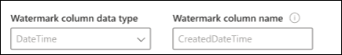

<!---Previous ms.author: vivg --->

# Azure SQL および Microsoft SQL Server Graph コネクタ

Microsoft SQL Serverまたは Azure SQL Graph コネクタを使用すると、組織はオンプレミスの SQL Server データベース、またはクラウド内の Azure SQL インスタンスでホストされているデータベースからデータを検出してインデックス付けできます。
指定Graphコネクタは、指定したコンテンツをインデックスにMicrosoft Search。 ソース データを使用してインデックスを最新の状態に保つために、定期的なフル クロールと増分クロールをサポートします。 これらのコネクタSQL、特定のユーザーの検索結果へのアクセスを制限できます。

> [!NOTE]
> コネクタの [**セットアップに関する**](configure-connector.md)Graph一般的なコネクタのセットアップGraph説明します。

この記事は、Azure SQL および Microsoft SQL コネクタを構成、実行、およびGraphします。 これは、一般的なセットアップ プロセスを補足し、Azure SQL および Microsoft SQL サーバー Graph表示します。 この記事では、Microsoft  SQL および Azure SQLについて説明します。

## 使用を開始する前に

### コネクタ エージェントGraphインストールする (オンプレミスのコネクタMicrosoft SQL Serverのみ)

オンプレミスのサード パーティ製データにアクセスするには、コネクタ エージェントをインストールして構成Graph必要があります。 詳細については[、「Graphコネクタ エージェントをインストール](graph-connector-agent.md)する」を参照してください。

>[!NOTE]
>Microsoft SQL Server Graph コネクタの構成中に Windows 認証を使用する場合、サインインしようとしているユーザーは、Graph コネクタ エージェントがインストールされているコンピューターに対する対話型ログオン権限を持っている必要があります。 ログオン権限を確認するには [、ログオン ポリシー管理に関](/windows/security/threat-protection/security-policy-settings/allow-log-on-locally#policy-management) するドキュメントを参照してください。

## 手順 1: Graphコネクタを追加Microsoft 365 管理センター

一般的なセットアップ [手順に従います](./configure-connector.md)。
<!---If the above phrase does not apply, delete it and insert specific details for your data source that are different from general setup 
instructions.-->

## 手順 2: 接続に名前を付け

一般的なセットアップ [手順に従います](./configure-connector.md)。
<!---If the above phrase does not apply, delete it and insert specific details for your data source that are different from general setup 
instructions.-->

## 手順 3: 接続設定を構成する

### アプリを登録する (Azure SQLコネクタのみ)

Azure SQL コネクタの場合は、アプリがインデックス作成Azure Active DirectoryデータにアクセスMicrosoft Searchアプリを登録する必要があります。 アプリの登録の詳細については、「アプリを登録するGraph Microsoft Graph」[を参照してください](/graph/auth-register-app-v2)。

アプリの登録を完了し、アプリ名、アプリケーション (クライアント) ID、テナント ID をメモした後、新しいクライアント シークレットを [生成する必要があります](/azure/healthcare-apis/register-confidential-azure-ad-client-app#application-secret)。 クライアント シークレットは 1 回だけ表示されます。 クライアント シークレットを&注意してください。 クライアント ID とクライアント シークレットを使用して、新しい接続を構成Microsoft Search。

登録したアプリをアプリに追加するには、Azure SQL Databaseする必要があります。

- Azure SQL DB にログインする
- 新しいクエリ ウィンドウを開く
- コマンド 'CREATE USER [アプリ名] FROM EXTERNAL PROVIDER' を実行して新しいユーザーを作成する
- コマンド 'exec sp_addrolemember 'db_datareader', [アプリ名]' または 'ALTER ROLE db_datareader ADD MEMBER [アプリ名]] を実行して、ユーザーを役割に追加する

>[!NOTE]
>アプリに登録されているアプリへのアクセスを取り消Azure Active Directory、登録されたアプリの削除に関する Azure[のドキュメントを参照してください](/azure/active-directory/develop/quickstart-remove-app)。

### 接続設定

Microsoft SQL Serverコネクタをデータ ソースに接続するには、クロールするデータベース サーバーと on-prem エージェントを構成する必要があります。 その後、必要な認証方法でデータベースに接続できます。

> [!NOTE]
> - データベースを接続するにはSQL Serverバージョン 2008 以降Microsoft SQL Server実行する必要があります。
> - Azure SQL グラフ コネクタでは、同じテナント内の Azure SQL インスタンスからの取り込みのみを許可Microsoft 365。 テナント間のデータ フローはサポートされていません。

Azure SQLコネクタの場合は、接続先のサーバー名または IP アドレスのみを指定する必要があります。 Azure SQLコネクタは、データベースAzure Active Directory接続するための Open ID 接続 (OIDC) 認証のみをサポートします。

セキュリティを強化するには、Azure サーバーまたはデータベースの IP ファイアウォールSQL Server構成できます。 IP ファイアウォールルールの設定の詳細については、IP ファイアウォールルールに関する [ドキュメントを参照してください](/azure/azure-sql/database/firewall-configure)。 ファイアウォール設定に次のクライアント IP 範囲を追加します。

| 地域 | IP 範囲 |
| ------------ | ------------ |
| NAM | 52.250.92.252/30, 52.224.250.216/30 |
| EUR | 20.54.41.208/30, 51.105.159.88/30 |
| APC | 52.139.188.212/30, 20.43.146.44/30 |

データベース コンテンツを検索するには、コネクタを構成するときにSQLクエリを指定する必要があります。 これらのSQLクエリでは、インデックスを作成するデータベース列 (つまり、ソース プロパティ) に名前を付け、すべての列を取得するために実行する必要がある SQL 結合を含む必要があります。 検索結果へのアクセスを制限するには、コネクタを構成するときに、アクセス制御リスト (ACL) SQLクエリ内で指定する必要があります。

## 手順 3a: フル クロール (必須)

この手順では、データベースのフル クロールSQL実行するクエリを構成します。 フル クロールでは、クエリ、検索、または取得のオプションを選択するすべての列または **プロパティが** 選択 **されます**。 ACL 列を指定して、検索結果へのアクセスを特定のユーザーまたはグループに制限することもできます。

> [!Tip]
> 必要なすべての列を取得するには、複数のテーブルを結合できます。

### データ列の選択 (必須) 列と ACL 列 (オプション)

この例では、OrderId、OrderTitle、OrderDesc、CreatedDateTime、IsDeleted の 5 つのデータ列の選択を示しています。 データ行ごとに表示権限を設定するには、必要に応じて、次の ACL 列 (AllowedUsers、AllowedGroups、DeniedUsers、DeniedGroups) を選択できます。 これらすべてのデータ列には、クエリ、 **検索**、または **取得の** オプション **があります**。

次のクエリ例に示すように、データ列を選択します。 `SELECT OrderId, OrderTitle, OrderDesc, AllowedUsers, AllowedGroups, DeniedUsers, DeniedGroups, CreatedDateTime, IsDeleted`

このコネクタではSQL SELECT 句で英数字以外の列名を使用することはできません。 エイリアスを使用して、列名から英数字以外の文字を削除します。 例 - SELECT *column_name* AS *columnName*

検索結果へのアクセスを管理するには、クエリで 1 つ以上の ACL 列を指定できます。 このSQLを使用すると、レコード レベルごとにアクセスを制御できます。 テーブル内のすべてのレコードに対して同じアクセス制御を使用できます。 ACL 情報が別のテーブルに格納されている場合は、クエリでそれらのテーブルとの結合を行う必要がある場合があります。

上記のクエリで各 ACL 列を使用する方法を以下に示します。 次の一覧では、4 つのアクセス **制御メカニズムについて説明します**。

- **AllowedUsers**: この列は、検索結果にアクセスできるユーザー ID の一覧を指定します。 次の例では、ユーザーの一覧 (john@contoso.com、keith@contoso.com、lisa@contoso.com が OrderId = 12 のレコードにのみアクセスできます。
- **AllowedGroups**: この列は、検索結果にアクセスできるユーザーのグループを指定します。 次の例では、グループ sales-team@contoso.com OrderId = 12 のレコードにのみアクセスできます。
- **DeniedUsers**: この列は、検索結果にアクセスできないユーザーの一覧を指定します。 次の例では、ユーザー john@contoso.com および keith@contoso.com OrderId = 13 のレコードにアクセスできないのに対し、他のすべてのユーザーは、このレコードにアクセスできます。
- **DeniedGroups**: この列は、検索結果にアクセスできないユーザーのグループを指定します。 次の例では、グループ engg-team@contoso.com グループ pm-team@contoso.com OrderId = 15 のレコードにアクセスすることはできませんが、他のすべてのユーザーは、このレコードにアクセスできます。  

### サポートされているデータ型

次の表は、MS SQLおよび Azure SQL コネクタでサポートされているデータ型SQL示します。 この表では、サポートされているデータ型のインデックスデータ型SQL示します。 インデックス作成でサポートされている Microsoft Graph コネクタの詳細については、プロパティ リソースの種類に関する[ドキュメントを参照してください](/graph/api/resources/property?preserve-view=true&view=graph-rest-beta#properties)。

| カテゴリ | ソース データ型 | データ型のインデックス作成 |
| ------------ | ------------ | ------------ |
| 日時 | date   日付型   datetime2   smalldatetime | 日付型 |
| 正確な数値 | bigint   int   smallint   tinyint | int64 |
| 正確な数値 | ビット | boolean |
| 近似数値 | 浮動小数点数   本当の | double |
| 文字の文字列 | char   varchar   text | string |
| Unicode 文字の文字列 | nchar   nvarchar   ntext | string |
| その他のデータ型 | uniqueidentifier | string |

現在直接サポートされていない他のデータ型では、列をサポートされているデータ型に明示的にキャストする必要があります。

### 透かし (必須)

データベースの過負荷を防ぐために、コネクタはフル クロール透かし列を使用してフル クロール クエリをバッチ処理して再開します。 透かし列の値を使用すると、後続の各バッチがフェッチされ、最後のチェックポイントからクエリが再開されます。 基本的に、このメカニズムは、フル クロールのデータ更新を制御します。

次の例に示すように、透かしのクエリ スニペットを作成します。

- `WHERE (CreatedDateTime > @watermark)`. 予約済みのキーワードで透かしの列名を引用します `@watermark` 。 透かし列の並べ替え順序が昇順の場合は、使用 `>` します。それ以外の場合は、 を使用します `<` 。
- `ORDER BY CreatedDateTime ASC`. 透かし列の昇順または降順で並べ替えます。

次の図に示す構成では `CreatedDateTime` 、選択した透かし列です。 行の最初のバッチをフェッチするには、透かし列のデータ型を指定します。 この場合、データ型は `DateTime` .

最初のクエリでは、"CreatedDateTime > 1753 00:00:00" (DateTime データ型の最小値) を使用して、最初の **N** 行数をフェッチします。 最初のバッチがフェッチされた後、行を昇順に並べ替えた場合、バッチで返される最高値はチェックポイント `CreatedDateTime` として保存されます。 たとえば、2019 年 3 月 1 日 03:00:00:00 です。 次に、 **クエリ** で "CreatedDateTime > 2019 年 3 月 1 日 03:00:00" を使用して、N 行の次のバッチをフェッチします。

### ソフト削除された行のスキップ (オプション)

データベース内のソフト削除された行のインデックス作成を除外するには、その行が削除されたかどうかを示す、削除可能な列名と値を指定します。

### フル クロール: 検索アクセス許可を管理する

[ **アクセス許可の管理]** を選択して、アクセス制御メカニズムを指定するさまざまなアクセス制御 (ACL) 列を選択します。 クエリのフル クロールで指定した列名SQLします。

各 ACL 列は、複数値の列である必要があります。 これらの複数の ID 値は、セミコロン (;)、コンマ (、)など) で区切ることができます。 値の区切り記号フィールドにこの区切り **記号を指定する必要** があります。

ACL として使用するには、次の ID の種類がサポートされています。

- **ユーザー プリンシパル名 (UPN)**: ユーザー プリンシパル名 (UPN) は、電子メール アドレス形式のシステム ユーザーの名前です。 UPN (たとえば、john.doe@domain.com) は、ユーザー名 (ログオン名)、区切り記号 (@ 記号)、およびドメイン名 (UPN サフィックス) で構成されます。
- **Azure Active Directory (AAD) ID**: Azure AD では、すべてのユーザーまたはグループに'e0d3ad3d-0000-1111-2222-3c5f5c52ab9b' のようなオブジェクト ID があります。
- **Active Directory (AD)** セキュリティ ID : オンプレミスの AD セットアップでは、すべてのユーザーとグループに、'S-1-5-21-3878594291-2115959936-132693609-65242.

## 手順 3b: 増分クロール (オプション)

このオプションの手順では、データベースSQLを実行するためのクエリを提供します。 このクエリを使用すると、SQLコネクタによって、前回の増分クロール以降のデータに対する変更が決定されます。 フル クロールと同様に、クエリ、検索、または取得のオプションを選択するすべての **列を選択****します**。 フル クロール クエリで指定したのと同じ ACL 列のセットを指定します。

次の図のコンポーネントは、1 つの例外を除き、フル クロール コンポーネントに似たものとなります。 この場合、「ModifiedDateTime」は選択された透かし列です。 フル クロール [の手順を確認して](#step-3a-full-crawl-required) 、増分クロール クエリを記述する方法を説明し、例として次のイメージを参照してください。

## 手順 4: プロパティ ラベルを割り当てる

一般的なセットアップ [手順に従います](./configure-connector.md)。

<!---If the above phrase does not apply, delete it and insert specific details for your data source that are different from general setup 
instructions.-->

## 手順 5: スキーマの管理

一般的なセットアップ [手順に従います](./configure-connector.md)。
<!---If the above phrase does not apply, delete it and insert specific details for your data source that are different from general setup 
instructions.-->

## 手順 6: 検索アクセス許可を管理する

フル クロール画面で指定された [ACL](#full-crawl-manage-search-permissions) を使用するか、または ACL を上書きしてコンテンツをすべてのユーザーに表示することができます。

## 手順 7: 更新設定を選択する

一般的なセットアップ [手順に従います](./configure-connector.md)。
<!---If the above phrase does not apply, delete it and insert specific details for your data source that are different from general setup 
instructions.-->

## 手順 8: 接続の確認

一般的なセットアップ [手順に従います](./configure-connector.md)。
<!---If the above phrase does not apply, delete it and insert specific details for your data source that are different from general setup 
instructions.-->

<!---## Next steps: Customize the search results page

Create your own verticals and result types, so end users can view search results from new connections. Without this step, data from your connection won't show up on the search results page.

To learn more about how to create your verticals and MRTs, see [Search results page customization](customize-search-page.md).-->

## トラブルシューティング

次に示すのは、コネクタの構成中に発生する一般的なエラーとその考えられる理由です。

| 構成手順 | エラー メッセージ | 考えられる理由 |
| ------------ | ------------ | ------------ |
| フル クロール | `Error from database server: A transport level error has occurred when receiving results from the server.` | このエラーは、ネットワークの問題が原因で発生します。 Microsoft ネットワーク モニターを使用してネットワーク ログを確認し [、Microsoft](https://www.microsoft.com/download/details.aspx?id=4865) カスタマー サポートに問い合わせください。 |
| フル クロール | `Column column_name returned from full crawl SQL query contains non-alphanumeric character` | SELECT 句の列名では、英数字以外の文字 (アンダースコアなど) は使用できません。 エイリアスを使用して列の名前を変更し、英数字以外の文字を削除します (例 - AS columnName column_name選択)。 |

## 制限事項

次SQLコネクタには、プレビュー リリースで次の制限があります。

- Microsoft SQL Serverコネクタ: オンプレミス データベースは、バージョン 2008 以降SQL Server実行する必要があります。
- サブスクリプションMicrosoft 365 Azure サブスクリプション (Azure SQL データベースをホストする) は、同じサブスクリプション内にある必要Azure Active Directory。
- ACL は、ユーザー プリンシパル名 (UPN)、Azure Active Directory (Azure AD)、または Active Directory セキュリティを使用してのみサポートされます。
- データベース列内のリッチ コンテンツのインデックス作成はサポートされていません。 このようなコンテンツの例としては、データベース列内のリンクとして存在する HTML、JSON、XML、BLOB、およびドキュメント解析があります。
