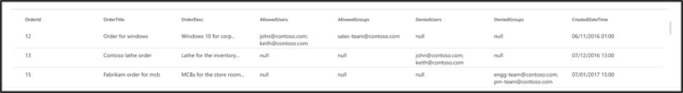

# Oracle SQL コネクタ

Oracle SQL コネクタを使用すると、組織は社内の Oracle データベースからデータを検出し、インデックスを作成できます。 コネクタは、指定されたコンテンツを Microsoft Search にインデックス付けします。 ソースデータのインデックスを最新の状態に保つために、フルクロールと増分クロールを定期的に行います。 Oracle SQL コネクタを使用すると、特定のユーザーに対する検索結果へのアクセスを制限することもできます。

この記事は、Microsoft 365 管理者または Oracle SQL コネクタを構成、実行、および監視するユーザーを対象としています。 コネクタとコネクタの機能、制限事項、およびトラブルシューティングの手法を構成する方法について説明します。

## Graph connector エージェントをインストールする

オンプレミスのサードパーティデータにアクセスするためには、Graph connector エージェントをインストールして構成する必要があります。 詳細について [は、「Graph connector agent をインストール](on-prem-agent.md) する」を参照してください。  

## データソースへの接続

Oracle SQL コネクタをデータソースに接続するには、クロールするデータベースサーバーとオンプレミスのグラフコネクタエージェントを構成する必要があります。 その後、必要な認証方法を使用してデータベースに接続できます。

Oracle SQL コネクタの場合は、ホスト名、ポート、およびサービス (データベース) の名前を、推奨される認証方法、ユーザー名、およびパスワードと共に指定する必要があります。

> [!NOTE]
> コネクタが接続できるようにするには、データベースで Oracle データベースバージョン11g 以降を実行する必要があります。 コネクタは、Windows、Linux、および Azure VM プラットフォームでホストされている Oracle データベースをサポートします。

データベースコンテンツを検索するには、コネクタを構成するときに SQL クエリを指定する必要があります。 これらの SQL クエリは、すべての列を取得するために実行する必要があるすべての SQL 結合を含む、インデックスを作成するすべてのデータベース列に名前を付ける必要があります (つまり、ソースプロパティ)。 検索結果へのアクセスを制限するには、コネクタを構成するときに SQL クエリ内でアクセス制御リスト (Acl) を指定する必要があります。

## フルクロール (必須)

この手順では、データベースのフルクロールを実行する SQL クエリを構成します。 フルクロールでは、**クエリ** 可能、**検索** 可能、または取得可能にするすべての列またはプロパティが選択 **されます。** また、ACL 列を指定して、検索結果のアクセスを特定のユーザーまたはグループに制限することもできます。

> [!Tip]
> 必要なすべての列を取得するには、複数のテーブルに結合することができます。

### データ列の選択 (必須) と ACL 列 (省略可能)

この例では、検索のデータを保持する5つのデータ列 (OrderId、OrderTitle、Ordertitle、Htmldatetime、および IsDeleted) の選択例を示します。 データの各行に対して表示権限を設定するには、必要に応じて、次の ACL 列を選択できます。 AllowedUsers、Allowedusers、DeniedUsers、および DeniedGroups。 これらのすべてのデータ列は、 **クエリ** 可能、 **検索** 可能 **、または** 取得可能にすることができます。

次のクエリ例に示すように、データ列を選択します。 `SELECT OrderId, OrderTitle, OrderDesc, AllowedUsers, AllowedGroups, DeniedUsers, DeniedGroups, CreatedDateTime, IsDeleted`

検索結果へのアクセスを管理するには、クエリで1つ以上の ACL 列を指定できます。 SQL コネクタを使用すると、レコードレベルごとにアクセスを制御できます。 テーブル内のすべてのレコードに対して同じアクセス制御を行うことを選択できます。 ACL 情報が別のテーブルに格納されている場合は、クエリでそれらのテーブルを使用して結合する必要があります。

以下では、上記のクエリで各 ACL 列を使用する方法について説明します。 次のリストでは、4つの **アクセス制御メカニズム** について説明します。

* **Allowedusers**: これにより、検索結果にアクセスできるユーザー id のリストを指定します。 次の例では、ユーザーのリスト: john@contoso.com、keith@contoso.com、および lisa@contoso.com には、OrderId = 12 のレコードへのアクセスのみが許可されています。
* **Allowedgroups**: これにより、検索結果にアクセスできるユーザーのグループが指定されます。 次の例では、グループ sales-team@contoso.com は OrderId = 12 のレコードにのみアクセスできます。
* **DeniedUsers**: 検索結果への **アクセス権を持たない** ユーザーのリストを指定します。 次の例では、ユーザー john@contoso.com および keith@contoso.com は OrderId = 13 のレコードにアクセスできませんが、他のすべてのユーザーはこのレコードにアクセスできます。
* **DeniedGroups**: 検索結果への **アクセス権を持たない** ユーザーのグループを指定します。 次の例では、groups engg-team@contoso.com および pm-team@contoso.com には OrderId = 15 のレコードへのアクセス権がありませんが、他のユーザーはこのレコードにアクセスできます。  

### サポートされるデータ型

次の表は、Oracle SQL コネクタでサポートされているデータ型の概要を示しています。 また、サポートされている SQL データ型のインデックスデータ型の概要を示します。 インデックス用にサポートされている Microsoft Graph コネクタの詳細については、「 [プロパティリソースの種類](https://docs.microsoft.com/graph/api/resources/property?view=graph-rest-beta#properties)に関するドキュメント」を参照してください。

| カテゴリ | ソースデータ型 | インデックス作成データの種類 |
| ------------ | ------------ | ------------ |
| 数値データ型 | 数値 (p, 0) | int64 (p <= 18)   倍精度浮動小数点型 (p > 18) |
| 浮動小数点の数値データ型 | 数値 (p、s)   FLOAT (p) | double |
| Date データ型 | 状態   示   タイムスタンプ (n) | 日付型 |
| 文字データ型 | CHAR (n)   VARCHAR   VARCHAR2   L   CLOB   NCLOB | string |
| Unicode 文字データ型 | NCHAR   NVARCHAR | string |
| RowID データ型 | ROWID   UROWID | string |

現在直接サポートされていないその他のデータ型については、列は、サポートされているデータ型に明示的にキャストする必要があります。

### ウォーターマーク (必須)

データベースが過負荷にならないようにするために、コネクタはフルクロールのウォーターマーク列を使用して、フルクロールクエリをバッチ処理および再開します。 [すかし] 列の値を使用すると、以降の各バッチが取得され、最後のチェックポイントからクエリが再開されます。 基本的には、フルクロールのデータ更新を制御するメカニズムを示します。

次の例に示すように、ウォーターマークに対してクエリスニペットを作成します。

* `WHERE (CreatedDateTime > @watermark)`. 予約済みのキーワードを使用して、ウォーターマーク列名を指定し `@watermark` ます。 [すかし] 列は、昇順でのみ並べ替えることができます。
* `ORDER BY CreatedDateTime ASC`. [すかし] 列を昇順で並べ替えます。

次の図に示す構成では、[ `CreatedDateTime` 選択されたウォーターマーク] 列が選択されています。 行の最初のバッチをフェッチするには、[すかし] 列のデータ型を指定します。 この例では、データ型は `DateTime` です。

最初のクエリは、次の値を使用して、最初の **N 個** の行をフェッチします。 "/1 月1日 > 1753 00:00:00" (datetime データ型の最小値)。 最初のバッチをフェッチした後、 `CreatedDateTime` バッチで返される最大値は、行が昇順で並べ替えられている場合に、チェックポイントとして保存されます。 例としては、2019年3月1日、03:00:00 があります。 その後、 **N** 行の次のバッチは、クエリ内の "/datetime > 03:00:00 2019 年3月1日を使用してフェッチされます。

### 削除された削除済みの行をスキップする (オプション)

データベース内の削除済みの行をインデックス作成から除外するには、その行が削除されたことを示す、回復可能な削除の列名と値を指定します。

### フルクロール: 検索権限を管理する

[アクセス **許可の管理** ] をクリックして、アクセス制御メカニズムを指定するさまざまなアクセス制御 (ACL) 列を選択します。 フルクロール SQL クエリで指定した列名を選択します。

各 ACL 列は複数値の列になることが想定されています。 これらの複数の ID 値は、セミコロン (;)、コンマ (,) などの区切り記号で区切ることができます。 この区切り記号は、[値の **区切り記号** ] フィールドで指定する必要があります。

Acl としてを使用するために、次の ID タイプがサポートされています。

* **ユーザープリンシパル名 (upn)**: ユーザープリンシパル名 (upn) は、電子メールアドレス形式のシステムユーザーの名前です。 UPN (例: john.doe@domain.com) は、ユーザー名 (ログオン名)、区切り記号 (@ 記号)、およびドメイン名 (UPN サフィックス) で構成されます。
* **Azure Active Directory (AAD) ID**: azure AD では、すべてのユーザーまたはグループのオブジェクト ID が ' e0d3ad3d-0000-1111-2222-3c5f5c52ab9b ' のようになります。
* **Active Directory (AD) セキュリティ ID**: オンプレミスの AD セットアップでは、すべてのユーザーとグループに、1-5-21-3878594291-2115959936-132693609-65242 というような不変の一意のセキュリティ識別子があります。

## 増分クロール (オプション)

このオプションの手順では、データベースの増分クロールを実行するための SQL クエリを指定します。 このクエリでは、最後の増分クロール以降のデータの変更が SQL コネクタによって決定されます。 フルクロールの場合と同様に、 **クエリ** 可能、 **検索** 可能、または取得可能にするすべての列を **選択します**。 フルクロールクエリで指定したものと同じ ACL 列のセットを指定します。

次の図のコンポーネントは、完全なクロールコンポーネントに似ていますが、1つの例外があります。 この例では、"ModifiedDateTime" は選択された透かし列です。 [フルクロールの手順](#full-crawl-required)を確認して、増分クロールクエリを記述する方法を説明し、次の画像を例として示します。

## 検索アクセス許可を管理する

[フルクロール画面で指定された acl](#full-crawl-manage-search-permissions)を使用するか、すべてのユーザーにコンテンツを表示するように上書きするかを選択できます。

## 更新スケジュールを設定する

Oracle SQL コネクタは、フルクロールと増分クロールの両方の更新スケジュールをサポートしています。 両方を設定することをお勧めします。

フルクロールスケジュールは、Microsoft 検索インデックスと同期フィルターから移動されたすべての行に対して以前に同期された削除済みの行を検索します。 最初にデータベースに接続すると、フルクロールが実行されて、フルクロールクエリから取得したすべての行が同期されます。 新しい行を同期し、更新を行うには、増分クロールをスケジュールする必要があります。

## 次の手順: 検索結果ページをカスタマイズする

独自の業種と結果の種類を作成することで、エンドユーザーは新しい接続から検索結果を表示できるようになります。 この手順を行わないと、接続からのデータが検索結果ページに表示されません。

業種および MRTs の作成方法の詳細については、「 [検索結果ページのカスタマイズ](customize-search-page.md)」を参照してください。

## 制限事項

Oracle SQL コネクタには、次のようなプレビューリリースの制限があります。

* オンプレミスデータベースで Oracle データベースバージョン11g 以降を実行する必要があります。
* Acl は、ユーザープリンシパル名 (UPN)、Azure Active Directory (Azure AD)、または Active Directory セキュリティを使用する場合にのみサポートされます。
* データベース列内のリッチコンテンツのインデックス作成はサポートされていません。 このようなコンテンツの例としては、HTML、JSON、XML、blob、ドキュメント parsings などがあります。これらは、データベース列内のリンクとして存在します。

## トラブルシューティング ガイド

下には、コネクタを構成する際に観察される一般的なエラーと、考えられる理由の一覧があります。
| 構成手順 | エラー メッセージ | 考えられる理由 (s) |
| ------------ | ------------ | ------------ |
| データベース設定 | データベースサーバーからのエラー: 接続要求がタイムアウトしました | 無効なホスト名   ホストに到達できない |
| データベース設定 | データベースサーバーからのエラー: ORA-12541: TNS: No listner | 無効なポート |
| データベース設定 | データベースサーバーからのエラー: ORA-12514: TNS: listner は現在、要求されたサービスをコネクタ記述子で認識していません | 無効なサービス (データベース) 名 |
| データベース設定 | データベースサーバーからのエラー: ユーザー ' ' に対するログインに失敗しました `user` 。 | ユーザー名またはパスワードが無効です |
