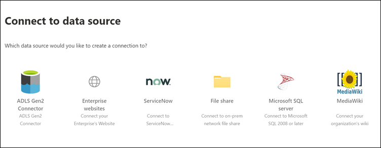
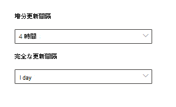

# Microsoft が開発したコネクタを Microsoft Search 用にセットアップするSet up your Microsoft-built connector for Microsoft Search

この記事では、Microsoft によって作成されたコネクタを構成する手順について説明します。This article guides you through the steps of configuring a Microsoft-built connector. この記事では、Microsoft 365[管理センター](https://admin.microsoft.com)での接続のセットアップフローについて説明します。It outlines the flow of setting up a connection in the Microsoft 365 [admin center](https://admin.microsoft.com). 特定の Microsoft が作成したコネクタをセットアップする方法の詳細については、次の記事を参照してください。For more details on how to set up specific Microsoft-built connectors, see these articles:
* [Azure Data Lake Storage Gen2Azure Data Lake Storage Gen2](azure-data-lake-connector.md)
* [大企業の Web サイトEnterprise websites](enterprise-web-connector.md)
* [ファイル共有File share](file-share-connector.md)
* [MediaWikiMediaWiki](mediawiki-connector.md)
* [Microsoft SQL ServerMicrosoft SQL server](MSSQL-connector.md)
* [ServiceNowServiceNow](servicenow-connector.md)

## 設定Set up
Microsoft によって作成されたコネクタのいずれかを構成するには、[管理センター](https://admin.microsoft.com)に移動します。To configure any of the Microsoft-built connectors, go to the [admin center](https://admin.microsoft.com):
1. [Microsoft 365](https://www.microsoft.com/microsoft-365)テストテナントの資格情報を使用して、アカウントにサインインします。Sign in to your account with the credentials for your [Microsoft 365](https://www.microsoft.com/microsoft-365) test tenant.
2. [**設定** > ]**Microsoft 検索** > **コネクタ**に移動します。Go to **Settings** > **Microsoft Search** > **Connectors**.
3. [**コネクタの追加**] を選択します。Select **Add a connector**.
4. 使用可能なコネクタのリストから、選択したコネクタを選択します。From the list of available connectors, select the connector of your choice.

### コネクタに名前を指定するName the connector
接続を作成するには、最初に次の属性を指定します。To create a connection, first specify these attributes:
1. 接続の名前Name of the connection
2. 接続 IDConnection ID
3. 説明 (省略可能)Description (optional)

接続 ID は、コネクタの暗黙的なプロパティを作成します。The connection ID creates implicit properties for your connector. このファイルには、英数字のみが含まれ、最大32文字の文字が含まれている必要があります。It must contain only alphanumeric characters and be a maximum of 32 characters.

### データソースへの接続Connect to a data source
データ接続プロセスは、コネクタの種類によって異なります。The data connection process varies based on the type of connector. オンプレミスのデータソースへの接続の詳細については、「[オンプレミスのデータゲートウェイをインストール](https://aka.ms/configuregateway)する」を参照してください。To learn more about connecting to your on-premises data source, see [Install an on-premises data gateway](https://aka.ms/configuregateway).

### ソースのプロパティの選択Select source properties
サードパーティのデータソースによって設定されたデータフィールドは、ソースプロパティとして Microsoft Search にインデックスが付けられます。The data fields set by your third-party data source as source properties are indexed into Microsoft Search. これらのプロパティを変更するには、[**コネクタ**] ページの右側にあるサイドバーで [**プロパティの編集**] を選択します。To modify these properties, select **Edit properties** in the side bar on the right of the **Connectors** page. **最大64のソースプロパティ**を選択できます。You can select **up to 64 source properties**.

###  検索スキーマを管理するManage the search schema 
管理者は、検索スキーマの属性を設定して、各ソースプロパティの検索機能を制御できます。Admins can set the search schema attributes to control search functionality of each source property. 検索スキーマは、検索結果ページに表示される結果と、エンドユーザーが表示およびアクセスできる情報を決定するのに役に立ちます。A search schema helps determine what results display on the search results page and what information end users can view and access.

検索スキーマの属性には、検索可能、**クエリ**可能 **、および取得**可能**なものが**あります。Search schema attributes include **searchable**, **queryable**, and **retrievable**. 次の表に、Microsoft Graph コネクタがサポートしている各属性とその機能について説明します。The following table lists each of the attributes that Microsoft Graph connectors support and explains their functions.

**検索スキーマの属性****Search schema attribute** | **Function****Function** | **例****Example**
--- | --- | ---
サーチSEARCHABLE | プロパティのテキストコンテンツを検索可能にします。Makes the text content of a property searchable. プロパティの内容は、フルテキストインデックスに含まれています。Property contents are included in the full-text index. | プロパティが**title**の場合、**エンタープライズ**のクエリは、テキストまたはタイトルに " **enterprise** " が含まれている回答を返します。If the property is **title**, a query for **Enterprise** returns answers that contain the word **Enterprise** in any text or title.
クエリ可能QUERYABLE | クエリによって特定のプロパティの一致が検索されます。Searches by query for a match for a particular property. プロパティ名は、プログラムまたは逐語的にクエリで指定できます。The property name can then be specified in the query either programmatically or verbatim. |  **Title**プロパティがクエリ可能な場合は、クエリ**タイトル: Enterprise**がサポートされています。If the **Title** property is queryable, then the query **Title: Enterprise** is supported.
だっRETRIEVABLE | 検索結果の種類には取得可能なプロパティのみを使用し、検索結果に表示することができます。Only retrievable properties can be used in the result type and display in the search result. | 

ファイル共有コネクタを除くすべてのコネクタについては、カスタムの種類を手動で設定する必要があります。For all connectors except the file share connector, custom types must be set manually. 各フィールドの検索機能をアクティブにするには、プロパティのリストにマップされた検索スキーマが必要です。To activate search capabilities for each field, you need a search schema mapped to a list of properties. 接続ウィザードは、選択したソースプロパティのセットに基づいて検索スキーマを自動的に選択します。The connection wizard automatically selects a search schema based on the set of source properties you choose. このスキーマを変更するには、[検索スキーマ] ページで各プロパティと属性のチェックボックスをオンにします。You can modify this schema by selecting the check boxes for each property and attribute in the search schema page.

これらの制限と推奨事項は、検索スキーマ設定に適用されます。These restrictions and recommendations apply to search schema settings:
* カスタム型のインデックスを作成するコネクタの場合は、取得可能なメインコンテンツを含むフィールドを**マークし\*\*\*\*ない**ことをお勧めします。For connectors that index custom types, we recommend that you **do not** mark the field that contains the main content **retrievable**. 検索結果が検索属性を使用して表示される場合、パフォーマンスの著しい問題が発生します。Significant performance issues occur when search results render with that search attribute. この例は、 [ServiceNow](https://www.servicenow.com)ナレッジベースの記事の**テキスト**コンテンツフィールドです。An example is the **Text** content field for a [ServiceNow](https://www.servicenow.com) knowledge-base article.
* 検索結果には、取得可能としてマークされたプロパティのみが表示され、モダンの検索結果の種類 (MRTs) を作成するために使用できます。Only properties marked as retrievable render in the search results and can be used to create modern result types (MRTs).
* 検索可能としてマークできるのは、文字列のプロパティだけです。Only string properties can be marked searchable.

> [!Note]
> 接続を作成した後、スキーマを変更する**ことはできません**。After you create a connection, you **can't** modify the schema. そのためには、接続を削除して、新しい接続を作成する必要があります。To do that, you need to delete your connection and create a new one.

###  検索アクセス許可を管理するManage search permissions
アクセス制御リスト (Acl) は、組織内のどのユーザーがデータの各アイテムにアクセスできるかを決定します。Access Control Lists (ACLs) determine which users in your organization can access each item of data. ファイル共有コネクタは、 [Azure Active Directory (AZURE AD)](https://docs.microsoft.com/azure/active-directory/)にマップできる acl のみをサポートしています。The file share connector supports only ACLs that can be mapped to [Azure Active Directory (Azure AD)](https://docs.microsoft.com/azure/active-directory/). 他のすべてのコネクタは、すべてのユーザーに表示される検索アクセス許可をサポートします。All the other connectors support search permissions that are visible to all users.

### 更新スケジュールを設定するSet the refresh schedule
更新スケジュールは、Microsoft Graph と Microsoft Search のインデックスとデータを同期する頻度を決定します。The refresh schedule determines how often your data is synced with the index in Microsoft Graph and Microsoft Search. フルクロールまたは増分クロールの2つの方法で更新をスケジュールすることができます。You can schedule the refresh in two ways: full crawl or incremental crawl.

**フルクロール**では、検索エンジンは、以前のクロールに関係なく、コンテンツソース内のすべてのアイテムを処理してインデックスを付けます。With a **full crawl**, the search engine processes and indexes every item in the content source, regardless of previous crawls. フルクロールは、次のような場合に最適です。Full crawl works best in these situations:
* データの削除を検出する必要があります。You need to detect deletions of data.
* 増分クロールで、エラーのためにコンテンツをクロールできませんでした。The incremental crawl failed to crawl content for errors.
* Microsoft Search のソフトウェア更新プログラムが必要です。A software update for Microsoft Search is required. 更新プログラムによって検索スキーマが変更されます。Updates modify the search schema.
* Acl が変更されました。ACLs were modified.
* クロールルールが変更されました。Crawl rules were modified.

**増分クロール**では、検索エンジンは、最後に成功したクロール以降に作成または変更されたアイテムのみを処理してインデックスを作成できます。With an **incremental crawl**, the search engine can process and index only the items that were created or modified since the last successful crawl. そのため、コンテンツソース内のすべてのデータが再インデックス化されるわけではありません。Therefore, not all the data in the content source is re-indexed. 増分クロールは、コンテンツ、メタデータ、アクセス許可、その他の更新プログラムを検出するのに最適です。Incremental crawls works best to detect content, metadata, permission, and other updates.

増分クロールは、変更されていないアイテムは処理されないので、フルクロールよりもはるかに高速です。Incremental crawls are much faster than full crawls because unchanged items aren’t processed. コンテンツソースと検索インデックスとの間で正確なデータ同期を維持するには、両方のクロールを定期的に実行する必要があります。To maintain an accurate data sync between the content source and the search index, you need to run both crawls periodically.

各コネクタには、データが変更される頻度と変更の種類に基づいて、更新スケジュールの最適なセットがあります。Each connector will have a different optimal set of refresh schedules based on how often data is modified and the type of modifications.

### コネクタの設定を確認するReview connector settings
コネクタを構成した後は、[管理センター](https://admin.microsoft.com)から設定を確認できるページに移動します。After you configure your connector, the [admin center](https://admin.microsoft.com) takes you to a page where you can review your settings. 接続を確認する前に、構成プロセスに戻って設定を編集することができます。You can go back through the configuration process to edit any setting before you confirm the connection. 詳細については、「[コネクタの管理](manage-connector.md)」を参照してください。To learn more, see [Manage your connector](manage-connector.md).

## 次の手順: 検索結果ページをカスタマイズするNext steps: Customize the search results page
Microsoft 検索ユーザーインターフェイス (UI) を使用すると、エンドユーザーは[microsoft 365](https://www.microsoft.com/microsoft-365)プロダクティビティアプリと microsoft の広範なエコシステムからコンテンツを検索できます。With the Microsoft Search user interface (UI), your end users can search content from your [Microsoft 365](https://www.microsoft.com/microsoft-365) productivity apps and the broader Microsoft ecosystem. 縦方向検索は、ユーザーが[Bing](https://Bing.com)で[SharePoint](http://sharepoint.com/)、 [Microsoft Office](https://Office.com)、および microsoft search の検索結果を表示するときに表示されるタブを示します。A search vertical refers to the tabs that are shown when a user views their search results in [SharePoint](http://sharepoint.com/), [Microsoft Office](https://Office.com), and Microsoft Search in [Bing](https://Bing.com). 検索結果を絞り込んで検索結果の特定の種類だけが表示されるように、検索対象をカスタマイズすることができます。You can customize search verticals to narrow down results, so that only a certain type of search results is displayed. これらの業種は、検索結果ページの上部にタブとして表示されます。These verticals appear as a tab on the top of the search results page. モダン検索結果の種類 (MRT) は、結果の表示方法を指定する UI です。A modern result type (MRT) is the UI that designates how results are presented.

エンドユーザーが新しい接続から検索結果を表示できるように、独自の業種と結果の種類を作成する必要があります。You must create your own verticals and result types, so end users can view search results from new connections. この手順を行わないと、接続からのデータが検索結果ページに表示されません。Without this step, data from your connection won’t show up on the search results page.

業種および MRTs の作成方法の詳細については、「[検索結果ページのカスタマイズ](customize-search-page.md)」を参照してください。To learn more about how to create your verticals and MRTs, see [Search results page customization](customize-search-page.md).

## 設定が適用されたことを確認する方法How do I know this worked?
[管理センター](https://admin.microsoft.com)の [**コネクタ**] タブで、公開されている接続の一覧に移動します。Go to the list of your published connections under the **Connectors** tab in the [admin center](https://admin.microsoft.com). 更新と削除を行う方法については、「[コネクタの管理](manage-connector.md)」を参照してください。To learn how to make updates and deletions, see [Manage your connector](manage-connector.md).
