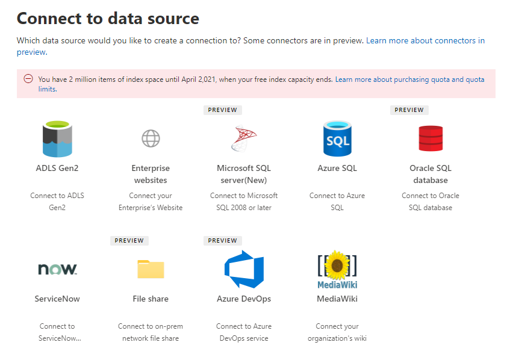

<!-- Previous ms.author: monaray -->

<!-- markdownlint-disable no-trailing-punctuation -->

# Microsoft による Graph コネクタの設定の概要

この記事では、Microsoft によるコネクタのセットアップに必要Graph基本的なプロセス[について説明](https://admin.microsoft.com)Microsoft 365 管理センター。 基本的なプロセスには、以下のステップが含まれます。  
<!---Add links to each section in the doc--->

1. [Microsoft 365 管理センターで Graph コネクタを追加する](#step-1-add-a-graph-connector-in-the-microsoft-365-admin-center)
2. [接続に名前を指定する](#step-2-name-the-connection)
3. [接続設定を構成する](#step-3-configure-the-connection-settings)
4. [プロパティの選択](#step-4-select-properties)
5. [検索のアクセス許可を管理する](#step-5-manage-search-permissions)
6. [プロパティ ラベルを割り当てる](#step-6-assign-property-labels)
7. [スキーマを管理する](#step-7-manage-schema)
8. [設定を更新する](#step-8-refresh-settings)
9. [接続を確認する](#step-9-review-connection)

この記事には、トラブルシューティング、制限事項、および次の手順に関する情報も含まれています。

* [トラブルシューティング](#troubleshooting)
* [限界事項](#limitations)
* [次の手順](#next-steps)

> [!NOTE]
> セットアップ プロセスは、Microsoft のすべてのGraph似ていますが、まったく同じではありません。 **この記事を読むだけでなく、必ずデータ ソースのコネクタ固有の情報を読んでください。**  

<!---## Before you get started-->

<!---Insert "Before you get started" recommendations for this data source-->

## 手順 1: Graphコネクタを追加Microsoft 365 管理センター

以下の手順を実行して、Microsoft が構築したコネクタGraphします。

1. [アカウント] で管理者アカウント[にサインインMicrosoft 365 管理センター。](https://admin.microsoft.com)

2. ナビゲーション ウィンドウで、[検索] を選択 **設定** し、[検索] を選択&**します**。 [データ ソース [] タブを選択します](https://admin.microsoft.com/Adminportal/Home#/MicrosoftSearch/Connectors)。

3. **[+追加]** を選択し、使用可能なオプションのメニューから選択したデータ ソースを選択します。

   > [!div class="mx-imgBorder"]
   > 

> [!NOTE]
> 各テナントに最大 10 個Graph接続を追加できます。

## 手順 2: 接続に名前を付け

次の属性を指定します。

* Name (必須)
* 接続 ID (必須)
* 説明 (省略可能)
* [選択] チェック ボックス (必須)

接続 ID は、コネクタの暗黙的なプロパティを作成します。 英数字のみを含み、最大 32 文字にする必要があります。

## 手順 3: 接続設定を構成する

接続設定を構成するプロセスは、データ ソースの種類によって異なります。 セットアップ プロセス [でこの手順を](/microsoftsearch/servicenow-connector#step-31-basic-authentication) 完了するには、テナントに追加するデータ ソースの種類に関するコネクタ固有の情報を参照してください。  

オンプレミス データ ソースへの接続の詳細については、「オンプレミス データ ゲートウェイのインストール [」を参照してください](/data-integration/gateway/service-gateway-install)。

## 手順 4: プロパティの選択

ユーザーがインデックスを作成するプロパティを選択Microsoft Search。

ServiceNow クエリを使用すると、データがインデックス化される前にデータをフィルター処理Microsoft Search。これにより、検索できるデータを詳細に制御できます。 ServiceNow クエリの詳細については、「ServiceNow クエリについて [」を参照してください](https://go.microsoft.com/fwlink/?linkid=2151447)。

## 手順 5: 検索アクセス許可を管理する

アクセス制御リスト (ACL) は、組織内のユーザーが各アイテムにアクセスできるかどうかを決定します。  

Microsoft SQL[および Azure](MSSQL-connector.md) Data Lake Storage [Gen2](azure-data-lake-connector.md)のような一部のコネクタは、Azure Active Directory [(Azure AD)](/azure/active-directory/) ACL をネイティブにサポートします。

[ServiceNow ナレッジ、ServiceNow](servicenow-knowledge-connector.md)[カタログ](servicenow-catalog-connector.md)[、Azure DevOps、Salesforce](azure-devops-connector.md)などの他のコネクタでは[、Azure](salesforce-connector.md)以外のユーザーとグループAD同期がサポートされています。  

[すべてのユーザー] を選択すると、組織内のすべてのユーザーが、このデータ ソースの検索結果を表示できます。

## 手順 6: プロパティ ラベルを割り当てる

セマンティック ラベルは、[プロパティ ラベルの割り当て] ページでソース プロパティに割り当てることができます。 ラベルは、意味的な意味を提供する Microsoft によって提供される既知のタグです。 これらの機能を使用すると、Microsoft は、拡張検索、Microsoft 365、インテリジェント検出など、さまざまなエクスペリエンスにコネクタ データを統合できます。  

次の表に、現在サポートされているラベルとその説明を示します。  

ラベル | 説明
--- | ---  
**title** | 検索やその他のエクスペリエンスに表示するアイテムのタイトル
**url** | ソース システム内のアイテムのターゲット URL
**Created By** | アイテムを作成したユーザーの名前
**最終更新者** | アイテムを最近編集したユーザーの名前
**Authors** | アイテムに参加/共同作業を行ったユーザーの名前
**作成された日付時刻** | アイテムが作成されたのは、いつ
**最終更新日時** | アイテムが最近編集された場合
**ファイル名** | ファイル アイテムの名前
**ファイル拡張子** | ファイル アイテムの種類 (.pdf .word など)

このページのプロパティは、データ ソースに基づいて事前に選択されますが、特定のラベルに適した別のプロパティがある場合は、この選択を変更できます。  

ラベル タイトル **は、** 最も重要なラベルです。 接続が **結果クラスター エクスペリエンス** に参加するには、このラベルにプロパティが割り当てられている必要 [があります。](result-cluster.md)

ラベルを正しくマッピングしないと、検索エクスペリエンスが低下します。 一部のラベルにプロパティが割り当てられていない場合は問題ありません。  

## 手順 7: スキーマの管理

### Content プロパティ

オプションのドロップダウン メニューから **コンテンツ** プロパティを選択するか、存在する場合は既定値のままにしてください。 このプロパティは、コンテンツのフルテキスト インデックス作成、検索結果ページ スニペットの生成、結果クラスターへの参加、言語の検出、HTML/テキストのサポート、ランク付けと関連性、およびクエリの作成に使用されます。

コンテンツ プロパティを選択すると、結果の種類を作成するときに、システム生成プロパティ **ResultSnippet** を [使用できます](customize-results-layout.md)。 このプロパティは、クエリ時に content プロパティから生成される動的スニペットのプレースホルダーとして機能します。 このプロパティを結果の種類で使用すると、検索結果にスニペットが生成されます。

### ソース プロパティのエイリアスの作成

[スキーマの管理] ページの [エイリアス] 列の下のプロパティにエイリアスを追加できます。 エイリアスは、プロパティの表示名であり、クエリやフィルターの作成にも使用されます。 また、同じ名前を持つ複数の接続からソース プロパティを正規化するためにも使用されます。 この方法で、複数の接続を持つ垂直の 1 つのフィルターを作成できます。 詳細については、「検索結果ページを [カスタマイズする」を参照してください](customize-search-page.md)。  

### スキーマ属性の検索

検索スキーマ属性を設定して、各ソース プロパティの検索機能を制御できます。 検索スキーマは、検索結果ページに表示される結果と、エンド ユーザーが表示およびアクセスできる情報を決定するのに役立ちます。

検索スキーマ属性には、クエリ、 **検索**、 **取得**、絞り込 **み** などのオプション **があります**。 次の表に、Microsoft がコネクタでサポートする各Graphを示し、その機能について説明します。

検索スキーマ属性 | 職務 | 例
--- | --- | ---
SEARCH | プロパティのテキスト コンテンツを検索可能にする。 プロパティの内容は、フルテキスト インデックスに含まれます。 | プロパティが **title** の場合は、テキスト **または** Enterpriseの単語を含む **Enterpriseを返** します。
QUERY | 特定のプロパティの一致をクエリで検索します。 その後、クエリでプロパティ名をプログラムまたは動詞で指定できます。 |  Title プロパティ **をクエリ** できる場合は、**クエリ Title: Enterprise** サポートされます。
RETRIEVE | 検索可能なプロパティのみを結果の種類で使用し、検索結果に表示できます。 |
REFINE | 絞り込みオプションは、[検索結果] ページMicrosoft Search使用できます。 | 接続のセットアップ中に絞り込みプロパティがマークされている場合、組織内のユーザーは検索結果ページの URL でフィルター処理できます

ファイル共有コネクタを除くすべてのコネクタでは、ユーザー設定の種類を手動で設定する必要があります。 各フィールドの検索機能をアクティブにするには、プロパティの一覧にマップされた検索スキーマが必要です。 接続ウィザードでは、選択したソース プロパティのセットに基づいて検索スキーマが自動的に選択されます。 このスキーマを変更するには、検索スキーマ ページの各プロパティと属性のチェック ボックスをオンにします。

:::image type="content" alt-text="コネクタのスキーマは、クエリ、検索、および取得関数を追加または削除することでカスタマイズできます。" source="media/manageschema.png" lightbox="media/manageschema.png":::

### 検索スキーマ設定の制限と推奨事項

* content **プロパティ** は検索可能です。 ドロップダウンで選択すると、このプロパティをオプションの取得またはクエリ **と一緒に** 使用 **することはできません**。

* 検索結果が content プロパティでレンダリングされる場合、パフォーマンスに関する重大な **問題が発生** します。 例として **、ServiceNow** ナレッジベース記事の [テキスト](https://www.servicenow.com) コンテンツ フィールドがあります。

* 検索結果で取得可能なレンダリングとしてマークされたプロパティのみであり、最新の結果の種類 (MRT) の作成に使用できます。

* 検索可能とマークできるのは文字列プロパティのみです。

> [!NOTE]
> 接続を作成した後は **、スキーマを** 変更できます。 これを行うには、接続を削除して新しい接続を作成する必要があります。

## 手順 8: 設定の更新

更新間隔は、データ ソースとデータ ソースの間でデータを同期する頻度をMicrosoft Search。 データ ソースの種類ごとに、データの変更頻度と変更の種類に基づいて、最適な更新スケジュールのセットが異なります。

更新間隔には、完全更新と増分更新の2種類がありますが、一部のデータ ソースでは増分更新を使用できません。

完全な更新により、検索エンジンは、以前のクロールに関係なく、コンテンツ ソースで変更されたアイテムを処理してインデックスを作成します。 完全な更新は、次の状況に最適です。

* データの削除を検出する。
* 増分更新でエラーが検出され、失敗しました。
* ACL が変更されました。
* クロール ルールが変更されました。
* 接続のスキーマが更新されました (スキーマ更新はまだサポートされていません)。

増分更新 **を使用すると**、検索エンジンは、前回のクロールが成功した後に作成または変更されたアイテムのみを処理およびインデックス付けできます。 その結果、コンテンツ ソース内のすべてのデータがインデックスを再作成する必要があります。 増分更新は、コンテンツ、メタデータ、アクセス許可、その他の更新プログラムを検出する場合に最適です。

変更されていないアイテムは処理されないので、増分更新は完全な更新よりもはるかに高速です。 ただし、増分更新を実行する場合でも、コンテンツ ソースと検索インデックスの間で正しいデータ同期を維持するには、定期的に完全な更新を実行する必要があります。

> [!div class="mx-imgBorder"]
> 

<!---Change screenshot for one that shows both options in new UI (try ServiceNow)--->

## 手順 9: 接続の確認

接続を完了する前に、必要に応じて構成全体を確認し、設定を編集できます。 **まだデータ ソースのコネクタ固有の情報を読み取っていない場合は、必ずお読みください。** 接続 **を完了する準備** ができたら、[更新の完了] を選択します。

### 接続のセットアップが機能した場合の確認

管理センターの [コネクタ] タブの下にある発行済み **接続の一** 覧に [移動します](https://admin.microsoft.com)。 更新と削除を行う方法については、「コネクタの管理 [」を参照してください](manage-connector.md)。

## トラブルシューティング
<!---Insert troubleshooting recommendations for this data source-->
データ ソースのコネクタ固有の情報を読み取る。

> [!NOTE]
> コネクタ固有の記事の中には、この時点でのトラブルシューティングの推奨事項が含まれる場合があります。

## 制限事項
<!---Insert limitations for this data source-->
すべてのデータ ソースに適用される制限の詳細については[、「Microsoft Graphコネクタの概要」を参照](connectors-overview.md)してください。

データ ソースのコネクタ固有の情報を参照して、その特定のコネクタに他の制限が適用されるGraphしてください。

## 次の手順

接続を発行した後、垂直方向と結果の種類を使用して検索結果ページをカスタマイズする必要があります。 検索結果のカスタマイズの詳細については、垂直方向と結果の種類を管理 [する](manage-verticals.md) 方法を [確認できます](manage-result-types.md)。
