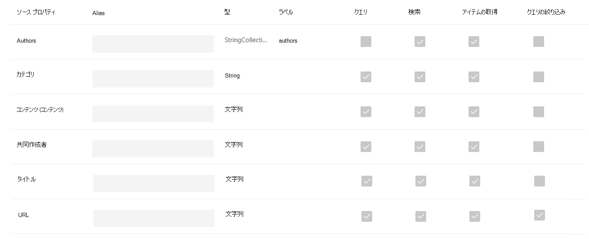

<!-- markdownlint-disable no-trailing-punctuation -->

# Microsoft による Graph コネクタのセットアップの概要 

この記事では [、Microsoft 365](https://admin.microsoft.com) 管理センターを使用して Microsoft が Graph コネクタをセットアップするために必要な基本的なプロセスを要約します。 基本的なプロセスには、次の手順が含まれます。  
<!---Add links to each section in the doc--->

1. Microsoft 365 管理センターで Graph コネクタを追加します。
2. 接続の名前を指定します。
3. 接続設定を構成します。
4. 検索アクセス許可を管理します。
5. プロパティ ラベルを割り当てる。
6. スキーマを管理します。
7. 更新設定を選択します。
8. 接続を確認します。

セットアップ プロセスは、Microsoft のすべての Graph コネクタで非常に似ていますが、まったく同じではありません。 **この記事を読むだけでなく、データ ソースのコネクタ固有の情報も必ずお読みください。**  

## 手順 1: Microsoft 365 管理センターで Graph コネクタを追加する

Microsoft が作成したコネクタを構成するには、次の手順を実行します。

1. [Microsoft 365 管理センターで管理者アカウントにサインインする](https://admin.microsoft.com)
2. ナビゲーション ウィンドウで、[設定] **を選択し**、[検索とインテリジェンス] **&します**。 [コネクタ [] タブを選択します](https://admin.microsoft.com/Adminportal/Home#/MicrosoftSearch/Connectors)。
3. **[+追加]** を選択し、使用可能なオプションのメニューから選択したデータ ソースを選択します。

>[!注:] 各テナントに最大 10 個の Graph 接続を追加できます。

## 手順 2: 接続に名前を付け
次の属性を指定する必要があります。 

* 名前  
* 接続 ID 
* 説明 (省略可能) 

接続 ID は、コネクタの暗黙的なプロパティを作成します。 英数字のみを含む必要があります。最大 32 文字です。 

## 手順 3: 接続設定を構成する

接続設定を構成するプロセスは、データ ソースの種類によって異なります。 セットアップ プロセスでこの手順を完了するには、テナントに追加するデータ ソースの種類に関するコネクタ固有の情報を参照してください。  

オンプレミスのデータ ソースへの接続の詳細については、「オンプレミス のデータ ゲートウェイをインストールする」 [を参照してください](https://aka.ms/configuregateway)。

## 手順 4: 検索権限を管理する

アクセス制御リスト (ACL) は、組織内のユーザーがデータの各アイテムにアクセスできるかどうかを決定します。  

Microsoft SQL [や](MSSQL-connector.md) Azure Data [Lake Storage Gen2](azure-data-lake-connector.md) のような一部のコネクタは [、Azure Active Directory (Azure AD)](https://docs.microsoft.com/azure/active-directory/) ACL をネイティブにサポートしています。

[ServiceNow、Azure DevOps、Salesforce](servicenow-connector.md)などの他のコネクタは、Azure 以外のユーザーとグループAD同期をサポートします。   

## 手順 5: プロパティ ラベルを割り当てる
セマンティック ラベルは、[プロパティ ラベルの割り当て] ページでソース プロパティに割り当てることができます。 ラベルは、意味を提供する Microsoft によって提供される既知のタグです。 Microsoft は、拡張検索、ユーザー カード、インテリジェント検出などの Microsoft 365 エクスペリエンスにコネクタ データを統合できます。  

次の表に、現在サポートされているラベルとその説明を示します。  

ラベル | 説明
--- | ---  
**title** | 検索やその他のエクスペリエンスに表示するアイテムのタイトル 
**url** | ソース システム内のアイテムのターゲット URL 
**createdBy** | アイテムを作成したユーザーの名前 
**lastModifiedBy** | アイテムを最近編集したユーザーの名前 
**authors** | アイテムに参加/共同作業を行ったユーザーの名前 
**createdDateTime** | アイテムが作成されたのはいつか 
**lastModifiedDateTime** | アイテムが最近編集されたのはいつか 
**fileName** | ファイル アイテムの名前 
**FileExtension** | .pdf や .word などのファイルアイテムの種類 

このページのプロパティは、データ ソースに基づいて事前に選択されますが、特定のラベルに適した別のプロパティがある場合は、この選択を変更できます。  

ラベルの **タイトルは** 最も重要なラベルです。 接続が **結果クラスター エクスペリエンス** に参加するには、このラベルにプロパティが割り当てられている必要 [があります。](result-cluster.md)

ラベルを正しくマッピングしないと、検索エクスペリエンスが低下します。 一部のラベルにはプロパティが割り当てられていない場合でも問題ありません。  

## 手順 6: スキーマを管理する

### Content プロパティ

オプションのドロップダウン メニューから [コンテンツ プロパティ] を選択するか、存在する場合は既定値のままにしてください。 このプロパティは、コンテンツのフルテキスト インデックス作成、検索結果ページ スニペットの生成、 [結果クラスター](result-cluster.md) への参加、言語検出、HTML/テキストのサポート、ランク付けと関連性、クエリの生成に使用されます。

コンテンツ プロパティを選択すると、結果の種類を作成するときに、システム生成プロパティ **ResultSnippet** [を使用できます](customize-results-layout.md)。 このプロパティは、クエリ時にコンテンツ プロパティから生成される動的スニペットのプレースホルダーとして機能します。 このプロパティを結果の種類で使用すると、検索結果にスニペットが生成されます。

### ソース プロパティのエイリアスの作成

[スキーマの管理] ページの [エイリアス] 列で、プロパティにエイリアスを追加できます。 エイリアスは、プロパティの表示名です。 クエリやフィルターの作成で使用されます。 また、同じ名前を持つ複数の接続からソース プロパティを正規化するためにも使用されます。 この方法で、複数の接続を持つ垂直に対して 1 つのフィルターを作成できます。 詳細 [については、「検索結果のカスタマイズ」ページ](customize-search-page.md) を参照してください。  

### 検索スキーマの属性

検索スキーマ属性を設定して、各ソース プロパティの検索機能を制御できます。 検索スキーマは、検索結果ページに表示される結果と、エンド ユーザーが表示およびアクセスできる情報を決定するのに役立ちます。

検索スキーマの属性には **、検索可能、****クエリ可能、****取得可能、** 絞り込み **可能な属性が含まれます**。 次の表に、Microsoft Graph コネクタがサポートする各属性とその機能を示します。

検索スキーマ属性 | 関数 | 例
--- | --- | ---
SEARCHABLE | プロパティのテキスト コンテンツを検索可能にする。 プロパティの内容は、フルテキスト インデックスに含まれます。 | プロパティが title **の場合**、 **エンタープライズ** のクエリは、任意のテキストまたはタイトルに **Enterprise** という単語を含む回答を返します。
QUERYABLE | 特定のプロパティの一致をクエリで検索します。 その後、クエリでプログラムまたは動詞を使用してプロパティ名を指定できます。 |  Title プロパティ **がクエリ** 可能な場合、クエリ **Title: Enterprise** がサポートされます。 
取得可能 | 検索結果の種類で使用できるのは、取得可能なプロパティのみであり、検索結果に表示されます。 |
絞り込み可能 | 絞り込み可能なプロパティは、Microsoft Search の結果ページで使用できます。 | 接続のセットアップ中に プロパティが絞り込み可能とマークされている場合、組織内のユーザーは検索結果ページで **lastModifiedDateTime** でフィルター処理できます。

ファイル共有コネクタを除くすべてのコネクタでは、カスタム型を手動で設定する必要があります。 各フィールドの検索機能をアクティブにするには、プロパティのリストにマップされた検索スキーマが必要です。 接続ウィザードは、選択したソース プロパティのセットに基づいて検索スキーマを自動的に選択します。 このスキーマを変更するには、検索スキーマ ページの各プロパティと属性のチェック ボックスをオンにします。

 
### 検索スキーマ設定の制限事項と推奨事項

* コンテンツ **プロパティ** は検索のみ可能です。 ドロップダウンで選択すると、このプロパティを取得可能またはクエリ可能 **と** マーク **することはできません**。

* コンテンツ プロパティを使用して検索結果が表示される場合、パフォーマンスに重大な問題 **が発生** します。 たとえば [、ServiceNow](https://www.servicenow.com) **ナレッジ** ベースの記事のテキスト コンテンツ フィールドがあります。

* 検索結果で取得可能とマークされているプロパティのみ、モダン検索結果の種類 (MRT) の作成に使用できます。

* 検索可能とマークできるのは文字列プロパティのみです。

> [!NOTE]
> 接続を作成した後は **、スキーマを** 変更できます。 これを行うには、接続を削除し、新しい接続を作成する必要があります。

## 手順 7: 設定を更新する

更新間隔は、データ ソースと Microsoft Search の間でデータが同期される頻度を決定します。 データ ソースの種類ごとに、データの変更頻度と変更の種類に基づいて、最適な更新スケジュールのセットが異なります。

更新間隔には、完全更新と増分更新の2種類がありますが、一部のデータ ソースでは増分更新を使用できません。

完全な更新では、検索エンジンは、以前のクロールに関係なく、コンテンツ ソース内のすべてのアイテムを処理し、インデックスを作成します。 完全な更新は、次の状況に最適です。

* データの削除を検出する。
* エラーが原因で、増分更新でコンテンツの更新に失敗しました。
* ACL が変更されました。
* クロール ルールが変更されました。
* 接続のスキーマが更新された場合 (スキーマの更新はまだサポートされていません)

増分更新 **では、** 検索エンジンは前回成功したクロール以降に作成または変更されたアイテムのみを処理してインデックスを作成できます。 したがって、コンテンツ ソース内のすべてのデータのインデックスが再作成されるのではありません。 増分更新は、コンテンツ、メタデータ、アクセス許可、その他の更新を検出する場合に最適です。

変更されていないアイテムは処理されないので、増分更新は完全な更新よりもずっと高速です。 ただし、増分更新を実行する場合でも、コンテンツ ソースと検索インデックスの間の正確なデータ同期を維持するために、定期的に完全な更新を実行する必要があります。

![増分クロールとフル クロールの間隔の設定で、[15 分の増分] と [1 週間のフル クロール] が表示されます。](media/refreshschedule.png)

<!---Change screenshot for one that shows both options in new UI (try ServiceNow)--->

## 手順 8: 接続を確認する

接続を完了する前に、必要に応じて構成全体を確認し、設定を編集できます。 **データ ソースのコネクタ固有の情報をまだ読み込んでいなき場合は、必ずお読みください。** 接続 **を完了する準備ができたら** 、[更新の完了] を選択します。

## 接続セットアップの動作を確認する方法

管理センターの [コネクタ] タブで、公開されている接続の一覧に[移動します](https://admin.microsoft.com)。 更新と削除を行う方法については、「コネクタの管理」 [を参照してください](manage-connector.md)。
