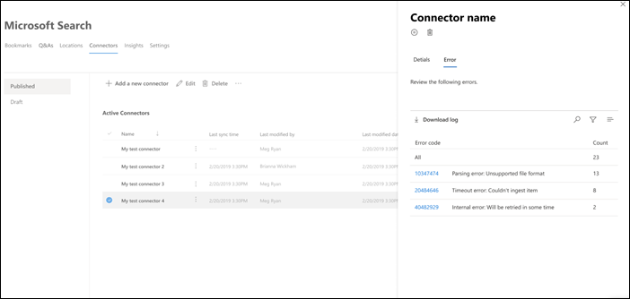

<!-- markdownlint-disable no-inline-html -->

# Microsoft Search の接続の詳細とエラーを表示する

コネクタにアクセスして管理するには、テナントの検索管理者として指定する必要があります。 テナント管理者に問い合わせて、検索管理者ロールのプロビジョニングを行います。

Microsoft 365 [管理センターの](https://admin.microsoft.com/Adminportal/Home#/MicrosoftSearch/Connectors) [ [コネクタ] タブに移動します](https://admin.microsoft.com)。

[コネクタ] タブで接続をクリックすると、接続の詳細とエラー [を表示できます](https://admin.microsoft.com/Adminportal/Home#/MicrosoftSearch/Connectors)。  

## 最後のクロール情報を表示する

最初の増分クロールまたはフル クロールが正常に完了すると、最後のクロール データ値が詳細ウィンドウの最後のクロール ヘッダーの下に表示されます。 前回実行されたクロールがない場合は、最後のクロール ヘッダーの下に情報は表示されません。 最後のクロールに関するこの情報は、クロールの実行方法を把握し、必要な場合は必要な手順を実行するのに役立ちます。

接続ごとに次の最後のクロール値を使用できます。

値 | 説明
--- | ---
**完了:** | 前回のクロールが完了した日時
**型** | 増分クロールまたはフル クロール
**Duration** | 前回のクロールの完了にかかる時間
**成功** | 前回のクロールで正常に取り込まれたアイテムの数
**エラー** | 前回のクロールでエラーが発生したアイテムの数

## エラーを監視する

[コネクタ **] タブの Active Connector** **ごとに、[エラー** ] タブに既存のクロール エラー **が表示** されます。タブには、エラー コード、各数、およびエラー ログのダウンロード オプションが一覧表示されます。 次の図の例を参照してください。 エラー コード **を選択して** 、エラーの詳細を表示します。

エラーの特定の詳細を表示するには、エラー コードを選択します。 エラーの詳細とリンクを含む画面が表示されます。 最新のエラーが上部に表示されます。 次の表の例を参照してください。

次に、接続に対して発生する可能性があるさまざまなエラーの一覧を示します。

エラー コード | エラー メッセージ | ソリューション
--- | --- | ---
1000 | データ ソースを使用できません。 インターネット接続を確認するか、コネクタがデータ ソースに引き続きアクセス可能な場所を確認します。 | このエラーは、ネットワークの問題が原因でデータ ソースに到達できない場合、またはデータ ソース自体が削除、移動、または名前変更された場合に発生します。 指定されたデータ ソースの詳細がまだ有効な場合に確認します。
1001 | データ ソースがコネクタを調整しているので、データを更新できない。 | データ ソースのチェックを解除するには、そのスケール制限を増やしたり、トラフィックの負荷が少ない日まで待機したりできるのを確認します。
1002 | データ ソースで認証できない。 このデータ ソースに関連付けられている資格情報が正しいか確認します。 | [ **編集] を** クリックして、認証資格情報を更新します。
1003 | コネクタに関連付けられているアカウントには、アイテムにアクセスするためのアクセス許可が付与されません。 |  適切なアカウントが、インデックスを作成するアイテムにアクセスできる必要があります。
1004 | オンプレミスのデータ ゲートウェイに到達できません。 ゲートウェイ サービスが実行中であり、接続構成でゲートウェイの詳細が更新されます。 | ゲートウェイを使用してコンピューターを確認し、Power BI Gateway アプリケーションを開き、ゲートウェイが実行されている必要があります。 ゲートウェイが Microsoft Search と同じ管理者アカウントを使用しているのを確認し、すべてのゲートウェイの詳細が接続構成で更新されます。
1005 | このデータ ソースに関連付けられている資格情報の有効期限が切れています。 資格情報を更新し、接続を更新します。 | [ **編集] を** クリックして、認証資格情報を更新します。
1006 | ゲートウェイのバージョンが最新ではなくなったので、このコネクタはサポートされていません。 ゲートウェイを更新する必要があります。 | ゲートウェイを [含むコンピューターに最新バージョン](https://docs.microsoft.com/data-integration/gateway/service-gateway-install) の Power BI ゲートウェイをダウンロードしてインストールするには、オンプレミス のデータ ゲートウェイのインストールにアクセスしてください。
1007 | 有効な Power BI ライセンスが検出されません。 このクロールを実行するには、有効な Power BI ライセンスが必要です。 | このクロールを実行するには、有効な Power BI ライセンスが必要です。 組織に有効なライセンスが設定されていないことを確認します。 その場合は、もう一度お試しください。 ライセンスを取得しない場合は、もう一度お試しください。
1008 | テナントのクォータ使用率の合計が上限に達しました。 | 接続を削除してクォータの一部を解放するか、取り込みフィルターを調整してデータを減らしてみてください。 それでも問題が解決しない場合は、Microsoft サポートにお問い合わせください。
1009 | 接続のクォータ使用率の合計が上限に達しました。 | 取り込みフィルターを調整して、より少ないデータを取り込もうとします。 それでも問題が解決しない場合は、Microsoft サポートにお問い合わせください。
1010 | Azure 以外のグループのインデックス作成のクォータ使用率AD、上限の 100K に達しました。 | 接続を削除してクォータの一部を解放するか、取り込みフィルターを調整してデータを減らしてみてください。 それでも問題が解決しない場合は、Microsoft サポートにお問い合わせください。
1011 | Graph コネクタ [エージェントに](on-prem-agent.md) 到達できないか、オフラインです。 | 
1012 | サポートされていない認証モードのため、接続への認証に失敗しました。 | 接続を編集して、接続の認証設定を更新します。
2001 | キューに大量の更新が含まれていますが、インデックス処理が調整されます。 キューによっては、更新が完了するには少し時間がかかる場合があります。 | キューがクリアされるまで待ちます。
2002 | サポートされていないアイテムの書式設定が原因でインデックス作成に失敗しました。 | 詳細については、コネクタ固有のドキュメントを参照してください。
2003 | サポートされていないアイテムのコンテンツが原因でインデックス作成に失敗しました。 | 詳細については、コネクタ固有のドキュメントを参照してください。
2004 | サポートされていないアイテムまたはファイル サイズのためにインデックス作成に失敗しました。 | 詳細については、コネクタ固有のドキュメントを参照してください。
2005 | URI が長すぎるため、インデックス作成に失敗しました。 | 詳細については、コネクタ固有のドキュメントを参照してください。
2006 | マッピング式が無効であるか、このプロパティを持つ Azure ADが原因で、ユーザー マッピングに失敗しました。 | 別のマッピング数式を使用して接続を削除し、再作成してみてください。 
2007 | このアイテムを表示する権限のない一部のユーザーまたはグループにインデックスを作成できない場合、このアイテムは Microsoft Search に表示されません。 | 
2008 | 接続に、50,000 を超えるメンバー AD Azure 以外のグループを含めすることはできません。 | グループからユーザーを削除するか、そのグループと共に ACL されたアイテムを取り込みから削除して、接続を再作成してみてください。
2009 | Azure 以外のADは、多数の要求のために一時的に一時停止されます。 システムがこれらの要求の処理を完了すると、インデックス処理が再開されます。 後で確認してください。 | 
2010 | Microsoft によって更新されたため、この接続は無効になります。 Please delete the connection and create a new one. | Please delete the connection and create a new one.
5000 | 問題が起きました。 それでも問題が続く場合は、サポートにお問い合わせください。 |
