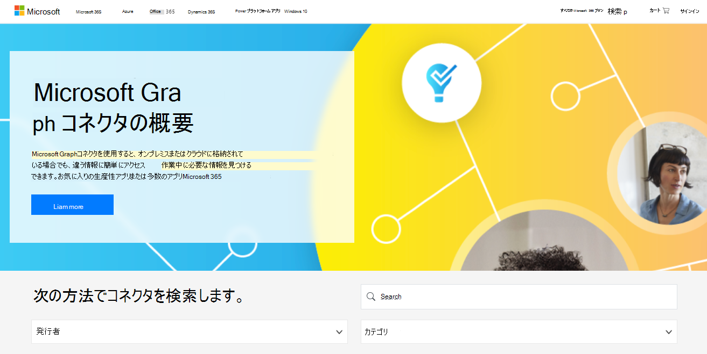

# Microsoft Graph コネクタ ギャラリー

[Microsoft Graph コネクタ](https://www.microsoft.com/microsoft-search/connectors)ギャラリーには、Microsoft とパートナーによって作成された各コネクタの簡単な説明と、各パートナーの Web サイトへのリンクが含まれています。

現在利用可能なコネクタが 100 を超える場合は、Azure サービス、Box、Confluence、MediaWiki、ServiceNow、SalesForce、Google サービス、MediaWiki など、一般的な Microsoft および非 Microsoft サービス に接続できます。

今すぐ[Microsoft Graph コネクタ ギャラリーにアクセス](http://www.microsoft.com/microsoft-search/connectors)し、必要なすべての情報を見つける。

 

