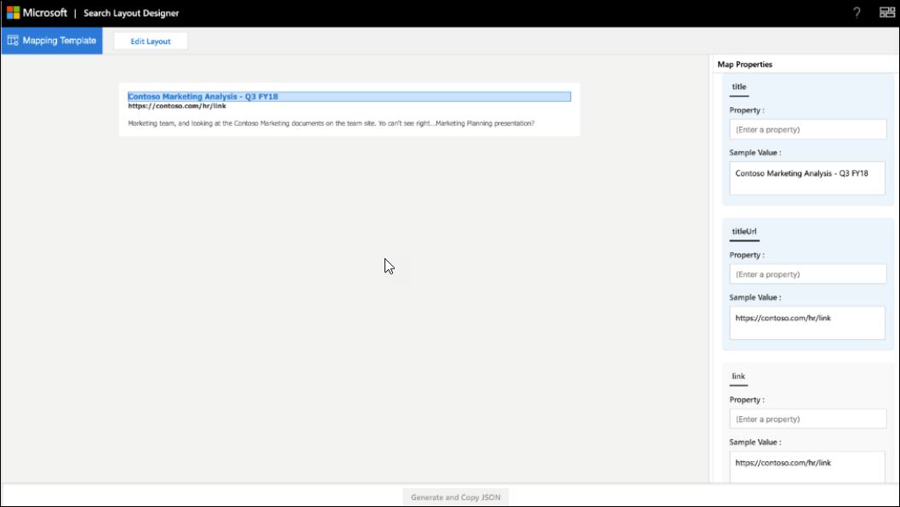

# <a name="create-a-layout-to-customize-search-results"></a>レイアウトを作成して検索結果をカスタマイズする

検索レイアウトデザイナーを使用して、カスタム縦の結果レイアウトを設計できます。 レイアウトの設計を開始するには、レイアウトデザイナーで提供されているテンプレートを選択し、要件に適合している場合はそのテンプレートを使用します。 また、必要に応じてさまざまな方法でテンプレートを編集することもできます。 たとえば、画像の追加または削除、テキストの追加と削除、テキストの変更を行います。 要件を満たすテンプレートがない場合は、空白のテンプレートを使用してレイアウトの設計を開始することを選択できます。  

 

レイアウトの準備が整ったら、[アダプティブカードテンプレート言語](https://docs.microsoft.com/adaptive-cards/templating/language)を使用して、結果の種類を定義するために使用される結果レイアウト JSON を作成します。 レイアウトデザイナーのマッピング手順を使用して、結果のプロパティをレイアウトにマップします。  

## <a name="create-a-layout-on-your-own"></a>独自のレイアウトを作成する
独自にレイアウトを作成するには、[アダプティブカード](https://docs.microsoft.com/adaptive-cards/authoring-cards/getting-started)とその[スキーマ](https://adaptivecards.io/explorer/)についての知識が必要です。 検索結果のレイアウトでは、アダプティブカードで提供される要素のサブセットを使用し、レイアウトデザイナーを使用して、サポートされている要素のセットを調べることができます。  

独自のレイアウトを作成するときに、からデータを使用してアダプティブカードレイアウトを作成し、レイアウトを確定します。
独自のレイアウトを作成するには、2つの主要な手順があります。
- レイアウトの設計
- テンプレートからのデータの分離

#### <a name="designing-the-layout"></a>レイアウトの設計

この例では、ヘッダー、リンク、および説明のテキストを含むレイアウトを表示しています。


レイアウトに関連付けられている JSON ファイルは次のとおりです。


```json
{ 
    "type": "AdaptiveCard", 
    "version": "1.0", 
     "body": [ 
{ 

            "type": "ColumnSet", 
             "columns": [ 
                 { 
                     "type": "Column", 
                     "width": 8, 
                     "items": [ 
                         { 
                             "type": "TextBlock", 
                             "text": "Contoso Marketing Analysis - Q3 FY18", 
                             "color": "Accent", 
                             "size": "Medium", 
                             "spacing": "None", 
                             "$when": "{title != \"\"}", 
                             "weight": "Bolder" 
                        }, 
                        { 
                        "type": "TextBlock",  
                        "text": "https://contoso.com/hr/link", 
                        "spacing": "None",  
                        "color": "Dark", 
                        "weight": "Bolder" 

                        }, 

                        {  
                        "type": "TextBlock", 
                        "text": "Marketing team at Contoso.., and looking at the Contoso Marketing documents on the team site. This contains the data from FY20 and will taken over to FY21...Marketing Planning is ongoing for FY20..",  
                        "wrap": true, 
                        "maxLines": 2, 
                        "spacing": "Medium" 
                        } 
                        ], 

                    "horizontalAlignment": "Center", 
                    "spacing": "None" 

                } 

            ] 

        } 
        ], 

    "$schema": "http://adaptivecards.io/schemas/adaptive-card.json" 
}
```

#### <a name="separating-the-data-from-the-layout"></a>データをレイアウトから分離する

データをレイアウトから分離し、データをバインドすることができます。 

データをバインドした後のレイアウト JSON を次に示します。


```json
{ 

    "type": "AdaptiveCard", 
    "version": "1.0", 
    "body": [ 
    { 
    "type": "ColumnSet", 
"columns": [ 

                { 
                "type": "Column", 
                "width": 8, 
                "items": [ 
                { 
                "type": "TextBlock", 
                "text": "[{title}]({titleUrl})", 
                "color": "Accent", 
                "size": "Medium",
                "spacing": "None", 
                "weight": "Bolder" 

                 }, 
                 { 
                 "type": "TextBlock", 
                 "text": "{link}",
                 "spacing": "None", 
                 "color": "Dark",
                 "weight": "Bolder" 
                 }, 
                 { 
                 "type": "TextBlock",
                 "text": "{description}",
                 "wrap": true,
                 "maxLines": 2, 
                 "spacing": "Medium" 
                 } 
                 ], 
                 "horizontalAlignment": "Center", 
                 "spacing": "None" 
                 } 
                 ] 

        } 

    ], 

    "$schema": "http://adaptivecards.io/schemas/adaptive-card.json" 
}
```

サンプルデータ: サンプルデータ**エディター**でサンプルデータを指定して、[プレビューモード] のときにデータバインドカードを表示します。

```json
{ 

    "title": "Contoso Marketing Analysis - Q3 FY18", 
    "titleUrl": "https://contoso.com/hr/link", 
    "link": "https://contoso.com/hr/link", 
    "description": "Marketing team, and looking at the Contoso Marketing documents on the team site. Yo can't see right...Marketing Planning presentation?" 

} 
```

## <a name="map-the-layout-to-the-result-properties"></a>レイアウトを結果プロパティにマップする

結果レイアウト JSON を生成するには、レイアウトの各フィールドを result プロパティまたは connector プロパティにマップする必要があります。



レイアウト内のフィールドを選択して、マップする必要がある変数を強調表示にします。 1つのフィールドに複数の変数を使用することができます。また、すべてのフィールドを result プロパティにマップする必要があります。

## <a name="things-to-consider"></a>検討事項

開始する前に、レイアウトが正常に機能するようにするために、いくつかの作業を行う必要があります。

### <a name="do"></a>するべきこと

- ロゴに対して静的なリンクを使用していて、結果のプロパティではない場合は、テンプレートを編集して、レイアウトにロゴのリンクを表示します。   
- Result のレイアウトを検証します。結果の JSON で使用される result プロパティのデータが返されない場合があります。 プロパティ`$when`にデータが含まれていない場合は、条件を使用して要素を非表示にします。  
- `$when`条件のデータ型と result プロパティが一致していることを確認してください。 たとえば、in `Number` `Text` `$when`条件と比較しないでください。  
- 結果のレイアウトを設計するときは、テーマの要件を考慮してください。  
- 要素が動的`Textblock`コンテンツを処理できることを確認してください。   この目的には`wrap` 、 `maxLines`および要素のプロパティを使用できます。 
- Markdown で使用`{DATE()}`するときに、日付を適切に書式設定します。  

### <a name="dont"></a>してはいけないこと

- 値をバインドするときは、無効なデータ型を定義しないでください。 データ型の詳細については、「 [Manage The Search schema](https://docs.microsoft.com/sharepoint/search/manage-the-search-schema )」を参照してください。
- 結果レイアウト JSON の最大の高さに従って、結果ページ上の結果をトリミングしないようにします。 結果レイアウトの高さの最大値を超えると、結果ページに結果がトリミングされます。
- 要素の`px`プロパティで値を使用しないでください。


## <a name="resources"></a>リソース
[検索結果ページをカスタマイズする](customize-search-page.md)

[アダプティブカード](https://docs.microsoft.com/adaptive-cards/authoring-cards/getting-started)

[アダプティブカードテンプレートの言語](https://docs.microsoft.com/adaptive-cards/templating/language)

[アダプティブカードスキーマ](https://adaptivecards.io/explorer/)
