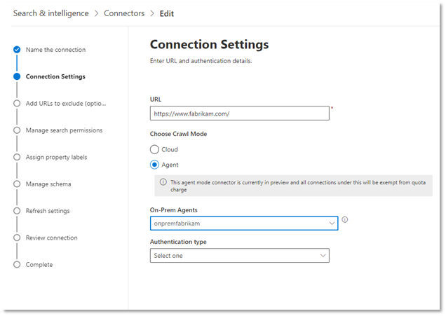

<!---Previous ms.author: monaray --->

<!-- markdownlint-disable no-inline-html -->

# エンタープライズ Web サイト Graph コネクタEnterprise websites Graph connector

エンタープライズ Web サイトグラフ コネクタを使用すると、組織は内部向け Web サイトから記事やコンテンツ **をインデックス化できます**。The Enterprise websites Graph connector allows your organization to index articles and **content from its internal-facing websites**. コネクタを構成し、Web サイトからコンテンツを同期すると、エンド ユーザーは任意の Microsoft Search クライアントからそのコンテンツを検索できます。After you configure the connector and sync content from the website, end users can search for that content from any Microsoft Search client.

> [!NOTE]
> 一般的な [**Graph コネクタの**](configure-connector.md) セットアップ プロセスについては、「グラフ コネクタのセットアップ」の記事をご覧ください。Read the [**Setup your Graph connector**](configure-connector.md) article to understand the general Graph connectors setup process.

この記事は、エンタープライズ Web サイト コネクタを構成、実行、および監視するユーザー向けです。This article is for anyone who configures, runs, and monitors an Enterprise websites connector. 一般的なセットアップ プロセスを補足し、Enterprise Web サイト コネクタにのみ適用される手順を示します。It supplements the general setup process, and shows instructions that apply only for the Enterprise websites connector. この記事には、トラブルシューティングと [制限事項に関](#troubleshooting) する情報 [も含まれています](#limitations)。This article also includes information about [Troubleshooting](#troubleshooting) and [Limitations](#limitations).

<!---## Before you get started-->

<!---Insert "Before you get started" recommendations for this data source-->

## 手順 1: Microsoft 365 管理センターに Graph コネクタを追加するStep 1: Add a Graph connector in the Microsoft 365 admin center

一般的なセットアップ [手順に従います](https://docs.microsoft.com/microsoftsearch/configure-connector)。Follow the general [setup instructions](https://docs.microsoft.com/microsoftsearch/configure-connector).
<!---If the above phrase does not apply, delete it and insert specific details for your data source that are different from general setup instructions.-->

## 手順 2: 接続に名前を付けStep 2: Name the connection

一般的なセットアップ [手順に従います](https://docs.microsoft.com/microsoftsearch/configure-connector)。Follow the general [setup instructions](https://docs.microsoft.com/microsoftsearch/configure-connector).
<!---If the above phrase does not apply, delete it and insert specific details for your data source that are different from general setup instructions.-->

## 手順 3: 接続設定を構成するStep 3: Configure the connection settings

データ ソースに接続するには、Web サイトのルート URL を入力し、クロール ソースを選択し、使用する認証の種類 [(None、Basic Authentication、または](https://docs.microsoft.com/azure/active-directory/)OAuth 2.0 と Azure Active Directory (Azure AD) を使用する必要があります。To connect to your data source, you need to fill in the root URL of the website, select a crawl source, and the type of authentication you'd like to use: None, Basic Authentication, or OAuth 2.0 with [Azure Active Directory (Azure AD)](https://docs.microsoft.com/azure/active-directory/). この情報を完了したら、[接続のテスト] を選択して設定を確認します。After you complete this information, select Test Connection to verify your settings.

> [!NOTE]
> クロールするサイトにサイトマップが定義されている場合、コネクタはサイトマップにリストされている URL のみをクロールします。If the site you want to crawl has a sitemap defined, the connector will only crawl the URLs listed in the sitemap. サイトマップが定義されていない場合、コネクタはサイトのルート URL で見つかったすべてのリンクを深くクロールします。If no sitemap is defined, the connector will do a deep crawl of all the links found on the root URL of the site.

### URLURL

URL フィールドを使用して、クロールする Web サイトのルートを指定します。Use the URL field to specify the root of the website that you'd like to crawl. エンタープライズ Web サイト コネクタは、この URL を開始点として使用し、クロールのためにこの URL からのすべてのリンクに従います。The enterprise websites connector will use this URL as the starting point and follow all the links from this URL for its crawl.

### クロール モード: クラウドまたはオンプレミス (プレビュー)Crawl mode: Cloud or On-premises (Preview)

クロール モードは、インデックスを作成する Web サイトの種類 (クラウドまたはオンプレミス) を決定します。The crawl mode determines the type of websites you want to index, either cloud or on-premises. クラウド Web サイトの場合は、クロール **モードとして [クラウド** ] を選択します。For your cloud websites, select **Cloud** as the crawl mode.

また、コネクタはオンプレミス Web サイトのクロールをサポートしています。Also, the connector now supports crawling of on-premises websites. このモードはプレビュー中です。This mode is in preview. オンプレミスのデータにアクセスするには、まず Graph コネクタ エージェントをインストールして構成する必要があります。To access your on-premises data, you must first install and configure the Graph connector agent. 詳細については [、「Graph コネクタ エージェント」を参照してください](https://docs.microsoft.com/microsoftsearch/on-prem-agent)。To learn more, see [Graph connector agent](https://docs.microsoft.com/microsoftsearch/on-prem-agent).

オンプレミス Web サイトの場合は、クロール モードとして [エージェント] を選択し **、[On-Prem Agent]** フィールドで、前にインストールして構成した Graph コネクタ エージェントを選択します。For your on-premises websites, select **Agent** as the crawl mode and in the **On-Prem Agent** field, choose the Graph connector agent that you installed and configured earlier.  

> [!div class="mx-imgBorder"]
> ![Enterprise Web コネクタの [接続設定] ウィンドウのスクリーンショット](media/enterprise-web-connector/connectors-enterpriseweb-settings.png)

### 認証Authentication

基本認証には、ユーザー名とパスワードが必要です。Basic Authentication requires a username and password. Microsoft 365 管理センターを使用して [、このボット アカウントを作成します](https://admin.microsoft.com)。Create this bot account by using the [Microsoft 365 admin center](https://admin.microsoft.com).

Azure サーバーを使用する [OAuth](https://docs.microsoft.com/azure/active-directory/) 2.0 AD ID、クライアント ID、およびクライアント シークレットが必要です。OAuth 2.0 with [Azure AD](https://docs.microsoft.com/azure/active-directory/) requires a resource ID, Client ID, and Client Secret. OAuth 2.0 はクラウド モードでのみ動作します。OAuth 2.0 only works with Cloud mode.

詳細については [、「OAuth 2.0](https://docs.microsoft.com/azure/active-directory/develop/v1-protocols-oauth-code)コード許可フローを使用して Azure Active Directory Web アプリケーションへのアクセスを承認する」を参照してください。For more information, see [Authorize access to Azure Active Directory web applications using OAuth 2.0 code grant flow](https://docs.microsoft.com/azure/active-directory/develop/v1-protocols-oauth-code). 次の値を使用して登録します。Register with the following values:

**名前:** Microsoft Search**Name:** Microsoft Search  
**Redirect_URI:**`https://gcs.office.com/v1.0/admin/oauth/callback`**Redirect_URI:** `https://gcs.office.com/v1.0/admin/oauth/callback`

リソース、client_id、client_secretの値を取得するには、「承認コードを使用してリダイレクト URL  Web ページでアクセス トークンを要求する」を参照してください。To get the values for the resource, client_id, and client_secret, go to **Use the authorization code to request an access token** on the redirect URL webpage.

詳細については、「クイック スタート [: アプリケーションを Microsoft ID プラットフォームに登録する」を参照してください](https://docs.microsoft.com/azure/active-directory/develop/quickstart-register-app)。For even more information, see [Quickstart: Register an application with the Microsoft identity platform](https://docs.microsoft.com/azure/active-directory/develop/quickstart-register-app).

## 手順 3a: 除外する URL を追加する (オプションのクロール制限)Step 3a: Add URLs to exclude (Optional crawl restrictions)

ページがクロールされるのを防ぐ方法は、robots.txt ファイルで禁止するか、除外リストに追加する方法の 2 つがあります。There are two ways to prevent pages from being crawled: disallow them in your robots.txt file or add them to the Exclusion list.

### サービスのrobots.txtSupport for robots.txt

コネクタは、ルート サイトの robots.txt ファイルが存在するかどうかを確認し、存在する場合は、そのファイル内で見つかった方向に従って尊重します。The connector checks to see if there is a robots.txt file for your root site and, if one exists, it will follow and respect the directions found within that file. コネクタでサイト上の特定のページまたはディレクトリをクロールしない場合は、robots.txt ファイルの "Disallow" 宣言でそれらのページまたはディレクトリを呼び出します。If you do not want the connector to crawl certain pages or directories on your site, you can call out those pages or directories in the "Disallow" declarations in your robots.txt file.

### 除外する URL を追加するAdd URLs to exclude

必要に応じて除外リストを作成して、コンテンツが機密性の高い場合やクロールする価値がない場合に、一部の URL をクロールから除外できます。You can optionally create an **Exclusion list** to exclude some URLs from getting crawled if that content is sensitive or not worth crawling. 除外リストを作成するには、ルート URL を参照します。To create an exclusion list, browse through the root URL. 構成プロセス中に、除外された URL をリストに追加できます。You can add the excluded URLs to the list during the configuration process.

## 手順 4: プロパティ ラベルを割り当てるStep 4: Assign property labels

各ラベルにソース プロパティを割り当てるには、オプションのメニューから選択します。You can assign a source property to each label by choosing from a menu of options. この手順は必須ではありませんが、一部のプロパティ ラベルを使用すると、検索の関連性が向上し、エンド ユーザーの検索結果の精度が向上します。While this step is not mandatory, having some property labels will improve the search relevance and ensure more accurate search results for end users.

## 手順 5: スキーマの管理Step 5: Manage schema

[スキーマの **管理**] 画面で、プロパティに関連付けられたスキーマ属性(オプションはクエリ、**検索**、取得、絞り込 **み)** を変更し、オプションのエイリアスを追加し **、Content** プロパティを選択できます。On the **Manage Schema** screen, you can change the schema attributes (the options are **Query**, **Search**, **Retrieve**, and **Refine**) associated with the properties, add optional aliases, and choose the **Content** property.

## 手順 6: 検索アクセス許可を管理するStep 6: Manage search permissions

エンタープライズ Web サイト コネクタは、Everyone に表示される検索アクセス許可のみを **サポートします**。The Enterprise websites connector only supports search permissions visible to **Everyone**. インデックス付きデータは検索結果に表示され、組織内のすべてのユーザーに表示されます。Indexed data appears in the search results and is visible to all users in the organization.

## 手順 7: 更新スケジュールを設定するStep 7: Set the refresh schedule

エンタープライズ Web サイト コネクタは、完全な更新のみをサポートします。The Enterprise websites connector only supports a full refresh. つまり、更新の度にコネクタが Web サイトのすべてのコンテンツを再スキャンします。This means that the connector will recrawl all the website's content during every refresh. コネクタがコンテンツをクロールするのに十分な時間を取得するには、大規模な更新スケジュール間隔を設定することをお勧めします。To make sure the connector gets enough time to crawl the content, we recommend that you set a large refresh schedule interval. 1 ~ 2 週間の間にスケジュールされた更新をお勧めします。We recommend a scheduled refresh between one and two weeks.

## 手順 8: 接続の確認Step 8: Review connection

一般的なセットアップ [手順に従います](https://docs.microsoft.com/microsoftsearch/configure-connector)。Follow the general [setup instructions](https://docs.microsoft.com/microsoftsearch/configure-connector).
<!---If the above phrase does not apply, delete it and insert specific details for your data source that are different from general setup instructions.-->

## トラブルシューティングTroubleshooting

Web サイトのコンテンツを読み取る場合、クロールでソース エラーが発生する可能性があります。これは、以下の詳細なエラー コードで表されます。When reading the website's content, the crawl may encounter some source errors, which are represented by the detailed error codes below. エラーの種類の詳細については、接続を選択した後でエラー **の詳細** ページに移動します。To get more information on the types of errors, go to the **error details** page after selecting the connection. エラー コード **を選択して** 、詳細なエラーを表示します。Select the **error code** to see more detailed errors. 詳細については、「 [コネクタの管理」](https://docs.microsoft.com/microsoftsearch/manage-connector) も参照してください。Also refer to [Manage your connector](https://docs.microsoft.com/microsoftsearch/manage-connector) to learn more.

 詳細なエラー コードDetailed Error code | エラー メッセージError message
 --- | ---
 60016001 | インデックス作成を試みようとしているサイトに到達できないThe site that is being tried to index is not reachable
 60056005 | インデックス作成を試みようとしているソース ページは、構成に基robots.txtされています。The source page that is being tried to index has been blocked by as per robots.txt configuration.
 60086008 | DNS を解決できませんUnable to resolve the DNS
 60096009 | クライアント側のすべてのエラー (HTTP 404、408 を除く) については、HTTP 4xx エラー コードを参照してください。For all client-side errors (Except HTTP 404, 408), refer to HTTP 4xx error codes for details.
 60136013 | インデックス作成を試みようとしているソース ページが見つかりませんでした。The source page that is being tried to index could not be found. (HTTP 404 エラー)(HTTP 404 error)
 60186018 | ソース ページが応答していないと、要求がタイム アウトしました。(HTTP 408 エラー)The source page is not responding, and the request has timed out. (HTTP 408 error)
 60216021 | インデックスを作成するソース ページには、ページにテキスト コンテンツはありません。The source page that is being tried to index has no textual content on the page.
 60236023 | インデックス作成を試みようとしているソース ページはサポートされていません (HTML ページではありません)The source page that is being tried to index is unsupported (not an HTML page)
 60246024 | インデックス作成を試みようとしているソース ページには、サポートされていないコンテンツがあります。The source page that is being tried to index has unsupported content.

* エラー 6001~6013 は、ネットワークの問題が原因でデータ ソースに到達できない場合、またはデータ ソース自体が削除、移動、または名前変更された場合に発生します。Errors 6001-6013 occur when the data source is not reachable due to a network issue or when the data source itself is deleted, moved, or renamed. 提供されたデータ ソースの詳細がまだ有効か確認します。Check if the data source details provided are still valid.
* エラー 6021-6024 は、データ ソースにページにテキスト以外のコンテンツが含まれている場合、またはページが HTML でない場合に発生します。Errors 6021-6024 occur when the data source contains non-textual content on the page or when the page is not an HTML. データ ソースを確認し、除外リストにこのページを追加するか、エラーを無視します。Check the data source and add this page in exclusion list or ignore the error.

## 制限事項Limitations

エンタープライズ Web サイト コネクタは、動的 Web ページ上のデータの検索 **をサポートされていません**。The Enterprise websites connector doesn't support searching data on **dynamic webpages**. これらの Web ページの例は [、Confluence](https://www.atlassian.com/software/confluence) や [Unily](https://www.unily.com/) のようなコンテンツ管理システム、または Web サイトのコンテンツを格納するデータベースに含まれています。Examples of those webpages live in content management systems like [Confluence](https://www.atlassian.com/software/confluence) and [Unily](https://www.unily.com/) or databases that store website content.