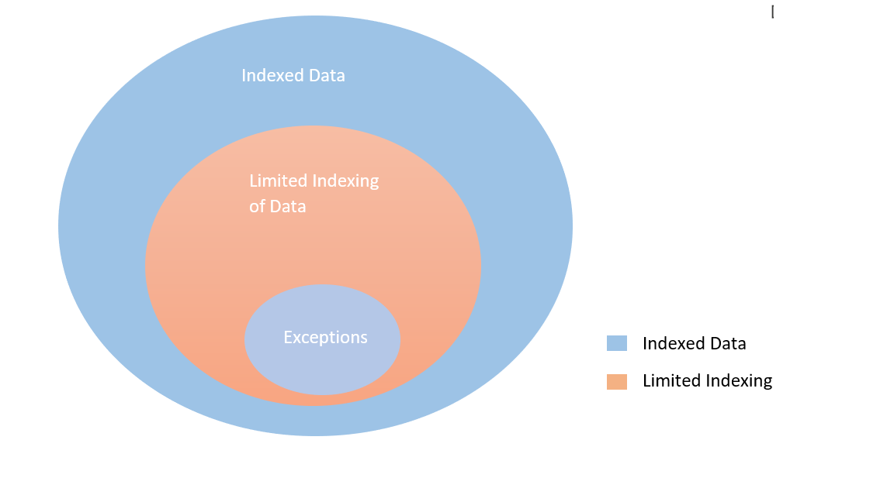
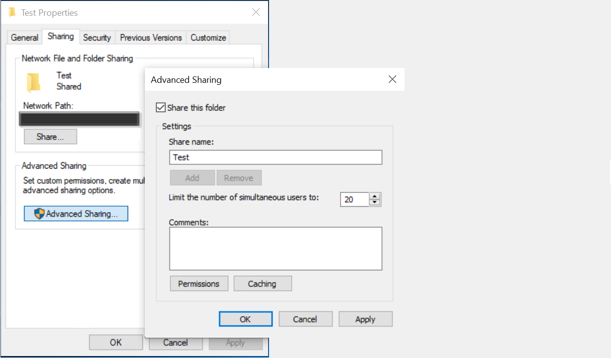

<!---Previous ms.author: rusamai --->

# ファイル共有Graphコネクタ

[ファイル共有] Graphコネクタを使用すると、組織内のユーザーがオンプレミスのファイル共有Windows検索できます。

> [!NOTE]
> コネクタの [**セットアッププロセスの一Graphについては**](configure-connector.md)、「Graph」を参照してください。

## 使用を開始する前に

### コネクタ エージェントGraphインストールする

ファイル共有にインデックスWindowsするには、コネクタ エージェントをインストールして登録Graph必要があります。 詳細については[、「Graphコネクタ エージェントをインストール](graph-connector-agent.md)する」を参照してください。  

### コンテンツ要件

### ファイルの種類

次の形式のコンテンツは、インデックスを作成して検索できます。DOC、 DOCM、DOCX、DOT、DOTX、EML、GIF、HTML、JPEG、MHT、MHTML、MSG、NWS、OBD、OBT、ODP、ODS、ODT、ONE、PDF、POT、PPS、PPTM、PPTX、PPTX、TXT、XLB、XLC、XLSB、XLSX、XLT、XML、XML、XPS、および ZIP。 これらの形式のテキスト コンテンツだけがインデックス付けされます。 すべてのマルチメディア コンテンツは無視されます。 この形式に属していないファイルの場合は、メタデータだけでインデックスが作成されます。

### ファイル サイズの制限を超えている

サポートされるファイルの最大サイズは 100 MB です。 100 MB を超えるファイルはインデックス付けされません。 処理後の最大サイズ制限は 4 MB です。 ファイルのサイズが 4 MB に達すると、処理が停止します。 したがって、ファイルに存在する一部の語句が検索に使用できない場合があります。

## 手順 1: Graphコネクタを追加Microsoft 365 管理センター

一般的なセットアップ [手順に従います](./configure-connector.md)。
<!---If the above phrase does not apply, delete it and insert specific details for your data source that are different from general setup instructions.-->

## 手順 2: 接続に名前を付け

一般的なセットアップ [手順に従います](./configure-connector.md)。
<!---If the above phrase does not apply, delete it and insert specific details for your data source that are different from general setup instructions.-->

## 手順 3: 接続設定を構成する

[データ **ソースConnect] ページで**、[**ファイル** 共有] を選択し、名前、接続 ID、および説明を指定します。 次のページで、ファイル共有へのパスを指定し、以前にインストールしたコネクタ エージェントGraph選択します。 ファイル共有内のすべてのファイルへの読みWindowsアクセス権を持つ[Microsoft](https://microsoft.com/windows)ユーザー アカウントの資格情報を入力します。

### 最後のアクセス時間を保持する

コネクタがファイルをクロールしようとすると、そのメタデータ内の "最終アクセス時刻" フィールドが更新されます。 アーカイブソリューションとバックアップ ソリューションのフィールドに依存し、コネクタがアクセスするときに更新しない場合は、[詳細設定] ページでこのオプション **を構成** できます。

## 手順 4: ファイルのインデックス作成の制限

ファイル共有接続を構成する場合、管理者はファイルとフォルダーのインデックス作成を制限できます。 これを行う方法は複数あります。

#### ファイルの種類に基づく

これらの形式のテキストコンテンツだけがインデックス付けされます。DOC、DOCM、DOCX、DOTX、EML、HTML、MHT、MHTML、MSG、OBS、OBT、ODP、ODS、ODT、1、PDF、POT、PPS、PPTM、PPTX、TXT、XLB、XLC、XLSB、XLSX、XLT、XLT、XLX、XML、XPS。 この形式に属していないマルチメディア ファイルとファイルの場合、唯一のメタデータがインデックス付けされます。

#### 最終変更日または最終変更後の日数に基づく

#### インデックス作成を制限するファイル/フォルダーまたは正規表現の完全なネットワーク パス 

ネットワーク パスでは、次のような特殊文字の前にエスケープ文字 ( \\ ) を使用します \\ 。 例: パス CONTOSO FILE SHAREDFOLDER の場合、正しい入力方法 \\ \\ \\ は CONTOSO FILE \\ \\ \\ \\ \\ \\ \\ \\ \\ SHAREDFOLDER です

正規表現を記述するルールについては、こちらを参照 [してください。](https://docs.microsoft.com/dotnet/standard/base-types/regular-expression-language-quick-reference)

管理者は、制限ルールに例外を与える機能も持っています。 例外ルールの優先度は、制限ルールよりも優先されます。 同様の方法で、インデックス作成に含めるアイテムのフォルダー/ファイル パスを指定することで例外を定義できます。

## 手順 5: 検索アクセス許可を管理する

[検索アクセス許可の管理] ページで目的のオプションを選択することにより、Share Access Control Lists または New Technology File System (NTFS) Access Control Lists に基づいて任意のファイルを検索するアクセス許可を制限できます。  これらのアクセス制御リストで提供されるユーザー アカウントとグループは、Active Directory (AD) によって管理する必要があります。 ユーザー アカウント管理に他のシステムを使用している場合は、[すべてのユーザー] オプションを選択して、ユーザーがアクセス制限なしですべてのファイルを検索できます。 ただし、ユーザーがファイルを開く場合は、ソースで設定されたアクセス制御が適用されます。

既定では、フォルダーがネットワーク上で共有されている場合、Windows は Share ACL の 'Everyone' に対する 「読み取り」 アクセス許可を提供します。 [検索アクセス許可の管理] で [ACLの共有] を選択している場合、ユーザーはすべてのファイルを検索できます。 アクセスを制限する場合は、ファイル共有の 'Everyone' の 'Read' アクセスを削除し、目的のユーザーとグループにのみアクセスを提供します。 コネクタは次に、これらのアクセス制限を読み取り、それらを検索に適用します。

[ACL の共有] を選択できるのは、指定した共有パスが UNC パス形式に従う場合のみです。 UNC 形式のパスを作成するには、[共有] オプションの [高度な共有] に進む必要があります。

## 手順 6: プロパティ ラベルを割り当てる

一般的なセットアップ [手順に従います](./configure-connector.md)。
<!---If the above phrase does not apply, delete it and insert specific details for your data source that are different from general setup instructions.-->

## 手順 7: スキーマの管理

一般的なセットアップ [手順に従います](./configure-connector.md)。
<!---If the above phrase does not apply, delete it and insert specific details for your data source that are different from general setup instructions.-->

## 手順 8: 更新設定を選択する

一般的なセットアップ [手順に従います](./configure-connector.md)。
<!---If the above phrase does not apply, delete it and insert specific details for your data source that are different from general setup instructions.-->

## 手順 9: 接続の確認

一般的なセットアップ [手順に従います](./configure-connector.md)。
<!---If the above phrase does not apply, delete it and insert specific details for your data source that are different from general setup 
instructions.-->

<!---## Troubleshooting-->
<!---Insert troubleshooting recommendations for this data source-->

<!---## Limitations-->
<!---Insert limitations for this data source-->
