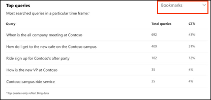

# Microsoft Search Insights ダッシュボードレポートMicrosoft Search Insights dashboard reports

Microsoft Search insights ダッシュボードを使用して、発行された回答の Bing データを管理できます。You can use the Microsoft Search insights dashboard to manage the Bing data for your published answers. これは、ユーザーがコンテンツを簡単に[見つけられるよう](make-content-easy-to-find.md)にするために必要な手順の1つにすぎません。This is just one of the steps needed to [make content easy to find](make-content-easy-to-find.md) for your users.

Microsoft 365 管理センターで最初に Microsoft Search に移動すると、Insights ダッシュボードにが入力されます。When you first go to Microsoft Search in the Microsoft 365 admin center, you'll enter on the Insights dashboard.

ここでは、insights ダッシュボードで使用可能なレポートについて説明します。Here are the reports that are available on the insights dashboard.

> [!NOTE]
> レポート内のデータは、Bing データのみを表します。The data in the reports only represents Bing data.

## よく使用されるクエリTop queries

このレポートでは、ユーザーが実行する上位の 2000 Bing 検索クエリについての詳細が提供されます。This report gives details about the top 2000 Bing search queries that users run. クエリを**上位のクエリ**に表示するには、クエリは少なくとも3回のクリックを取得する必要があります。For a query to appear in **Top queries**, the query must get at least three clicks.

ユーザーが検索しているものを見つけないことを意味するのは、クリックスルーレート (CTR) です。A low click-through rate (CTR) means that users aren’t finding what they’re looking for.

回答の種類に基づいてフィルター処理することで、レポートのさまざまなビューを選択できます。You can choose different views of the report by filtering on the type of answer. たとえば、ブックマークの上位のクエリを表示する場合は、レポートの右上隅にあるドロップダウンを選択し、[**ブックマーク**] を選択します。For example if you just want to view the top queries for Bookmarks, select the drop-down in the upper-right corner of the report, and then select **Bookmarks**. 既定では、**すべて**の応答の種類が表示されます。By default, **All** answer types are shown.

## インプレッションの分布Impression distribution

このレポートでは、さまざまな回答に関して Bing でのインプレッション分布が表示されます。This report shows impression distribution in Bing over time for various answers. ブックマーク、ユーザー、Q&A、ファイル、場所、ファイルサイト、グループ、会話などがあります。Examples are bookmarks, people, Q&A, files, locations, file sites, groups, and conversations. 

インプレッション配布は、指定された期間中にユーザーが検索する内容を管理者が理解するのに役立ちます。Impression Distribution can help admins understand what users look for during a specified period.
