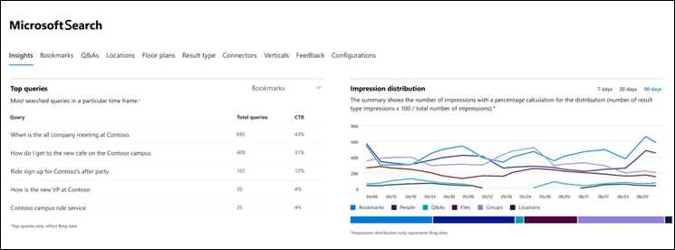
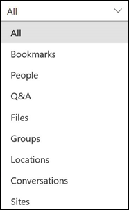
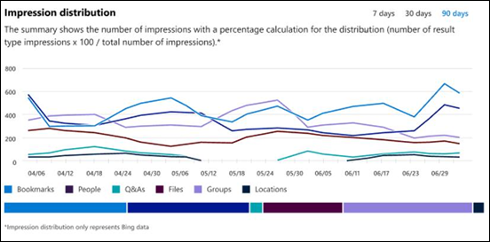

# Microsoft Search Insights ダッシュボードレポートMicrosoft Search Insights dashboard reports

Microsoft Search Insights ダッシュボードを使用して、発行された回答の[Bing](https://Bing.com)データを管理できます。You can use the Microsoft Search Insights dashboard to manage [Bing](https://Bing.com) data for your published answers. これは、ユーザーがコンテンツを簡単に[見つけられるよう](make-content-easy-to-find.md)にするために必要な手順の1つにすぎません。This is just one of the steps needed to [make content easy to find](make-content-easy-to-find.md) for your users.

Microsoft 365[管理センター](https://admin.microsoft.com)で最初に microsoft Search に移動するときは、Insights dashboard に入力します。When you first go to Microsoft Search in the Microsoft 365 [admin center](https://admin.microsoft.com), you enter on the Insights dashboard.

次のレポートは、Insights ダッシュボードで利用できます。The following reports are available on the Insights dashboard.

> [!NOTE]
> レポート内のデータは、 [Bing](https://Bing.com)データのみを表します。The data in the reports only represents [Bing](https://Bing.com) data.

## よく使用されるクエリTop queries

このレポートでは、ユーザーが実行する上位の 2000 [Bing](https://Bing.com)検索クエリについての詳細が提供されます。This report gives details about the top 2000 [Bing](https://Bing.com) search queries that users run. クエリを**上位のクエリ**に表示するには、クエリは少なくとも3回のクリックを取得する必要があります。For a query to appear in **Top queries**, the query must get at least three clicks.

![[上位のクエリ] テーブルヘッダーでレポートします。クエリ、クエリの合計数、およびクリックスルー率。](media/Insights-topqueries.png)

ユーザーが検索しているものを見つけないことを意味するのは、クリックスルーレート (CTR) です。A low click-through rate (CTR) means that users aren’t finding what they’re looking for.

回答の種類に基づいてフィルター処理することで、レポートのさまざまなビューを選択できます。You can choose different views of the report by filtering on the type of answer. たとえば、ブックマークの上位のクエリを表示する場合は、レポートの右上隅にあるドロップダウンを選択し、[**ブックマーク**] を選択します。For example, if you just want to view the top queries for Bookmarks, select the drop-down in the upper-right corner of the report, and then select **Bookmarks**. 既定では、**すべて**の応答の種類が表示されます。By default, **All** answer types are shown.

## インプレッションの分布Impression distribution

このレポートでは、さまざまな回答に関して[Bing](https://Bing.com)でのインプレッション分布が表示されます。This report shows impression distribution in [Bing](https://Bing.com) over time for various answers. ブックマーク、ユーザー、Q&A、ファイル、場所、ファイルサイト、グループ、会話などがあります。Examples are bookmarks, people, Q&A, files, locations, file sites, groups, and conversations.

インプレッション配布は、指定された期間中にユーザーが検索する内容を管理者が理解するのに役立ちます。Impression distribution can help admins understand what users look for during a specified period.
