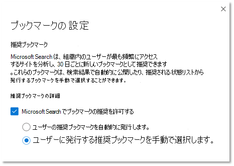

# ブックマークの管理

ブックマークは、検索だけで重要なサイトやツールをすばやく見つけるのに役立ちます。 各ブックマークには、タイトル、URL、ブックマークをトリガーするユーザーに優しいキーワードのセット、およびカテゴリが含まれます。

## ブックマークを作成する機能

ブックマークには、次の 4 つの主要な要素があります。

1. 強力で情報に基づいた **タイトル**。 最大 8 単語または最大約 60 文字を指定してください。 ユーザーがタイトルをクリックしてコンテンツを表示する必要がありますが、明らかなクリックバイトは避けるようにします。
    - 良い: この週のお気に入りは、レストランのメニューで試してみてください。 タイトルは明確で簡潔で興味深いものの、過剰な可能性があります。
    - 良い: 今週のセベリア メニュー。 広告のように過剰に使い過ぎたり、聞こえ過ぎない。
    - 避ける: 今週、何が起こってるのか分からない。 広告のように聞こえるクリックバイト クリップを使います。
2. リンクされた **リソースの目的** または機能を要約した、約 300 文字の簡潔な説明。
3. ユーザーが検索 **するときに** ブックマークを見つけるのに役立つキーワードのコレクションです。 少なくとも 5 つのキーワードをお勧めしています。 また、組織内のユーザーが使用する可能性のあるバリエーション (たとえば、レストランメニュー、ランチ メニュー、喫茶メニューなど) はすべて、レストランメニューのバリエーションとすることができます。
4. 管理センター **でブックマークの** 並べ替えとフィルター処理を容易にする一連の便利なカテゴリ。 割り当てられたカテゴリはユーザーに表示されます。

## ブックマークの回答を作成する

Microsoft [365](https://admin.microsoft.com/)管理センターで、[ブックマーク] に移動し、新しいブックマークの作成方法を選択します。

- ブックマークを追加する
- SharePoint の結果をインポートする
- 既定のブックマークと推奨ブックマークを追加する
- ブックマークをインポートする
- 推奨ブックマークを発行または確認する

### ブックマークを追加する

検索管理者と編集者は、Microsoft 365 管理センターでブックマークを追加できます。 ブックマークは、発行または下書きに保存できます。 ブックマークを発行すると、検索インデックスがすぐに更新され、ユーザーはすぐに検索と使用を開始できます。 また、公開する日時を指定してブックマークをスケジュールできます。

- **発行** 済み : Microsoft Search を使用して組織のユーザーがブックマークを使用できます。
- **下** 書き : 下書きとして保存されたブックマークは、ユーザーが使用できません。 自分または他の関係者がブックマークを公開する前に確認または更新する場合は、この状態を使用します。
- **Scheduled**: 指定した日時に公開されるブックマーク。

Microsoft Search コンテンツ作成者のブラウザー拡張機能を使用すると、ブックマークを簡単に追加できます。 ブラウザー拡張機能をインストールするには、ブックマークとして追加するサイトに移動し、拡張機能の [追加] をクリックします。
Edge と Chrome の拡張機能をインストールします。

- Chromium Edge または Chrome の場合: Chrome Web ストア [に移動し](https://chrome.google.com/webstore/detail/microsoft-search-content/nocnablpaoeecfmfnjoheefkogmleipm) 、拡張機能を追加します。
- 従来の Edge の場合: Microsoft Store に [移動し](https://www.microsoft.com/p/microsoft-search-content-creator/9nrqdbcbwq55?activetab=pivot:overviewtab) 、拡張機能を追加します。

### SharePoint の結果をインポートする

組織で SharePoint で昇格した結果を設定している場合は、タイトル、URL、および説明をテナントの昇格した結果から Microsoft Search にインポートし、インポートしたコンテンツをユーザーが使用できます。 ほとんどの場合、SharePoint の結果のインポートには数分かかります。 大量の結果をインポートする場合、最大 48 時間かかる場合があります。 これは、検索結果をすばやく設定し、ユーザーに対してより効果的な方法です。 SharePoint から昇格した結果を参照として使用して、関連する検索結果に名前を付け、作成する方法を理解することをお勧めします。

### 既定のブックマークと推奨ブックマークを追加する

人事、特典、IT サポート、パスワード管理などのブックマークなど、ユーザーが役立つ可能性がある既定の推奨ブックマークがいくつか含まれています。 これらの推奨ブックマークを確認、更新、および公開して、ユーザーに高品質の結果を提供します。

ユーザーは、Microsoft Search のフィードバック リンクを使用して追加されたブックマークを提案できます。 推奨されるブックマークが候補として表示されます。

### ブックマークをインポートする

インポート機能を使用すると、多数のブックマークの追加や編集をより迅速かつ簡単に行うことができます。 次の場合に使用します。

- ブックマークの一括追加: ブックマーク テンプレート ファイルに詳細を追加し、インポートします。
- ブックマークの一括編集: ブックマークを .csv ファイルにエクスポートし、エクスポートしたファイルのブックマークの詳細を編集して、編集したファイルをインポートします。

テンプレート ファイルに関する重要な点を次に示します。

- [ID]、[最終更新日時]、および [最終変更者]*フィールドのデータ**を編集しない*
- 既存のブックマーク *の ID* を含める場合は、インポート ファイルの情報に置き換まれます。
- 同じタイトルまたは URL を持つ既存のブックマークの場合、ブックマークはインポート ファイル内の情報で更新されます。
- テンプレート ファイルのすべてのフィールドが必要なわけではなく、ブックマークの状態によって必要なフィールドは変わります。
- [状態] *フィールドに* 基づいて、ブックマークが下書き、推奨、スケジュール、除外として保存されます。または、ブックマークが自動的に公開されます。
- 複数の組織を管理するパートナーの場合は、組織間でブックマークをエクスポートし、別の組織にインポートできます。 ただし、インポートする前に *ID* 列のデータを削除する必要があります。

### インポート エラーを回避する

必要なデータが不足しているか無効な場合はエラーになり、修正する行と列に関する詳細情報を含むログ ファイルが生成されます。 必要な編集を行い、ファイルのインポートを再度実行してください。 すべてのエラーが解決されるまで、ブックマークをインポートまたは保存することはできません。

エラーを回避するには、インポート ファイルが正しく書式設定されていることに加えて、次の事項を確認してください。

- インポート テンプレートに存在していたヘッダー行とすべての列が含まれていること。
- 列の順序がインポート テンプレートと同じであること。
- すべての列に値があります。ただし、空にできる 3 つ *(ID、**最終* 変更者、最終変更者 *) を除く*
- State *列* が空ではなく、必須の情報です。
- 発行済み、推奨、スケジュール済み、下書きのブックマークをインポートする場合、*タイトル**、URL、**およびキーワードの列が* 必要です。
- 除外ブックマークをインポートする場合 *、URL* 列が必要です。

ブックマーク間の重複エラーを回避するには、次の方法を使用します。

- 異なるブックマークに重複する URL を使用しない。 URL が別のブックマークに割り当てられている場合に、インポート ファイルから URL を再度追加すると、エラーが発生します。 これは、他の種類の回答の重複する URL にも適用されます。
- 既存のブックマークを更新する場合は、ブックマーク *ID 列を使用* します。 既存のブックマークのその他のプロパティ (キーワードや説明など) を更新できますが、ブックマーク *ID* がインポート ファイルの適切な列に含けられている必要があります。 ブックマーク *ID が* 存在する場合は、新しい追加として扱われるので、エラーとして処理されません。

### 推奨ブックマークを発行または確認する

ブックマークの追加に必要な手動の作業を減らすために、Microsoft Search は組織内の SharePoint リンクを評価し、ブックマークを推奨します。また、ブックマークを発行する前に確認したり、自動的に発行する設定を行います。 推奨ブックマークにはセットアップは必要ない。設定は有効で、既定では自動発行に設定されています。 これらの設定をいつでも変更するには、[ブックマークの管理] **を選択して** [ブックマークの設定] パネルを開きます。

推奨ブックマークが有効になっている場合、推奨事項エンジンは組織内の SharePoint サイトを評価してトラフィックの多いリンクを識別します。 最初の評価期間が終了すると、推奨ブックマークが自動的に発行されるか、推奨ブックマークの一覧に追加されます。 次のサイクル (30 日間の評価期間の後に自動発行または推奨ブックマークを追加) が開始されます。

検索管理者または編集者は、これらの自動公開ブックマークまたは推奨ブックマークを定期的に確認してください。 また、推奨ブックマークには、既存の発行済みブックマーク、おすすめブックマーク、スケジュール済みブックマーク、または除外ブックマークにある URL は含めつかりません。

アクセス権を持つユーザーにのみ、推奨ブックマークが作業結果に表示されるのを確認するために、すべての推奨ブックマークに対してアクセス チェック機能が含まれています。 SharePoint サイトにアクセスする権限を持たなかったユーザーには、そのサイトの推奨ブックマークが表示されません。 このアクセス チェックは、推奨ブックマークごとに[グループ] 設定の [このリンクにアクセスできるユーザーのみ] オプションによって制御されます。

推奨ブックマークまたはグループ設定の URL が変更された場合、アクセス チェックは停止します。

おすすめエンジンが特定のサイトにブックマークを発行または提案し込むのを防ぐには、除外するリストに URL を追加します。 おすすめエンジンは、除外されたサイトまたは除外されたサイト内のページのブックマークを発行または提案しは行いません。

## キーワードと予約済みキーワードについて

ブックマークには複数のキーワードを含め、ブックマークは同じキーワードを共有できますが、予約済みのキーワードは共有できます。 予約済みキーワードは、1 つの特定のブックマークをトリガーする一意の用語または語句です。 予約済みのキーワードは、1 つの回答にのみ関連付けできます。 予約済みのキーワードは、使用する必要があります。

## よく寄せられる質問

**Q: Microsoft Search の公開後にブックマークが表示されるのにどれくらいの時間がですか。**

**A:**  Microsoft Search では、発行直後にブックマークを使用できます。

**Q: 推奨ブックマークが表示されるのにどれくらいの時間が必要ですか。**

**A:**  推奨ブックマークは、推奨ブックマークと自動発行の両方が有効になっている場合にのみ、Microsoft Search に表示されます。 最初の評価期間中に、推奨事項エンジンは SharePoint トラフィックを評価して適切なブックマークを識別し、自動発行します。 公開されたファイルは、Microsoft Search ですぐに利用できます。

**Q: Microsoft Search は、すべての言語のサイトからのブックマークを推奨しますか。**

**A**: はい、Microsoft Search は言語に関係なく、任意の内部 SharePoint サイトからのブックマークを推奨できます。

**Q: 検索結果への推奨ブックマークの表示を停止できますか。**

**A:** 推奨ブックマークの表示を停止するには、管理センターで自動公開設定をオフにします。 推奨ブックマークは、推奨ブックマークの一覧に追加されます。

**Q: 検索結果または管理センターで推奨ブックマークを特定するにはどうすればよいですか。**

**A:** 検索結果では、推奨ブックマークには URL の前に "Suggested for you" という語句が含まれます。 管理センターでは、マイニングされたブックマークの所有者の値は "SYSTEM" になります。

**Q: 推奨ブックマークへのアクセスは、どのように管理されますか。**

**A**: Microsoft によって設計されたアクセス エンジンは、ブックマーク URL が特定のユーザーがアクセス可能かどうかを判断し、適切な対象ユーザーにのみ推奨ブックマークを表示します。 ただし、URL が編集された場合、またはグループの設定が変更された場合、設計されたアクセス エンジンは無効になります。

**Q: 推奨リストに追加された推奨ブックマークに対して何もアクションが実行されないか。**

**A**: 推奨リスト内のブックマークの量が多くなことを避けるため、推奨ブックマーク (owner = SYSTEM) は 180 日後に削除されます。

**Q: Power App のアプリ ID はどこで確認できますか。**

**A**: Power Apps サイトに移動し、アプリの [詳細] ウィンドウを表示します。 アプリ ID の [取得について詳しくは、次をご覧ください](https://docs.microsoft.com/powerapps/maker/canvas-apps/get-sessionid#get-an-app-id)。
