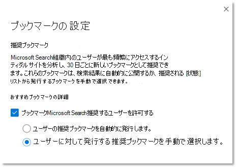

# ブックマークの管理

ブックマークは、ユーザーが検索だけで重要なサイトやツールをすばやく見つけるのに役立ちます。 各ブックマークには、タイトル、URL、ブックマークをトリガーするユーザーフレンドリーなキーワードのセット、およびカテゴリが含まれます。

## 素晴らしいブックマークの作成方法

大きなブックマークには、次の 4 つの重要な要素があります。

1. 強力で有益な **タイトル** です。 8 単語以内、または最大約 60 文字を目指します。 ユーザーがタイトルをクリックしてコンテンツを表示する必要がありますが、明らかなクリックベイトは避ける必要があります。
    - 良い: 今週のおいしいお気に入りをカフェテリア メニューから試してみてください。 タイトルは明確で簡潔で面白いですが、過剰な可能性があります。
    - 良い: 今週のカフェテリア メニュー。 広告のように過剰にプロマまたはサウンドを出したりしない。
    - 避ける: 今週のカフェテリア メニューに何が来ているかは信じられないでしょう。 広告のように聞こえる clickbait clichés を使用します。
2. リンクされた **リソースの目的** または機能を要約した簡潔な説明 (約 300 文字)。
3. ユーザーが **検索するときにブックマーク** を見つけるのに役立つキーワードのコレクション。 少なくとも 5 つのキーワードを推奨します。 また、食堂メニュー、ランチ メニュー、カフェ メニューなど、組織内のユーザーが使用するバリエーションはすべて、カフェテリア メニューのバリエーションである可能性があります。
4. 管理センター **でブックマークを** 並べ替え、フィルター処理しやすくする、便利な一連のカテゴリ。 ユーザーに割り当てられたカテゴリは表示されます。

## ブックマークの回答を作成する

Microsoft [365 管理](https://admin.microsoft.com/)センターで、[ [ブックマーク](https://admin.microsoft.com/Adminportal/Home#/MicrosoftSearch/bookmarks) ] に移動し、新しいブックマークの作成方法を選択します。

- ブックマークの追加
- SharePoint の結果をインポートする
- 既定のブックマークと推奨ブックマークを追加する
- ブックマークのインポート
- 推奨ブックマークを発行または確認する

### ブックマークの追加

検索管理者と編集者は、Microsoft 365 管理センターにブックマークを追加し、下書きに公開または保存できます。 ブックマークを発行すると、すぐに検索インデックスが更新され、ユーザーがすぐに検出できます。 ブックマークを公開する日時を指定して、ブックマークをスケジュールできます。

- **発行** 済み : ブックマークは、Microsoft Search を通じて組織のユーザーが利用できます。
- **下** 書き : 下書きとして保存されたブックマークは、ユーザーが使用できません。 自分や他の関係者がブックマークを公開する前に確認または更新する場合は、この状態を使用します。
- **スケジュール**: 指定した日付と時刻に発行されるブックマーク。

Microsoft Search コンテンツ作成者ブラウザー拡張機能を使用すると、ブックマークを簡単に追加できます。 ブラウザー拡張機能をインストールするには、ブックマークとして追加するサイトに移動し、拡張機能で [追加] をクリックします。
Edge と Chrome の拡張機能をインストールします。

- Chrome Edge または Chrome の場合: Chrome Web ストアに [移動し、](https://chrome.google.com/webstore/detail/microsoft-search-content/nocnablpaoeecfmfnjoheefkogmleipm) 拡張機能を追加します。
- 従来のエッジの場合: [Microsoft Store に移動し](https://www.microsoft.com/p/microsoft-search-content-creator/9nrqdbcbwq55?activetab=pivot:overviewtab) 、拡張機能を追加します。

### SharePoint の結果をインポートする

組織が SharePoint で昇格した結果を設定している場合は、テナントの昇格された結果から Microsoft Search にタイトル、URL、および説明をインポートし、インポートされたコンテンツをユーザーが利用できます。 ほとんどの場合、SharePoint 結果のインポートには数分かかります。 多数の結果をインポートする場合、最大 48 時間かかる場合があります。 これは、検索結果にすばやく入力し、ユーザーの効率を高くするための簡単な方法です。 関連する検索結果に名前を付け、作成する方法を理解するには、SharePoint の昇格された結果を参照として使用することをお勧めします。

### 既定のブックマークと推奨ブックマークを追加する

人事、特典、IT サポート、パスワード管理などのブックマークなど、ユーザーが役に立つ可能性がある既定の推奨ブックマークがいくつか含まれています。 これらの推奨ブックマークを確認、更新、発行して、ユーザーに高品質の結果を提供します。

ユーザーは、Microsoft Search のフィードバック リンクを使用して追加を表示するブックマークを提案できます。 推奨事項は、推奨ブックマークとして表示されます。

### ブックマークのインポート

多数のブックマークを追加または編集する場合は、インポート機能を使用して、より迅速かつ簡単にブックマークを追加または編集できます。 次の場合に使用します。

- ブックマークの一括追加: ブックマーク テンプレート ファイルに詳細を追加し、インポートします。
- ブックマークの一括編集: ブックマークを .csv ファイルにエクスポートし、エクスポートしたファイルのブックマークの詳細を編集してから、編集したファイルをインポートします。

テンプレート ファイルに関する重要な点を次に示します。

- これらのフィールドのデータを編集しない: *ID、**最終変更* 者、*および最終変更者*
- 既存のブックマーク *の ID* を含める場合は、インポート ファイル内の情報に置き換えられる。
- 同じタイトルまたは URL を持つ既存のブックマークの場合、ブックマークはインポート ファイル内の情報で更新されます。
- テンプレート ファイルのすべてのフィールドが必要なわけではなく、ブックマークの状態によって必要なフィールドは変わります。
- [状態] *フィールドに* 基づいて、ブックマークは下書き、提案、スケジュール、除外、または自動的に発行されます。
- 複数の組織を管理するパートナーの場合は、ある組織からブックマークをエクスポートし、別の組織にインポートできます。 ただし、インポートする前に ID 列のデータ *を* 削除する必要があります。

### インポート エラーを回避する

必要なデータが不足しているか無効な場合はエラーになり、修正する行と列に関する詳細情報を含むログ ファイルが生成されます。 必要な編集を行い、ファイルのインポートを再度実行してください。 すべてのエラーが解決されるまで、ブックマークをインポートまたは保存できない。

エラーを回避するには、インポート ファイルが正しく書式設定されていることに加えて、次の事項を確認してください。

- インポート テンプレートに存在していたヘッダー行とすべての列が含まれていること。
- 列の順序がインポート テンプレートと同じであること。
- すべての列には、ID、Last *Modified、Last* Modified By の 3 つの値を除 *く値があります。*
- [ *状態]* 列が空ではない、必須の情報
- 発行済み、提案済み、スケジュール済み、下書きブックマークをインポートする場合、*タイトル**、URL、**およびキーワードの列が* 必要です
- 除外ブックマークをインポートする場合 *、URL 列* が必要です

ブックマークからブックマークへの重複エラーを防止するには、次の方法を実行します。

- 異なるブックマークに重複する URL を使用しない。 URL が別のブックマークに割り当てられている場合、インポート ファイルから再度追加すると、エラーが発生します。 これは、他の種類の回答の重複する URL にも適用されます。
- 既存のブックマークを更新する場合は、ブックマーク *ID 列を使用* します。 既存のブックマークのその他のプロパティ (キーワードや説明など) を更新できますが、ブックマーク *ID* がインポート ファイルの適切な列に含けられている必要があります。 ブックマーク *ID が存在* する場合、ブックマーク ID は新しい追加として扱われるので、エラーとして処理されません。

### 推奨ブックマークを発行または確認する

ブックマークの追加に必要な手動の労力を削減するために、Microsoft Search は組織の SharePoint リンクを評価し、ブックマークを推奨できます。 発行する前に確認するか、自動的に発行する設定を行えます。 推奨ブックマークのセットアップは不要で、既定で有効にされ、自動公開に設定されます。 これらの設定をいつでも変更するには、[ブックマークの **管理] を選択** して、[ブックマークの設定] パネルを開きます。

推奨ブックマークが有効になっている場合、おすすめエンジンは組織内の SharePoint サイトを評価してトラフィックの多いリンクを識別します。 最初の評価期間が終了すると、推奨ブックマークが自動発行または推奨ブックマークの一覧に追加されます。 次のサイクル(30 日間の評価期間、その後に推奨ブックマークの自動公開または追加)が開始されます。

検索管理者または編集者は、これらの自動公開または推奨ブックマークを定期的に確認してください。 また、推奨ブックマークには、既存の発行済みブックマーク、推奨ブックマーク、スケジュール済みブックマーク、除外ブックマークに含まれる URL は含めされません。

アクセス権を持つユーザーだけが作業結果に推奨ブックマークを表示するには、すべての推奨ブックマークに対するアクセス チェック機能が含まれています。 ユーザーは、アクセスできない SharePoint サイトの推奨ブックマークを表示しません。 このアクセス チェックは、推奨されるブックマークごとに [グループ] 設定の [このリンクにアクセスできるユーザーのみ] オプションによって制御されます。

推奨ブックマークまたはグループ設定の URL が変更された場合、アクセス チェックは停止します。

おすすめエンジンが特定のサイトにブックマークを発行または提案し出すのを防ぐには、除外されたリストに URL を追加できます。 おすすめエンジンは、除外されたサイトまたは除外されたサイト内のページのブックマークを発行または提案したりは行いません。

## キーワードと予約済みキーワードについて

ブックマークには複数のキーワードを含め、同じキーワードを共有できますが、予約済みのキーワードは共有できない場合があります。 予約キーワードは、1 つの特定のブックマークをトリガーする一意の用語または語句です。 予約済みのキーワードは、1 つの回答にのみ関連付けできます。 予約済みのキーワードを使用する場合は、使用する必要があります。

## よく寄せられる質問

**Q: 発行後にブックマークが Microsoft Search に表示されるのにどれくらいの時間が必要ですか?**

**A:**  発行直後に Microsoft Search でブックマークを使用できます。

**Q: 推奨ブックマークが表示されるのにどれくらいの時間が必要ですか?**

**A:**  推奨ブックマークは、推奨ブックマークと自動公開の両方が有効になっている場合にのみ Microsoft Search に表示されます。 最初の評価期間中、推奨事項エンジンは SharePoint トラフィックを評価して適切なブックマークを識別し、それらを自動公開します。 公開すると、Microsoft Search ですぐに利用できます。

**Q: 削除されたブックマークを Microsoft 検索結果から削除するには、どのくらいの時間が必要ですか?**

**A**: 削除されたブックマークは、すぐに作業結果から削除されます。

**Q: Microsoft Search は、すべての言語のサイトからのブックマークを推奨しますか?**

**A**: はい、Microsoft Search は言語に関係なく、任意の内部 SharePoint サイトからのブックマークを推奨できます。

**Q: 検索結果で推奨ブックマークの表示を停止できますか?**

**A:** 推奨ブックマークの表示を停止するには、管理センターで自動公開設定をオフにします。 推奨ブックマークは、推奨ブックマークの一覧に追加されます。

**Q: 検索結果または管理センターで推奨ブックマークを特定する方法**

**A:** 検索結果では、推奨ブックマークには URL の前に "Suggested for you" という語句が含まれます。 管理センターでは、推奨ブックマークの所有者の値は "SYSTEM" になります。

**Q: 推奨ブックマークへのアクセスを管理する方法**

**A:** Microsoft によって設計されたアクセス エンジンは、ブックマーク URL が特定のユーザーがアクセス可能かどうかを判断し、適切な対象ユーザーにのみ推奨ブックマークを表示します。 ただし、URL が編集されている場合、または [グループ] 設定が変更された場合、設計されたアクセス エンジンは無効になります。

**Q: おすすめリストに追加された推奨ブックマークに対してアクションが実行されなかれば、どうなるでしょうか。**

**A**: 候補リスト内のブックマークの量が多い場合を避けるため、推奨ブックマーク (所有者 = SYSTEM) は 180 日後に削除されます。

**Q: Power アプリのアプリ ID はどこに表示されますか?**

**A**: Power Apps サイトに移動し、アプリの [詳細] ウィンドウを表示します。 アプリ ID の [取得の詳細については、次のリンクを参照してください](/powerapps/maker/canvas-apps/get-sessionid#get-an-app-id)。