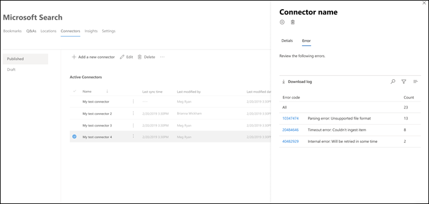

# Microsoft Search のためにコネクタを管理するManage your connector for Microsoft Search

コネクタにアクセスして管理するには、テナントの検索管理者として指定する必要があります。To access and manage your connectors, you must be designated as a search administrator for your tenant. テナント管理者に連絡して、検索管理者ロールのプロビジョニングを行います。Contact your tenant administrator to provision you for the search administrator role.

## はじめにGet started

1. [Microsoft 365 管理センター](https://admin.microsoft.com)にサインインします。Sign in to the [Microsoft 365 admin center](https://admin.microsoft.com).
2. [**設定** > ]**Microsoft 検索** > **コネクタ**に移動します。Go to **Settings** > **Microsoft Search** > **Connectors**.

各コネクタの種類について、 [Microsoft 365 管理センター](https://admin.microsoft.com)は次の表に示す操作をサポートしています。For each connector type, the [Microsoft 365 admin center](https://admin.microsoft.com) supports the operations shown in the following table:

**操作****Operation** | **Microsoft が構築したコネクタ****Microsoft-built connector** | **パートナーまたはカスタム作成コネクタ****Partner or custom-built connector**
--- | --- | ---
接続を追加するAdd a connection | : heavy_check_mark: ( [Microsoft が作成したコネクタを構成するを](configure-connector.md)参照):heavy_check_mark: (See [Configure your Microsoft-built connector](configure-connector.md)) | : x: (パートナーまたはカスタム構築コネクタ管理者 UX を参照してください):x: (Refer to your partner or custom-built connector admin UX)
接続を削除するDelete a connection | : heavy_check_mark::heavy_check_mark: | : heavy_check_mark::heavy_check_mark:
公開された接続を編集するEdit a published connection | : heavy_check_mark: Name:heavy_check_mark: Name   : heavy_check_mark: Description:heavy_check_mark: Description   : heavy_check_mark: 外部データソースの認証資格情報:heavy_check_mark: Authentication credentials for your external data source   : heavy_check_mark: オンプレミスのデータソースのゲートウェイ資格情報:heavy_check_mark: Gateway credentials for your on-premises data source   : heavy_check_mark: 更新スケジュール:heavy_check_mark: Refresh schedule   | : heavy_check_mark: Name:heavy_check_mark: Name   : heavy_check_mark: Description:heavy_check_mark: Description
下書き接続を編集するEdit a draft connection | : heavy_check_mark::heavy_check_mark: | エックス:x:

## 接続の状態を監視するMonitor your connection status
接続を作成すると、[ **Microsoft Search** ] ページの [**コネクタ**] タブに、処理されたアイテムの数が表示されます。After you create a connection, the number of processed items shows on the **Connectors** tab on the **Microsoft Search** page. 最初のフルクロールが正常に完了すると、定期的な増分クロールの進行状況が表示されます。After the initial full crawl completes successfully, the progress for periodic incremental crawls displays. このページでは、コネクタの毎日の操作に関する情報と、ログおよびエラー履歴の概要を提供します。This page provides information about the connector's day-to-day operations and an overview of the logs and error history.

各接続に対して、[**状態**] 列に4つの状態が表示されます。Four states show up in the **Status** column against each connection:
* **同期**します。**Syncing**. コネクタは、ソースからデータをクロールして、既存のアイテムのインデックスを作成し、更新を行います。The connector is crawling the data from the source to index the existing items and make any updates.
* **Enabled**: 接続が有効になっていますが、アクティブなクロールが実行されていません。**Enabled**: The connection is enabled, and there's no active crawl running against it. **最終同期時刻**は、最後に成功したクロールがいつ発生したかを示します。**Last sync time** indicates when the last successful crawl happened. この接続は、最後の同期時刻と同じになります。The connection is as fresh as the last sync time.
* **一時停止**します。**Paused**. クロールは、[一時停止] オプションを使用して管理者によって一時停止されます。The crawls are paused by the admins through the pause option. 次のクロールは、手動で再開した場合にのみ実行されます。The next crawl runs only when it's manually resumed. ただし、この接続からのデータは引き続き検索できます。However, the data from this connection continues to be searchable.
* **失敗しました**。**Failed**. 接続で重大なエラーが発生しました。The connection had a critical failure. このエラーには手動での介入が必要です。This error requires manual intervention. 表示されるエラーメッセージに基づいて、管理者は適切なアクションを実行する必要があります。The admin needs to take appropriate action based on the error message shown. エラーが発生するまでにインデックスが作成されたデータは検索可能になります。Data that was indexed until the error occurred is searchable.

### エラーを監視するMonitor errors
[**コネクタ**] タブ上の**アクティブな各コネクタ**について、既存のクロールエラーが [**エラー** ] タブに表示されます。タブには、エラーコード、各数、およびエラーログのダウンロードオプションが一覧表示されます。For each **Active Connector** on the **Connectors** tab, any existing crawl errors show under the **Error** tab. The tab lists error codes, the count of each, and error log download options. 次の画像の例を参照してください。See the example in the following image. エラー**コード**を選択して、エラーの詳細を表示します。Select an **error code** to view the error's details.

エラーの具体的な詳細を表示するには、エラーコードを選択します。To view an error's specific details, select its error code. エラーの詳細とリンクを含む画面が表示されます。A screen appears with error details and a link. 最新のエラーが一番上に表示されます。The most recent errors appear at the top. 次の表の例を参照してください。See the example in the following table.

任意の接続に対して表示できるさまざまなエラーの一覧を次に示します。Below is the list of different errors that can appear against any connection. これらの解決方法が機能しない場合は、サポートにお問い合わせいただくか (フィードバック) [コネクタ-feedback.md] をお送りください。If these solutions don’t work, contact support or send us (feedback)[connectors-feedback.md]. 

**エラー コード****Error code** | **エラー メッセージ****Error message** | **解決方法****Solution**
--- | --- | ---
10001000 | データソースを使用できません。The data source isn't available. インターネット接続を確認するか、コネクタでデータソースにアクセスできることを確認してください。Check your internet connection or make sure the data source is still accessible by the connector. | このエラーは、ネットワークの問題が原因でデータソースに到達できない場合、またはデータソース自体が削除、移動、または名前変更された場合に発生します。This error occurs when the data source is not reachable due to a network issue or when the data source itself is deleted, moved, or renamed. 指定したデータソースの詳細が有効であるかどうかを確認します。Check if the data source details provided are still valid.
10011001 | データソースがコネクタを調整しているため、データを更新できません。Can't update the data, because the data source is throttling the connector. | データソースのスロットルを停止するには、そのサイズ制限を増やすことができるかどうか、またはその日のトラフィックが少ない状態になるまで待機するかどうかを確認します。To unthrottle the data source, check if its scale limits can be increased or wait until a less traffic-heavy time of the day.
10021002 | データソースを使用して認証できません。Can't authenticate with the data source. このデータソースに関連付けられている資格情報が正しいことを確認します。Verify that the credentials associated with this data source are correct. | [**編集**] をクリックして、認証資格情報を更新します。Click **Edit** to update the authentication credentials.
10031003 | コネクタに関連付けられているアカウントには、アイテムにアクセスする権限がありません。The account associated with the connector doesn't have permission to access the item. |  インデックスを作成するアイテムに適切なアカウントがアクセスできることを確認します。Ensure the proper account has access to the item you want indexed.
10041004 | オンプレミスのデータゲートウェイに到達できません。Can't reach the on-premises data gateway. ゲートウェイサービスが実行中であることを確認します。Make sure the gateway service is running. | ゲートウェイがあるコンピューターに移動し、power bi ゲートウェイアプリケーションを開いて Power BI ゲートウェイが実行されているかどうかを確認します。Go to the machine which has the gateway and check if the Power BI gateway is running by opening the Power BI gateway application. Microsoft Search で使用されている管理者アカウントを使用して、ゲートウェイがサインインしているかどうかを確認します。Verify if the gateway is signed in with the admin account used for Microsoft Search. 
10051005 | このデータソースに関連付けられている資格情報は有効期限が切れています。Credentials associated with this data source have expired. 資格情報を更新し、接続を更新します。Renew the credentials and update the connection. | [**編集**] をクリックして、認証資格情報を更新します。Click **Edit** to update the authentication credentials. 
10061006 | ゲートウェイのバージョンが古いため、このコネクタをサポートしていません。Your gateway version is out of date and doesn’t support this connector anymore. ゲートウェイを更新する必要があります。You will need to update the gateway. | Gateway がインストールされているコンピューターに Power BI ゲートウェイhttps://docs.microsoft.com/data-integration/gateway/service-gateway-installの最新バージョンをダウンロードしてインストールするには、(オンプレミスのデータゲートウェイをインストールする) [] を参照してください。Please visit (Install an on-premises data gateway)[https://docs.microsoft.com/data-integration/gateway/service-gateway-install] to download  and install the latest version of the Power BI gateway on the machine containing the gateway.
20012001 | インデックスは、キューに大量の更新があるために調整されます。Indexing is throttled because of a large number of updates in the queue. キューによっては、更新が完了するまでに少し時間がかかることがあります。Depending on the queue, it can take some time for the updates to complete. | キューがクリアされるまで待機してください。Please wait until the queue gets cleared.
20022002 | アイテムの書式設定がサポートされていないため、インデックス付けに失敗しましたIndexing failed due to unsupported item formatting. | 詳細については、「コネクタ固有のドキュメント」を参照してください。See connector-specific documentation for more information.
20032003 | サポートされていないアイテムのコンテンツによってインデックス付けが失敗しました。Indexing failed due to unsupported item content. | 詳細については、「コネクタ固有のドキュメント」を参照してください。See connector-specific documentation for more information. 
20042004 | [ファイルサイズ](https://docs.microsoft.com/microsoftsearch/file-share-connector#content-requirements)が大きすぎてインデックス処理を行うことができません。The [file size](https://docs.microsoft.com/microsoftsearch/file-share-connector#content-requirements) is too large to be indexed. 処理の前に 100 MB 以下である必要があり、処理後 4 MB 未満である必要があります。It must be 100 MB or less before processing and no larger than 4 MB after processing. この場合、ファイルのインデックスは作成されません。The file gets indexed partially in this case. ファイルに含まれる語句が検索結果を返さない場合があります。Few phrases present in the file might not return a search result. |  
50005000 | 問題が発生しました。Something went wrong. この問題が解決しない場合は、サポートにお問い合わせください。If this continues, contact support. | 

## プレビューの制限事項Preview limitations
* Microsoft によって作成されたコネクタを**公開**する場合、接続が作成されるまで数分かかる場合があります。When you **publish** a Microsoft-built connector, it might take a few minutes for the connection to be created. その間、接続の状態は [保留中] と表示されます。During that time, the connection shows its status as pending. また、自動更新は行われないので、手動で更新する必要があります。Also, there's no auto-refresh, so you need to refresh manually.
* [Microsoft 365 管理センター](https://admin.microsoft.com)は、接続が公開された後の**検索スキーマ**の表示と編集をサポートしていません。The [Microsoft 365 admin center](https://admin.microsoft.com) doesn't support viewing and editing the **search schema** after a connection is published. 検索スキーマを編集するには、接続を削除してから、新しい接続を作成します。To edit the search schema, delete your connection and then create a new one.
* 接続の**更新スケジュール**を管理すると、各セッション中に同期するアイテムの数が表示されます。When you manage your connection's **refresh schedule**, the number of items that sync during each session are displayed. ただし、同期履歴は利用できません。However, the sync history isn't available.
