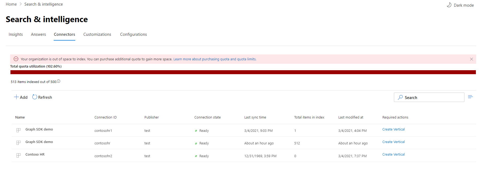

<!-- markdownlint-disable no-inline-html -->
# Microsoft Search のためにコネクタを管理する

コネクタにアクセスして管理するには、テナントの検索管理者として指定する必要があります。 テナント管理者に連絡して、検索管理者ロールのプロビジョニングを行います。

## 概要

[Microsoft 365 管理センター](https://admin.microsoft.com)の [[コネクタ] タブ](https://admin.microsoft.com/Adminportal/Home#/MicrosoftSearch/Connectors)に移動します。

各コネクタの種類について、 [Microsoft 365 管理センター](https://admin.microsoft.com) は次の表に示す操作をサポートしています。

Operation | Microsoft が構築したコネクタ | パートナーまたはカスタム作成コネクタ
--- | --- | ---
接続を追加する | : heavy_check_mark: ( [Microsoft が作成したコネクタを構成するを](configure-connector.md)参照) | : x: (パートナーまたはカスタム構築コネクタ管理者 UX を参照してください)
接続を削除する | : heavy_check_mark: | : heavy_check_mark:
公開された接続を編集する | : heavy_check_mark: Name   : heavy_check_mark: Description   : heavy_check_mark: 外部データソースの認証資格情報   : heavy_check_mark: オンプレミスのデータソースのゲートウェイ資格情報   : heavy_check_mark: 更新スケジュール   | : heavy_check_mark: Name   : heavy_check_mark: Description
下書き接続を編集する | : heavy_check_mark: | エックス

## 接続の状態を監視する

接続を作成すると、[ **Microsoft Search** ] ページの [**コネクタ**] タブに、処理されたアイテムの数が表示されます。 最初のフルクロールが正常に完了すると、定期的な増分クロールの進行状況が表示されます。 このページでは、コネクタの毎日の操作に関する情報と、ログおよびエラー履歴の概要を提供します。

各接続に対して、[ **状態** ] 列に4つの状態が表示されます。

* **同期**します。 コネクタは、ソースからデータをクロールして、既存のアイテムのインデックスを作成し、更新を行います。

* **Enabled**: 接続が有効になっていますが、アクティブなクロールが実行されていません。 **最終同期時刻** は、最後に成功したクロールがいつ発生したかを示します。 この接続は、最後の同期時刻と同じになります。

* **一時停止**します。 クロールは、[一時停止] オプションを使用して管理者によって一時停止されます。 次のクロールは、手動で再開した場合にのみ実行されます。 ただし、この接続からのデータは引き続き検索できます。

* **失敗**。 接続で重大なエラーが発生しました。 このエラーには手動での介入が必要です。 表示されるエラーメッセージに基づいて、管理者は適切なアクションを実行する必要があります。 エラーが発生するまでにインデックスが作成されたデータは検索可能になります。

### エラーを監視する

[**コネクタ**] タブ上の**アクティブな各コネクタ**について、既存のクロールエラーが [**エラー** ] タブに表示されます。タブには、エラーコード、各数、およびエラーログのダウンロードオプションが一覧表示されます。 次の画像の例を参照してください。 エラー **コード** を選択して、エラーの詳細を表示します。

エラーの具体的な詳細を表示するには、エラーコードを選択します。 エラーの詳細とリンクを含む画面が表示されます。 最新のエラーが一番上に表示されます。 次の表の例を参照してください。

任意の接続に対して表示できるさまざまなエラーの一覧を次に示します。 これらの解決方法が機能しない場合は、サポートに問い合わせるか、 [フィードバック](connectors-feedback.md)を送信してください。

エラー コード | エラー メッセージ | ソリューション
--- | --- | ---
1000 | データソースを使用できません。 インターネット接続を確認するか、コネクタでデータソースにアクセスできることを確認してください。 | このエラーは、ネットワークの問題が原因でデータソースに到達できない場合、またはデータソース自体が削除、移動、または名前変更された場合に発生します。 指定したデータソースの詳細が有効であるかどうかを確認します。
1001 | データソースがコネクタを調整しているため、データを更新できません。 | データソースのスロットルを停止するには、そのサイズ制限を増やすことができるかどうか、またはその日のトラフィックが少ない状態になるまで待機するかどうかを確認します。
1002 | データソースを使用して認証できません。 このデータソースに関連付けられている資格情報が正しいことを確認します。 | [ **編集** ] をクリックして、認証資格情報を更新します。
1003 | コネクタに関連付けられているアカウントには、アイテムにアクセスする権限がありません。 |  インデックスを作成するアイテムに適切なアカウントがアクセスできることを確認します。
1004 | オンプレミスのデータゲートウェイに到達できません。 ゲートウェイサービスが実行されていて、ゲートウェイの詳細が接続構成で更新されていることを確認してください。 | ゲートウェイを使用してコンピューターを確認し、Power BI ゲートウェイアプリケーションを開いて、ゲートウェイが実行されていることを確認してください。 ゲートウェイが Microsoft Search と同じ管理者アカウントを使用していることを確認してから、すべてのゲートウェイの詳細が接続構成で更新されていることを確認してください。
1005 | このデータソースに関連付けられている資格情報は有効期限が切れています。 資格情報を更新し、接続を更新します。 | [ **編集** ] をクリックして、認証資格情報を更新します。
1006 | ゲートウェイのバージョンが古いため、このコネクタをサポートしていません。 ゲートウェイを更新する必要があります。 | 「 [オンプレミスのデータゲートウェイをインストール](https://docs.microsoft.com/data-integration/gateway/service-gateway-install) する」を参照して、ゲートウェイが含まれているコンピューターに power BI ゲートウェイの最新バージョンをダウンロードしてインストールしてください。
1007 | 有効な Power BI ライセンスが検出されませんでした。 このクロールを実行するには、有効な Power BI ライセンスが必要です。 | このクロールを実行するには、有効な Power BI ライセンスが必要です。 組織に有効なライセンスがあるかどうかを確認します。 その場合は、もう一度試してください。 そうでない場合は、ライセンスを取得して、もう一度実行してください。
1008 | テナントのクォータ使用率の合計が上限に達しました。 クォータの一部を解放したり、取り込みフィルターを調整してデータを少なくしたりするには、接続を削除してみてください。 | クォータの一部を解放したり、取り込みフィルターを調整してデータを少なくしたりするには、接続を削除してみてください。 これらの方法で問題が解決しない場合は、Microsoft サポートにお問い合わせください。
2001 | インデックスは、キューに大量の更新があるために調整されます。 キューによっては、更新が完了するまでに少し時間がかかることがあります。 | キューがクリアされるまで待機してください。
2002 | アイテムの書式設定がサポートされていないため、インデックス付けに失敗しました | 詳細については、「コネクタ固有のドキュメント」を参照してください。
2003 | サポートされていないアイテムのコンテンツによってインデックス付けが失敗しました。 | 詳細については、「コネクタ固有のドキュメント」を参照してください。
5000 | 問題が発生しました。 この問題が解決しない場合は、サポートにお問い合わせください。 |

## インデックスクォータ使用率を監視する

プレビュー期間中は、すべての組織は、すべての接続で外部システムからのコンテンツにインデックスを作成するために最大200万アイテムの固定クォータを使用しています。

> [!NOTE]
> グラフコネクタのクォータは、プレビュー期間中は無料で利用できます。 これは一般的な可用性で変更されます。

利用可能なインデックスクォータと使用量が [コネクタ] ランディングページに表示されます。

クォータ使用率バーは、組織によるクォータ消費量に基づいたさまざまな状態を示します。

State | クォータ使用量
--- | ---
標準 | 1-69%
高 | 70-89%
重大 | 90%-99%
Full | 100%

インデックスが作成されたアイテムの数も、接続ごとに表示されます。 各接続によってインデックスが作成されたアイテムの数は、組織で使用可能なクォータの合計に影響します。

組織のインデックスクォータを超過すると、すべてのアクティブな接続が影響を受け、それらの接続は取り込むコンテンツを停止します。 この問題を解決するには、次のいずれかの操作を行います。

* 取り込まれたされているコンテンツが多すぎる接続を特定し、それらを更新して、クォータを確保するためのスペースを作成するアイテムの数を減らします。 接続を更新するには、新しい取り込みフィルターを使用して新しい接続を削除して作成する必要があります。これにより、アイテム数を減らすことができます。

* 1つまたは複数の接続を完全に削除する

* 組織のインデックスクォータ制限を増やす必要がある場合は、Microsoft にお問い合わせください。

## プレビューの制限事項

* Microsoft によって作成されたコネクタを **公開** する場合、接続が作成されるまで数分かかる場合があります。 その間、接続の状態は [保留中] と表示されます。 また、自動更新は行われないので、手動で更新する必要があります。

* [Microsoft 365 管理センター](https://admin.microsoft.com)は、接続が公開された後の**検索スキーマ**の表示と編集をサポートしていません。 検索スキーマを編集するには、接続を削除してから、新しい接続を作成します。

* 接続の **更新スケジュール**を管理すると、各セッション中に同期するアイテムの数が表示されます。 ただし、同期履歴は利用できません。

* 組織のクォータの使用率が重要またはそれを超えると、メッセージセンターで通知され **ません** 。  [コネクタの管理] ページを定期的にチェックして、構成された接続が組織の全体的なクォータ制限を超えていないことを確認します。
