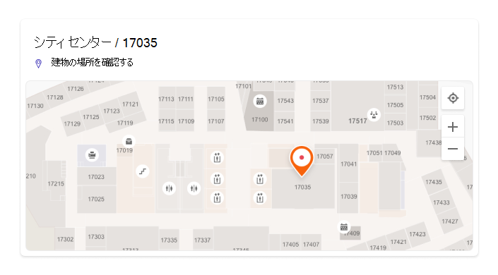
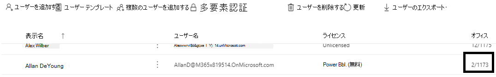
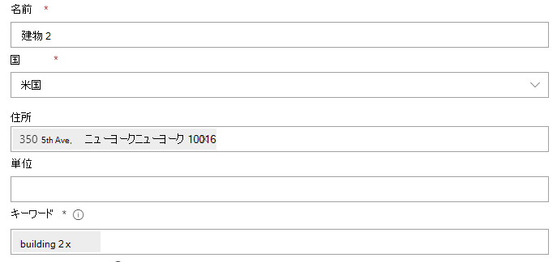
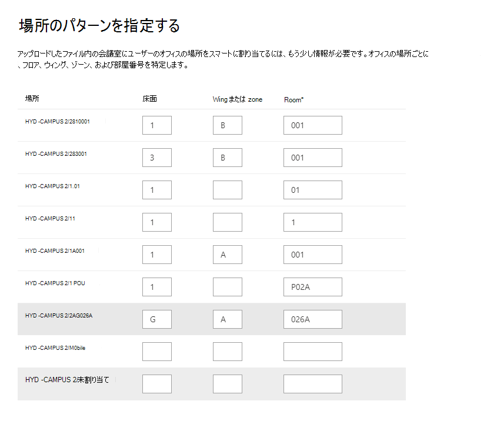

# 間取図を管理する

フロア プランは、Microsoft Search内のユーザー、部屋、スペースを見つけるのに役立ちます。 次の例のように、ユーザーのフルネーム、名、部屋名、または部屋の場所を含むクエリ パターンは、フロア プランを返します。

- Allan Deyoungのオフィスはどこにいますか?
- デイジーのオフィスはどこにあるのですか?
- 建物 2 階 3
- Workspace-1
- B1/1.20

## ユーザーのエクスぺリエンス

ユーザーは、フロア プランの回答[を](https://bing.com)、Bing、SharePoint、Office 365[で表示できます](https://office.com)。  検索やアドレス バー Bingなど、Windows結果を返Microsoft Edgeエントリ ポイントもサポートされています。 ユーザーが部屋の名前または場所を検索すると、フロア プランの回答に関心のあるポイントが表示されます。

> [!div class="mx-imgBorder"]
> 

ユーザーのオフィスを検索すると、同じような回答が表示されます。その人のプロフィール画像がマーカーに表示されます。

> [!div class="mx-imgBorder"]
> 

## 間取りを追加する

次の手順に従って、フロア プランの回答を設定Microsoft Search。

### 手順 1: 建物コードを決定する

建物コードは、ユーザーのオフィスの場所の一部として使用されます。 これらのコードは、ユーザー プロファイルの更新時に使用します。 たとえば、組織にこの住所に建物が含まれるとします *。Building 2, 350 5th Avenue, New York City, NY 10016*

建物のコードの良い例を次に示します。2、B2、Building2、Building 2、または NYCB2。 各建物には一意のコードが必要です。

### 手順 2: 間取りを確認する

フロア プラン ファイルは、テキスト ラベルをサポートする DWG 形式である必要があります。 テキスト ラベルがルームにマークを付け、ルーム ラベルと呼ばれる。 ラベルの種類が異なる DWG ファイルの例を次に示します。

| ルーム ラベルを含むテキスト ラベル | テキスト ラベルが部屋ラベルなし | テキスト ラベルなし |
|:-----:|:-----:|:-----:|
||||

ベスト プラクティスとして、DWG テキスト ラベルには、フロア番号、ウィング番号 (該当する場合)、および部屋番号をその順序で含む必要があります。 テキスト ラベル [形式の例](#frequently-asked-questions) 、および DWG ファイルの表示と更新に関する詳細については、「FAQ」を参照してください。

### 手順 3: ユーザー プロファイルのオフィスの場所を更新する

ユーザーのオフィスの場所は、建物コードと部屋ラベルの組み合わせです。 たとえば、建物コードが *2* で、部屋ラベルが *1173* の場合、オフィスの場所は *2/1173 になります*。

割り当てられた作業場所を持つユーザーのオフィスの場所を追加または更新します。 この操作は、Microsoft 365 管理センターまたはAzure Active Directory 管理センターのユーザー プロファイル、またはオンプレミスの Active Directory (管理者と同期) から行Azure Active Directory。 *PhysicalDeliveryOfficeName* は、オフィスの場所に使用されるフィールドです。 部屋のラベルにフロア番号が含されていない場合は [、「FAQ」のヒントを](#frequently-asked-questions) 参照してください。

この例では、Allan のオフィスは、2 号館の 1 階の 1173 号室にあります。

> [!div class="mx-imgBorder"]
> 

会議室の間取り図を設定するには、会議室の [会議室]セクション&にオフィスの場所を追加Microsoft 365 管理センター。 詳細については、「部屋メールボックスと [備品用メールボックスをセットアップする」を参照してください](/microsoft-365/admin/manage/room-and-equipment-mailboxes#set-up-room-and-equipment-mailboxes)。 組織内のユーザーが会議またはイベントの会議室またはリソースをスケジュールできる場合は、「会議室メールボックスが会議出席依頼を処理する方法を変更する」 [を参照してください](/Exchange/recipients/room-mailboxes#change-how-a-room-mailbox-handles-meeting-requests)。 ルーム メールボックスの設定を含むワークスペースの構成の詳細については、「Book a workspace in the workspace in Outlook」[を参照してください](https://techcommunity.microsoft.com/t5/exchange-team-blog/book-a-workspace-in-outlook/ba-p/1524560)。

### 手順 4: オフィスの場所を確認する

[Microsoft Searchを使用して、ユーザーを検索し、自分のオフィスの場所が正しく表示されていることを確認します。 更新プログラムが検索結果に表示されるまで **最大 72** 時間待機する必要がある場合があります。

> [!div class="mx-imgBorder"]
> 

### 手順 5: 建物の場所を追加する

間取り図では [、場所を使用](manage-locations.md) して建物を定義します。 [場所] [Microsoft 365 管理センター](https://admin.microsoft.com)移動し、[追加] を **選択します**。 建物の名前、住所、キーワードを入力します。 必要な数の建物を追加します。

> [!div class="mx-imgBorder"]
> 

場所の詳細については、「場所の管理 [」を参照してください。](manage-locations.md)

### 手順 6: オフィスの場所を収集して整理する

間取り図をアップロードする前に、オフィスの場所にインデックスを作成する必要があります。 この 1 回の操作で、完了に最大 48 時間かかる場合があります。 合計時間は、組織のサイズによって異なります。

管理 [センターで、フロア プラン] [**に移動**](https://admin.microsoft.com/Adminportal/Home#/MicrosoftSearch/floorplans)し、[インデックス作成の開始 **] を選択します**。 この通知が表示されていない場合、この手順は組織で既に完了しています

### 手順 7: アップロード計画を作成する

1. 管理センター [で、フロア プラン] [**に移動します**](https://admin.microsoft.com/Adminportal/Home#/MicrosoftSearch/floorplans)。

2. ドロップダウン リストで建物を選択し、[次へ] を **選択します**。 建物が一覧に表示されていない場合は、戻って建物の [場所を追加します](#step-5-add-building-locations)。

3. **[アップロード] を** 選択し、アップロードする間取りを選択します。

4. アップロードが完了したら、フロア プラン ファイルに表されるフロア番号を入力する必要があります。 [**次へ**] を選択します。

5. (省略可能)床に翼や領域がある場合は、その詳細を入力します。

6. フロア プランにマップされたオフィスの場所の数を示すレビュー画面が表示されます。 [ **詳細] を** 選択して、マッピングが正しいか確認します。
    - ユーザーがマップされていないか、マッピングに満足できない場合は、[マッピングの続行] **を選択します**。
    - 発行するには、[スキップして発行 **する] を選択します**。

1. この間取り図の建物コードを入力します。 建物コードは、ユーザーのオフィスの場所プロパティにあります。 たとえば、ユーザーのオフィスの場所が **2/1173** の場合、建物コードは **2 です**。

1. 確認画面で、手順 6 を繰り返してマッピングが正しいか確認します。 マッピングに問題がなければ、[マッピングの続行] と[スキップして発行]**を選択します**。 表示されない場合は、[マッピング **の続行] を** 選択し、[場所パターンの指定] 画面に移動します。

1. (省略可能)Azure ディレクトリ内のこの建物のすべての一意の場所パターンの名前付けロジックを確認して特定し、[次へ] を **選択します**。

1. 確認画面で、手順 6 を繰り返してマッピングが正しいか確認します。

1. 準備が整ったら、[発行]**を選択** して、フロア プランを Microsoft Search。

> [!NOTE]
> **間取りが公開されるには 48 時間かかります。** その後、同僚のオフィスを検索すると、以下のような間取り図の結果が表示されます。

> [!div class="mx-imgBorder"]
> 

### 手順 8: (オプション) 場所のパターンを指定する

間取り図をアップロードすると、部屋のテキスト ラベルがユーザーのプロファイル内のオフィスの場所と比較されます。 手順 2 および手順[3](#step-2-review-your-floor-plans)で推奨される名前付けパターンに従ってオフィスの場所やテキスト ラベルが一貫しない場合は、[場所パターンの指定] 画面を使用して、マッピングを完了するために詳細な情報を追加します。 場所パターンは、AAD オフィスの場所からフロア、ウィング、およびルームの情報を抽出するために使用されます。

> [!div class="mx-imgBorder"]
> 

床と翼はオプションで、部屋だけが必要であり、必要に応じて場所をスキップできます。

## 間取りを更新する

既存の間取り図を更新する前に、AAD のオフィスの場所が最新であり、AAD 更新プログラムが処理されるのを 48 時間待機している必要があります。 間取りを更新するには、[間取り] に移動し、間取り図の建物を選択し、[編集] を **選択します**。 フロア プランが構造的に変更されている場合は、たとえば、変更のために古いファイルを削除してから、新しい DWG ファイルをアップロードして発行します。

> [!NOTE]
> ユーザーが既にマップされているフロアに移動するときに、間取りを更新する必要はない。 新しいオフィスの場所を反映するようにユーザー プロファイルを更新します。
>
> - [アカウント] Microsoft 365 管理センター ([アクティブ ユーザー] >[>連絡先情報の管理] )
> - Azure Active Director 管理センター ([ユーザー] >プロファイル>連絡先情報の編集)
> - on-prem Active Directory (同期先のユーザーに同期Azure Active Directory)

## 間取りを削除する

1 つの間取り図を削除するには、[間取り] [に移動して](https://admin.microsoft.com/Adminportal/Home#/MicrosoftSearch/floorplans) 、建物を選択します。 次に、間取りを選択し、[削除] を **選択します**。 建物のすべての間取りを削除するには、[場所] に 移動し、建物を選択し、[削除] を選択 **します**。  

## トラブルシューティング

| 手順 | エラー メッセージ | タイプ | 操作 |
|:-----|:-----|:-----|:-----|
|アップロード間取り図|CC_1.dwg を読み取りできません。 間取り図を再アップロードまたは削除してください。|Error|ファイルのアップロードを再試行してください。 それでも問題が生じなかった場合は、ファイルを削除してもう一度やり直してください。|
|アップロード間取り図|CC_1.dwg という名前の 2 つのファイルがあります。 そのうちの 1 つを削除するか、別の名前で再アップロードしてください。|Error|ファイル名が正しくない場合は、フロア番号またはウィング番号を追加して一意のファイル名を作成し、再度アップロードします。 誤って同じファイルを 2 回追加した場合は、そのうちの 1 つを削除してください。|
|アップロード間取り図|データが見つかりません。|Error|ファイルを確認して、ファイルが正しいファイルか確認してから、もう一度アップロードするか、削除します。|
|アップロード間取り図|このファイルに外部参照がありません。 CC_1_furniture.dwg をアップロードするか、このファイルを削除します。|警告|アップロード参照ファイルを削除または削除します。|
|アップロード間取り図|DWG ファイル内の部屋番号またはタグを読み取る必要があります。 このファイルを削除してください。|警告|DWG ファイルを確認して、データが含まれているか確認してから、ファイルを削除してもう一度やり直してください。|
|オフィスの場所をリンクする|この場所にオフィスの場所Azure Active Directory。 フロア プランを設定する前Azure Active Directoryに場所データを追加します。|Error|[ユーザー プロファイルのオフィスの場所を更新する](#step-3-update-office-locations-on-user-profiles) |

## よく寄せられる質問

**Q:** DWG ファイルを表示および編集する方法

**A:** 次のオプションを使用して、DWG ファイルを表示します。

- アップロードファイルを開SharePoint開きます。
- Microsoft ファイルまたは[Autodesk DWG](https://support.office.com/article/Open-insert-convert-and-save-DWG-and-DXF-AutoCAD-drawings-60cab691-0f4c-4fc9-b775-583273c8dac5) TrueView Visio[ファイルを開きます](https://www.autodesk.com/products/dwg)。
- アップロードを[Autodesk のオンライン ビューアーに保存します](https://viewer.autodesk.com/)。

DWG ファイルは、任意の DWG エディターで作成または編集できます (図面または autodesk Visioを含AutoCAD。 [プランをVisioするには、「間取[り図を作成する」を参照してください](https://support.microsoft.com/office/create-a-floor-plan-ec17da08-64aa-4ead-9b9b-35e821645791)。 1 つの DWG ファイルの最大ファイル サイズは 16 MB です。

**Q:** マークされていない会議室にテキスト ラベルを追加する方法

**A:** エディターで DWG ファイルを開き、部屋 [のラベルを追加します](https://knowledge.autodesk.com/support/autocad-map-3d/learn-explore/caas/CloudHelp/cloudhelp/2019/ENU/MAP3D-Learn/files/GUID-4854F184-6279-4E0C-9487-34A4759017F6-htm.html)。

**Q:** DWG ファイルのテキスト ラベルに最適な形式は何ですか?

**A:** 最適な結果を得る場合は、DWG テキスト ラベルは、フロア番号、ウィング番号 (該当する場合)、および部屋番号を含む 1 行の順序である必要があります。 次の例では、建物コードに 2 または CITY CENTER を使用します。
<!-- markdownlint-disable no-inline-html -->
|ルーム ラベルの種類|Floor|Wing/Zone|Room|サンプル テキスト ラベル|Office場所 (建物コード/テキスト ラベル)|
|:-----|:-----|:-----|:-----|:-----|:-----|
|床と部屋の番号を持つ|1| |173|1173|2/1173|
|| 21| |45|21045|2/21045|
||23| |100K|23-100K|2/23-100K|
||1| |G06-07|1G06-07|CITY CENTER/1G06-07|
||2| |1024A|02.1024A|CITY CENTER/02.1024A|
|床、翼、および部屋番号を持つ|1|A|173|1A173|2/1A173
||2|Z1|128b|2Z1128b|2/2Z1128b

また、DWG ファイルには、部屋の寸法やアーキテクト名などの余分なテキスト ラベルは含めかねない。

**Q:** テキスト ラベルに文字制限はありますか?

**A:** テキスト ラベルは 1 行である必要があります。 特殊文字は、建物コードや部屋のラベルには使用できますが、床や翼の値には使用できません。

**Q:** フロア番号を含めない DWG ファイルを使用できますか?

**A:** DWG テキスト ラベルにはフロア番号が含まれるのをお勧めしますが、必須ではありません。手順 2 の名前付けパターン [を参照してください](#step-2-review-your-floor-plans)。 また、ユーザーの連絡先情報に、オフィスの場所の一部としてフロア番号を含める必要があります。 DWG ファイルをアップロードした後、オプションの [場所パターンの指定] 画面を使用して、これらの標準以外のラベルのマッピング プロセスを完了する必要があります。

たとえば、部屋番号が含まれるが、フロア番号がない DWG ファイルは、次のようになります。

> [!div class="mx-imgBorder"]
> 

ユーザーのプロファイルのオフィスの場所は 2/1175 で、'2' は建物コード、'1' はフロア番号、'175' は部屋番号です。

**Q:** 建物の場所を追加しましたが、間取りを追加するオプションが表示されません。

**A:** 最近追加または更新された建物の場所は、まだ検索インデックスに含めていない可能性があります。 検索結果に新しい場所または変更された場所が表示されるには数時間かかる場合があります。 また、建物に下書きまたは公開された間取り図がある場合は、建物名を選択してから、計画を追加します。

**Q:** [建物の選択] リストに場所の完全な一覧が表示されません。

**A:** [建物の選択] リストには、間取りがない建物だけが表示されます。 下書きまたは公開済み間取り図が 1 つ以上ある建物の場合は、リストで建物を選択してからアップロードすることで、さらに間取り図を追加します。

**Q:** アップロードできる間取り計画の数に制限はありますか?

**A:** いいえ。 建物ごとに、または組織ごとに、最大はありません。

**Q:** 1 つのフロア内の複数の翼/領域の計画を含む DWG ファイルを使用できますか?

**A:** すべてのプランが同じフロア用である限り、複数の翼/領域の間取り図を含む DWG ファイルをアップロードできます。 テキスト ラベルとオフィスの場所が、手順 [2](#step-2-review-your-floor-plans) と手順 3 の名前付けのベスト プラクティスに [従っている必要があります](#step-3-update-office-locations-on-user-profiles)。

DWG ファイルに複数の翼のデータが含まれている場合は、アップロード時に翼フィールドを空白のままにします。

**Q:** 同じフロアに対して 2 つの DWG ファイルをアップロードできますか。1 つはフロアが定義されているだけで、もう 1 つはフロアとウィングが定義されている場合にアップロードできますか。

**A:** 同じフロアに複数の DWG ファイルをアップロードできますが、各ファイルのウィングまたはゾーンを指定する必要があります。 次の例では、次の画面に移動するには、FloorPlan1.dwg ファイルの Wing または zone 値を入力する必要があります。 平面図ファイルに翼が含めなかったり、複数の翼がある場合は、[Wing] または [ゾーン] フィールドに 0 または X のような値を入力して続行します。

> [!div class="mx-imgBorder"]
> 

**Q:** 複数の間取り図を同時にアップロードおよび更新できますか?

**A:** 1 つの建物の複数の間取り図を同時にアップロードできます。 複数の建物の間取り図のインポートなど、一括操作は使用できません。

**Q:** 組織には何百人ものユーザーがいます。 各場所のパターンを指定する必要がありますか?

**A:** いいえ。 手順 [2](#step-2-review-your-floor-plans) と手順 [3](#step-3-update-office-locations-on-user-profiles)でラベルとオフィスの場所に関する書式設定の推奨事項に従い、手順 [7](#step-7-upload-floor-plans)でアイテム 1 ~ 8 を完了した場合は、場所のパターンを指定する必要があります。

ただし、ユーザーがまだマップされていないか、マッピングに満足していない場合は、オプションの [手順 8 を実行します](#step-8-optional-specify-location-patterns)。 手順 8 では、Azure サイトで見つかった各一意の場所パターンを定義しADコードを定義する必要があります。 たとえば、1,000 のオフィスを持つ A 棟の間取り図をアップロードします。 建物 A のオフィスでは、5 つの異なる場所パターンが使用されます。場所のパターンを指定する場合は、Azure サーバーに表示される 5 つのパターンをAD必要があります。

**Q:** ユーザーが割り当てられていない会議室、会議室、またはスペースの間取り図の回答を作成できますか?

**A:** はいできますよ。 会議室を会議室と備品のリストに追加します。 詳細については、「部屋メールボックスと [備品用メールボックスをセットアップする」を参照してください](/microsoft-365/admin/manage/room-and-equipment-mailboxes#set-up-room-and-equipment-mailboxes)。 組織内のユーザーが会議またはイベントの会議室またはリソースをスケジュールできる場合は、「会議室メールボックスが会議出席依頼を処理する方法を変更する」 [を参照してください](/Exchange/recipients/room-mailboxes#change-how-a-room-mailbox-handles-meeting-requests)。 ルーム メールボックスの設定を含むワークスペースを構成するには、「ワークスペースを予約する」に関する記事を参照[Outlook。](https://techcommunity.microsoft.com/t5/exchange-team-blog/book-a-workspace-in-outlook/ba-p/1524560) 間取り図については、手順 2 の DWG ルーム ラベルと手順 [3](#step-2-review-your-floor-plans) のプロファイルの場所に関する推奨事項 [に従います](#step-3-update-office-locations-on-user-profiles)。 ルームまたはワークスペースを追加した後、フロア プランをアップロードする前にインデックスが更新されるのを 72 時間待機する必要があります。

**Q:** 間取り図を追加するためのすべての手順が完了しました。 検索結果に表示されないMicrosoft Search。

**A:** 間取り回答へのリンクが検索結果ページの中央に表示される場合があります。 この種類のランク付けは、回答が検索意図と一致する自信が低い場合に発生します。 結果ページに情報が表示されない場合は、検索がサポートされているクエリ パターン (AAD に表示されるオフィス名、ユーザー名、またはオフィスの場所) に従うのを確認します。 部分またはあいまいな単語の一致は、間取り検索ではサポートされていません。

**Q:** 組織のワークスペースの間取り図を追加しました。 ワークスペースを予約するときに表示されない理由は、Outlook。

**A:** 現時点では、モバイルOutlookワークスペースの間取り計画のみをサポートしています。 デスクトップ アプリまたは Web アプリでは使用できません。 詳細については、「ワークスペースを予約する」の記事[を](https://techcommunity.microsoft.com/t5/exchange-team-blog/book-a-workspace-in-outlook/ba-p/1524560)参照Outlook。

**Q:** ユーザーは、間取り回答から会議室を予約できますか?

**A:** 間取り図の回答には、部屋を予約または予約する機能は含めではありません。 会議室を[予約するには、](https://support.microsoft.com/office/use-the-scheduling-assistant-and-room-finder-for-meetings-in-outlook-2e00ac07-cef1-47c8-9b99-77372434d3fa)スケジュール アシスタントまたは会議室Outlookを使用します。

**Q:** 場所パターンを指定する必要があるシナリオを説明できますか?

**A:** たとえば、コード 'Design B' を含む建物を持ち、1 階の 'F1' のプランを追加しようとしているとします。 ユーザーのプロファイルのオフィスの場所には、フロアのキュービクル番号を示す次の値があります。

- ユーザー 1: DesignB/F121
- ユーザー 2: DesignB/F122
- ユーザー 3: DesignB/F123
- ユーザー 4: DesignB/F124
- ユーザー 5: DesignB/F1-25
- ユーザー 6: DesignB/F1-26

フロアの DWG ファイルには、同じキュービクルの次のテキスト ラベルがあります。

-  21
- 22
- 23
- 24
- 25
- 26

ユーザーのプロファイルに表示されるオフィスの場所と対応するテキスト ラベル (DesignB/F121 と 21、DesignB/F1-25、25) の違いにより、Microsoft Search は一致しません。 ファイルのアップロード後、最初のレビューでは、場所がマップされていないと表示されます。 マッピングを続行し、[オフィスの場所のリンク] ステージで、建物コード DesignB を入力します。

2 番目のレビュー 段階では、Microsoft Search はユーザーのオフィスの場所の建物コード値を無視し、オフィスの場所とテキスト ラベル (F121 と 21、F1-25、25) の一致を再度試みます。 2 番目のレビューでは、ゼロの場所がマップされています。 もう一度マッピングを続行する必要があります。 この時点で、場所のパターンを指定するように求めるメッセージが表示されます。

場所のパターンを指定する場合は、すべてのオフィスに情報を追加する必要は一つで、Azure AD に表示される一意のパターンに対してのみです。  この段階では、Microsoft Search一意の場所パターンを決定しますが、アップロードした間取り図に限定されません。 このシナリオのユーザーには、2 つの固有の場所パターンがあります。 パターンごとにランダムに選択された場所が表示されます。 対応する床と部屋の値を入力します。

|Location|&nbsp;|Floor|ウィングまたはゾーン|Room|
|:-----|:-----|:-----|:-----|:-----|
|DesignB/F123| |F1 | |23|
|DesignB/F1-26| |F1| |-26|

次にMicrosoft Searchパターンを使用する建物内のすべての場所に照合ロジックを適用し、次の 2 つのチェックを実行します。

1. Rooms の場合、値は DWG ファイル内のテキスト ラベルと一致しますか?
1. 連結した場合、Floor、Wing、Room の値は、DWG ファイル内のテキスト ラベルと一致しますか?

いずれかのチェックが一致を返す場合、そのパターンの場所マッピングが成功し、最終ステージに移動します。 [準備完了] ステージで、間取り計画の場所にマップされたユーザーの数が表示されます。 確認するには、[詳細] ウィンドウに移動します。 このシナリオでは、ユーザー 1 ~ 4 だけがマップされます。 ユーザー 5 と 6 をマップするには、指定したパターンである DesignB/F125 に従ってユーザー プロファイルを更新する方法が推奨されます。 また、DWG ファイル内のテキスト ラベルを編集して、25 ではなく-25 という一意のパターンに一致することもできます。
