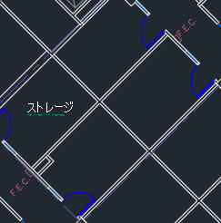
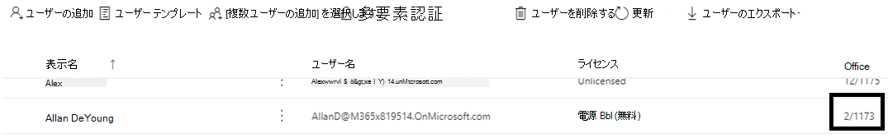
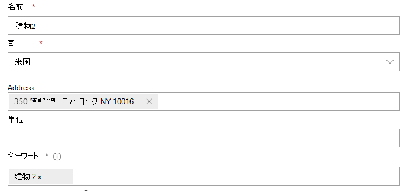
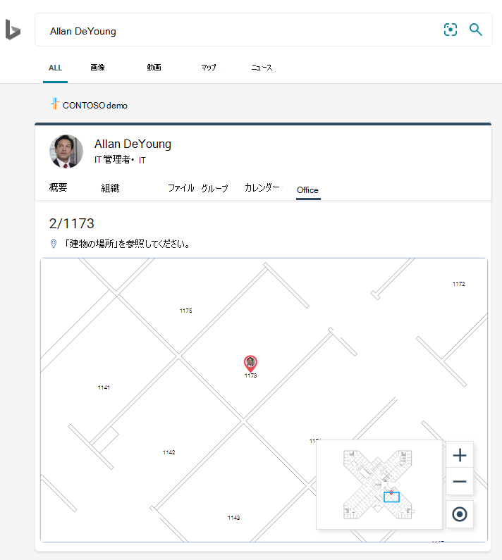
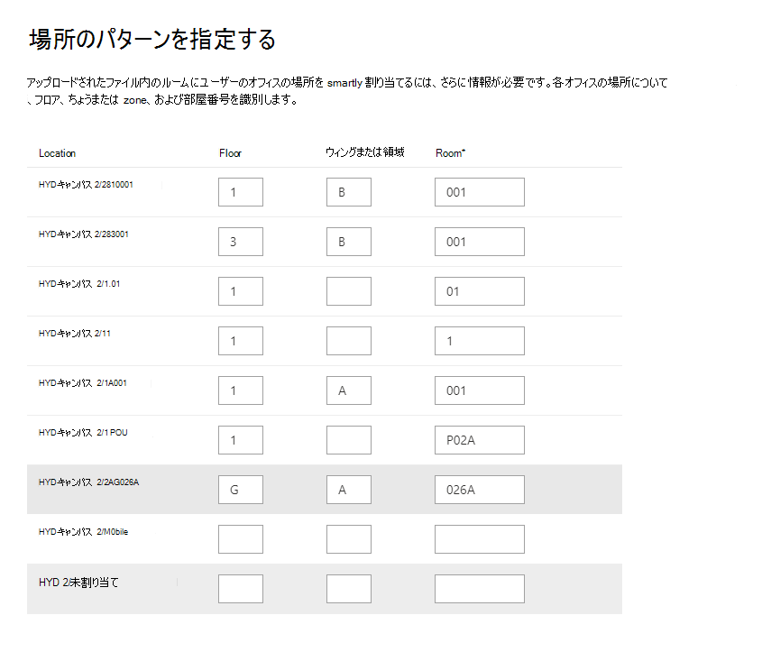

# 間取図を管理するManage floor plans

**Microsoft Search**のフロアプランは、ユーザーが建物内の人物や会議室を見つけられるように支援します。Floor plans in **Microsoft Search** help users find people and meeting rooms within a building. フロアプランでは、次の質問に回答します。Floor plans answer the following questions:

- Allan の office はどこにありますか?Where is Allan Deyoung's office?
- ビル2階3Building 2 floor 3
- 2/11173 を検索するFind 2/11173

## フロアプランを追加するAdd floor plans

次の手順に従って、 **Microsoft Search**でフロアプランの回答を設定します。Follow these steps to setup floor plans answers in **Microsoft Search**.

### 手順 1: 建物コードを決定するStep 1: Determine your building codes

作成コードは、ユーザーのオフィスの場所の一部として使用されます。Building codes are used as part of a user's office location. ユーザープロファイルを更新するときには、次のコードを使用します。You'll use these codes when updating user profiles. たとえば、次のような場所に組織があるとします。*ビル2、350 5 の3要素、ニューヨーク市、NY 10016*Let's say your organization has a building at this location: *Building 2, 350 5th Avenue, New York City, NY 10016*

この建物のコードには、2、B2、Building2、建物2、NYCB2 のいずれかの適切な例があります。Here are some good examples for this building's code: 2, B2, Building2, Building 2, or NYCB2. 各建物に固有のコードを指定する必要があります。Each building must have a unique code.

### 手順 2: フロアプランを確認するStep 2: Review your floor plans

フロアプランファイルは、DWG 形式である必要があります。DWG ファイルには、テキストラベルを含めることができます。Floor plans files must be in DWG format; DWG files can contain text labels. テキストラベルがルームをマークすると、そのラベルはルームラベルと呼ばれます。When a text label marks a room, it is called a room label. DWG ファイルには、ラベルが付いている少なくとも**10 個のルーム**が必要です。The DWG file must have **at least 10 rooms** marked with labels. ラベルの種類が異なる DWG ファイルの例を次に示します。Here are some examples of DWG files with different label types:

|**部屋のラベルを含むテキストラベル****Text labels including room labels**|**スペースラベルのないテキストラベル****Text labels but no room labels**|**テキストラベルなし****No text labels**|
|:-----:|:-----:|:-----:|
||||

DWG ファイルの表示と更新の詳細については、「 [FAQ](#frequently-asked-questions) 」セクションを参照してください。See the [FAQ](#frequently-asked-questions) section for information on viewing and updating DWG files.

### 手順 3: ユーザープロファイルのオフィスの場所を更新するStep 3: Update office locations on user profiles

ユーザーのオフィスの場所とは、建物コードとルームラベルの組み合わせです。A user's office location is a combination of a building code and a room label. たとえば、建物のコードが*2*で、会議室のラベルが*1173*の場合、オフィスの場所は*2/1173*になります。For example, if the building code is *2* and the room label is *1173*, the office location would be *2/1173*.

組織内の各ユーザーのオフィスの場所を追加または更新します。Add or update office locations for each user in your organization. Microsoft 365[管理センター](https://admin.microsoft.com)のユーザープロファイルでオフィスの場所を変更するか、オンプレミスの active directory を変更して Azure active directory と同期することができます。You can change office location on the user profile in the Microsoft 365 [admin center](https://admin.microsoft.com) or you can change in your on-premises Active Directory to sync into Azure Active Directory. *Physicaldeliveryofficename*は、office の場所として使用されるフィールドです。*PhysicalDeliveryOfficeName* is the field that is used for office location. 部屋のラベルに床数字が含まれていない場合は、ヒントについての FAQ を参照してください。If your room labels do not include floor numbers, see the FAQ for tips.

この例では、すべての office がビル2のフロア1の部屋1173にあります。In this example, Allan's office is in room 1173 on floor 1 of building 2.

> [!NOTE]
> フロアプランを検索するときに更新された office の場所を表示するには、各フロアで少なくとも**10 人**のオフィスの場所を更新する必要があります。To see updated office locations when searching for floor plans, you must update office locations for **at least 10 people** on each floor.

### 手順 4: office の場所を確認するStep 4: Verify office location

**Microsoft Search**を使用して、ユーザーを検索し、オフィスの場所が正しく表示されていることを確認します。Use **Microsoft Search** to find a user and verify that their office location is appearing correctly. 場所が更新されたばかりの場合は、更新プログラムが検索結果に表示されるまで最大**72 時間**待機する必要があります。If you have just updated locations, you may need to wait up to **72 hours** for the updates to appear in the search results.

### 手順 5: 建物の場所を追加するStep 5: Add building locations

フロアプランでは、[場所](manage-locations.md)を使用して建物を定義します。Floor plans uses [Locations](manage-locations.md) to define your buildings. Microsoft 365[管理センター](https://admin.microsoft.com)で、[microsoft Search アンサーの**設定**] の場所に移動し、[  >  **Microsoft Search**  >  **Answers**  >  [**Locations**](https://admin.microsoft.com/Adminportal/Home#/MicrosoftSearch/locations)**追加**] を選択します。In the Microsoft 365 [admin center](https://admin.microsoft.com), go to **Settings** > **Microsoft Search** > **Answers** > [**Locations**](https://admin.microsoft.com/Adminportal/Home#/MicrosoftSearch/locations), and then select **Add**. 建物の名前、アドレス、およびキーワードを入力します。Enter the name, address, and keywords for the building. 必要な数の建物を追加します。Add as many buildings as you need.

場所の詳細については、「[場所を管理](manage-locations.md)する」を参照してください。For more details about locations, see [Manage Locations](manage-locations.md)

### 手順 6: オフィスの場所を収集して整理するStep 6: Gather and organize office locations

フロアプランを使用するには、office の場所にインデックスを付ける必要があります。Before you can use floor plans, office locations must be indexed. これは、完了するまでに最大48時間かかる1回限りの操作です。This is a one-time operation that can take up to 48 hours to complete. 合計時間は、組織の規模によって異なります。The total time will depend on the size of your organization.

[管理センター](https://admin.microsoft.com)で、[**設定**] の  >  [**Microsoft 検索**  >  **応答**] フロアプランに移動し、[  >  [**Floor plans**](https://admin.microsoft.com/Adminportal/Home#/MicrosoftSearch/floorplans)**開始**] を選択します。In [admin center](https://admin.microsoft.com), go to **Settings** > **Microsoft Search** > **Answers** > [**Floor plans**](https://admin.microsoft.com/Adminportal/Home#/MicrosoftSearch/floorplans), and then select **Get started**. この通知が表示されていない場合、この手順は組織に対して既に完了しています。If you don't see this notice, this step has already been completed for your organization

### 手順 7: フロアプランをアップロードするStep 7: Upload floor plans

1. [管理センター](https://admin.microsoft.com)で、[**設定**] の [  >  **Microsoft 検索**  >  **応答**]  >  [**フロアプラン**](https://admin.microsoft.com/Adminportal/Home#/MicrosoftSearch/floorplans)に移動します。In the [admin center](https://admin.microsoft.com), go to **Settings** > **Microsoft Search** > **Answers** > [**Floor plans**](https://admin.microsoft.com/Adminportal/Home#/MicrosoftSearch/floorplans).
2. ドロップダウンリストで建物を選択し、[**次へ**] を選択します。Select a building in the drop-down list and select **Next**. 建物が表示されていない場合は、前の手順に戻って、[建物の場所を追加](#step-5-add-building-locations)します。If the building isn't listed, go back and [add building locations](#step-5-add-building-locations).
3. [**ファイルのアップロード**] を選択し、アップロードするフロアプランを選択します。Select **Upload files**, and then choose the floor plan you are uploading.
4. アップロードが完了すると、フロアプランファイルに表示されるフロア番号を入力する必要があります。When the upload is complete, you must enter floor number that is represented in the floor plan file. [**次へ**] を選択します。Then select **Next**.
5. オプションフロアに翼または領域がある場合は、その詳細を入力します。(Optional) If your floor has wings or zones, enter that detail.
6. フロアプランにマップされたオフィスの場所の一覧を示すレビュー画面が表示されます。You will see a review screen listing how many office locations were mapped to the floor plans. [**詳細**] を選択して、マッピングが正しいことを確認します。Select **Details** to ensure the mapping is correct.
    - マップされているユーザーがない場合、またはマッピングに満足していない場合は、[**マッピングの続行**] を選択します。If no users are mapped or you're not satisfied with the mapping, select **Continue mapping**. 発行するには、[**スキップして発行**] を選択します。To publish, select **Skip and publish**.
7. このフロアプランの建物コードを入力します。Enter the building code for this floor plan. 構築コードは、ユーザーの office location プロパティにあります。The building code can be found on users' office location property. たとえば、ユーザーのオフィスの場所が**2/1173**の場合、建物のコードは**2**になります。For example, if a user's office location is **2/1173**, then the building code is **2**.
8. [確認] 画面で、手順6を繰り返して、マッピングが正しいことを確認します。On the review screen, repeat step 6 to ensure the mapping is correct.
9. オプションアップロードされたすべてのフロアプランの場所パターンを確認して特定し、[**次へ**] を選択します。(Optional) Review and identify the location patterns for all uploaded floor plans and then select **Next**.
10. [確認] 画面で、手順6を繰り返して、マッピングが正しいことを確認します。On the review screen, repeat step 6 to ensure the mapping is correct.
11. 準備が整ったら、[**発行**] を選択して、 **Microsoft Search**でフロアプランを使用できるようにします。When you're ready, select **Publish** to make the floor plan available in **Microsoft Search**.

> [!NOTE]
> **フロアプランを公開するには、48時間かかります。****It takes 48 hours for the floor plans to be published.** その後、ユーザーが共同作業者のオフィスを検索するときに、次のようなフロアプラン結果が表示されます。After that your users will see a floor plan results similar to the one below when they search for a co-worker's office.

### 手順 8: (オプション) 場所のパターンを指定するStep 8: (Optional) Specify location patterns

フロアプランをアップロードすると、テキストラベルがユーザーのプロファイル内のオフィスの場所と比較されます。After uploading a floor plan, the text labels will be compared to the office locations in your users' profiles. 一致するものが10未満の場合は、[**場所のパターンの指定**] 画面が表示されます。If there are fewer than 10 matches, the **Specify location patterns** screen appears. 場所パターンは、オフィスの場所からフロア、ウィング、および部屋情報を抽出するために使用されます。Location patterns are used to extract floor, wing, and room information from office locations.

必要に応じて場所を省略することができますが、フロアと主翼は省略可能です。Only room is required, floor and wing are optional, and you can skip locations as needed.

## フロアプランを編集するEdit floor plans

既存のフロアプランを更新するには、変更するフロアプランを選択し、[**編集**] を選択します。To update an existing floor plan, select the floor plan you want to change, and then select **Edit**. 変更を行って保存します。Make your changes and save them.

## トラブルシューティングTroubleshooting

|**手順****Step**|**エラー メッセージ****Error message**|**型****Type**|**Action****Action**|
|:-----|:-----|:-----|:-----|
|フロアプランをアップロードするUpload floor plans|CC_1 .dwg を読み取ることができません。Unable to read CC_1.dwg. フロアプランを再アップロードまたは削除してください。Please re-upload or delete the floor plan.|ErrorError|ファイルをもう一度アップロードしてください。Try uploading the file again. それでも問題が解決しない場合は、ファイルを削除して、もう一度実行してください。If that doesn't work delete the file and try again.|
|フロアプランをアップロードするUpload floor plans|CC_1 .dwg という名前のファイルが2つあります。There are two files named CC_1.dwg. いずれかを削除するか、別の名前で再アップロードしてください。Please delete one of them or re-upload with another name.|ErrorError|ファイル名が正しくない場合は、floor またはウィング情報を追加してファイル名を一意にしてから、もう一度ファイルをアップロードしてください。If the file name is incorrect make the file name unique by adding floor or wing information and then upload the file again. 同じファイルを重複して追加した場合は、そのファイルを削除するだけです。If you accidentally added the same file twice just delete it.|
|フロアプランをアップロードするUpload floor plans|データが見つかりません。No data found.|ErrorError|ファイルが正しいことを確認してから、もう一度アップロードするか、削除してください。Check your file to make sure it's the correct one and then upload it again or delete it.|
|フロアプランをアップロードするUpload floor plans|このファイルに外部参照が含まれていません。External references are missing in this file. CC_1_furniture .dwg をアップロードするか、このファイルを削除します。Either upload CC_1_furniture.dwg or delete this file.|警告Warning|外部参照ファイルをアップロードするか、削除します。Upload external reference files or delete.|
|フロアプランをアップロードするUpload floor plans|DWG ファイルの部屋番号またはタグを読み取ることができませんでした。Could not read room numbers or tags in the DWG file. このファイルを削除してください。Please delete this file.|警告Warning|DWG ファイルを調べてデータが含まれていることを確認してから、ファイルを削除して、もう一度実行してください。Check your DWG file to make sure the data is included and then delete the file and try again.|
|Office の場所をリンクするLink office locations|Azure Active Directory にオフィスの場所がありません。No office locations found in Azure Active Directory. フロアプランを設定する前に、Azure Active Directory に場所データを追加します。Add location data to Azure Active Directory before setting up floor plans.|ErrorError|[ユーザープロファイルのオフィスの場所を更新するUpdate office locations on user profiles](#step-3-update-office-locations-on-user-profiles) |

## よく寄せられる質問Frequently asked questions

**Q:** DWG ファイルを表示して編集するにはどうすればよいですか?**Q:** How do I view and edit DWG files?

**A:** 次のいずれかのオプションを使用して、DWG ファイルを表示します。**A:** Use any of these options to view DWG files:

- ファイルを SharePoint にアップロードして開きます。Upload the file to SharePoint and open it.
- [Microsoft Visio](https://support.office.com/article/Open-insert-convert-and-save-DWG-and-DXF-AutoCAD-drawings-60cab691-0f4c-4fc9-b775-583273c8dac5)または[Autodesk DWG TrueView](https://www.autodesk.com/products/dwg)でファイルを開きます。Open the file in [Microsoft Visio](https://support.office.com/article/Open-insert-convert-and-save-DWG-and-DXF-AutoCAD-drawings-60cab691-0f4c-4fc9-b775-583273c8dac5) or [Autodesk DWG TrueView](https://www.autodesk.com/products/dwg).
- ファイルを[Autodesk のオンラインビューアー](https://viewer.autodesk.com/)にアップロードします。Upload the file to [Autodesk's Online Viewer](https://viewer.autodesk.com/).

**Q:** マークのない部屋にテキストラベルを追加するにはどうすればよいですか?**Q:** How do I add text labels to unmarked rooms?

**A:** エディターで DWG ファイルを開き、[ルームラベルを追加](https://knowledge.autodesk.com/support/autocad-map-3d/learn-explore/caas/CloudHelp/cloudhelp/2019/ENU/MAP3D-Learn/files/GUID-4854F184-6279-4E0C-9487-34A4759017F6-htm.html)します。**A:** Open the DWG file in an editor  and [add room labels](https://knowledge.autodesk.com/support/autocad-map-3d/learn-explore/caas/CloudHelp/cloudhelp/2019/ENU/MAP3D-Learn/files/GUID-4854F184-6279-4E0C-9487-34A4759017F6-htm.html).

**Q:** テスト用に DWG ファイルを作成または編集するにはどうすればよいですか?**Q:** How do I create or edit DWG files for testing purposes?

**A:** Microsoft Visio、Autodesk AutoCAD、またはその他の DWG エディターで DWG ファイルを作成します。**A:** Create a DWG file in Microsoft Visio, Autodesk AutoCAD, or any other DWG editor. ファイルに10以上の部屋のラベルが付けられていることを確認します。Make sure 10 or more rooms are labeled in the file.

**Q:** DWG ファイルのテキストラベルの最適な形式は何ですか。**Q:** What's the best format for text labels in DWG files?

**A:** 最良の結果を得るために、テキストラベルにはフロア番号と部屋番号を含める必要があります。**A:** For the best results, text labels should contain floor numbers and room numbers. 次の例では、建物コードに2または SC を使用しています。The examples below use 2 or SC for the building code.
<!-- markdownlint-disable no-inline-html -->
|会議室ラベルの種類Room label types|FloorFloor|RoomRoom|サンプルテキストのラベルSample text label|オフィスの場所 (コード/テキストラベルを作成する)Office location (building code/text label)|
|:-----|:-----|:-----|:-----|:-----|
|フロアおよび部屋番号があるHas floor and room number|1 1|173173|11731173|2/11732/1173|
|| 2121|4545|2104521045|2/210452/21045|
||最高23|10万100K|23 ~ 10 万人23-100K|2/23-10万2/23-100K|
||1 1|G06-07G06-07|1G06-071G06-07|2/1G06-072/1G06-07|
||2 2|1024 4A1024A|02.1024 a02.1024A|2/02.1024 a2/02.1024A|
||2 2|1024 4A1024A|02.1024 a02.1024A|2/02.1024 a2/02.1024A|
||2 2|105.01105.01|2105.012105.01|2/2105.012/2105.01|
|コード、フロア、および部屋番号の作成Has building code, floor, and room number|.00|X-11-M-12X-11-M-12|2-0-X-11-122-0-X-11-M-12|2/2-0-12-122/2-0-X-11-M-12 2-0-X-11-122-0-X-11-M-12|
||2 2|128 a128A|22128A22128A|2/22128A2/22128A 22128A22128A|
||1 1|B2-11B2-11|21-B2-1121-B2-11|2/21-B2-112/21-B2-11 21-B2-1121-B2-11|
||2 2|4545|SC2045SC2045|SC/SC2045SC/SC2045 SC2045SC2045|

**Q:** フロア番号を含まない DWG ファイルを使用できますか。**Q:** Can I use a DWG file that doesn't include floor numbers?

**A:** はいできますよ。**A:** Yes, you can. ユーザーの Azure Active Directory プロファイル内のオフィスの場所を更新するときは、DWG ファイルに含まれていない場合でも、部屋番号の一部として床番号を含めます。When you update office locations in the user's Azure Active Directory profile, include the floor number as part of the room number, even if it's missing from the DWG file. ファイルをアップロードすると、[場所のパターンの指定] 画面が表示され、両方の値を指定することができます。After you upload the file, the Specify location patterns screen will appear and you can indicate both values.

たとえば、部屋番号を含む DWG ファイルは、次のように表示されることがあります。For example, a DWG file that includes room numbers, but no floor numbers, may look similar to this:

ユーザーのプロファイル内のオフィスの場所は2/1175 で、' 2 ' は建物のコード、' 1 ' はフロア番号、' 175 ' は部屋番号です。The office location in the user's profile should be 2/1175 where '2' is the building code, '1' is the floor number, and '175' is the room number.
