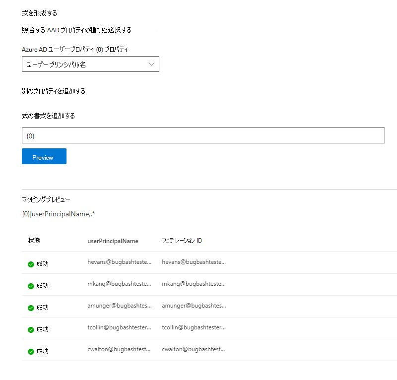

# Azure AD Id をマップする  

この記事では、azure ad id をデータソースの一意識別子 (非 Azure AD id) にマッピングする手順について説明します。これにより、非 Azure AD id を使用したアクセス制御リスト (ACL) 内のユーザーは、それらにスコープ設定されたコネクタ検索結果を表示できるようになります。

これらの手順は、"このデータソースにアクセスできるユーザーのみ" AAD "の検索アクセス許可を使用して、Microsoft によって [Salesforce](salesforce-connector.md) コネクタを設定する検索管理者にのみ関連しています。 次の手順では、Azure AD ユーザーのプロパティをユーザーの **フェデレーション id** にマップする方法について説明します。

>[!NOTE]
>[Salesforce コネクタ](salesforce-connector.md)を設定し、[アクセス許可] 画面で **AAD 以外** のユーザーに対してこのデータソースおよび id の種類 **へのアクセス権を持つユーザーのみ** を選択する場合は、非 azure ad id をマップする手順については、「 [azure ad の id をマップ](map-non-aad.md)する」の記事を参照してください。  

## Azure AD プロパティをマッピングする手順

### 1. マッピングする Azure AD ユーザーのプロパティを選択する

フェデレーション ID にマップする必要がある Azure AD プロパティを選択できます。

ドロップダウンから Azure AD ユーザーのプロパティを選択できます。 組織のフェデレーション ID マッピングを作成するためにこれらのプロパティが必要な場合は、Azure AD ユーザーのプロパティをいくつでも追加できます。

### 2. マッピングを完了するための数式を作成します。

Azure AD ユーザーのプロパティの値を組み合わせて、一意のフェデレーション ID を形成することができます。

[式] ボックスで、"" は、 {0} 選択した *最初* の Azure AD プロパティに対応します。 " {1} " は、選択した *2 番目* の Azure AD プロパティに対応します。 " {2} " は *3 番目* の Azure AD プロパティに対応します。以下同様になります。  

次に、サンプルの正規表現出力と数式出力を含む数式の例をいくつか示します。

| サンプル式                  | {0}サンプルユーザーのプロパティの値                 | {1}サンプルユーザーのプロパティの値           | 数式の出力                  |
| :------------------- | :------------------- |:---------------|:---------------|
| {0}.{1}@contoso .com  | 担当 | 社員 |firstname.lastname@contoso.com
| {0}@domain .com                 | userid                 |             |userid@domain.com

数式を入力した後で、必要に応じて、[ **プレビュー** ] をクリックして、データソースから5つのランダムユーザーのプレビューを表示し、それぞれのユーザーマッピングを適用することができます。 プレビューの出力には、手順1でユーザーが選択した Azure AD ユーザープロパティの値と、そのユーザーの手順2で提供された最終的な式の出力が含まれています。 また、「成功」または「失敗」アイコンを使用して、式の出力をテナントの Azure AD ユーザーに解決できるかどうかも示します。  

>[!NOTE]
>[ **プレビュー** ] をクリックした後、1つ以上のユーザーマッピングの状態が "Failed" になっている場合でも、接続の作成を続行できます。 プレビューには、5つのランダムユーザーと、データソースからのマッピングが表示されます。 指定したマッピングですべてのユーザーがマップされていない場合は、この場合に遭遇する可能性があります。

## Azure AD マッピングの例

Azure AD マッピングの例については、以下のスナップショットを参照してください。

## 制限事項  

- すべてのユーザーに対して1つのマッピングのみがサポートされます。 条件付きマッピングはサポートされていません。  

- 接続が公開されると、マッピングを変更することはできません。  

- Azure ad ユーザープロパティに対して Regex ベースの式を使用することは、Azure AD からフェデレーション ID への変換ではサポートされていません。