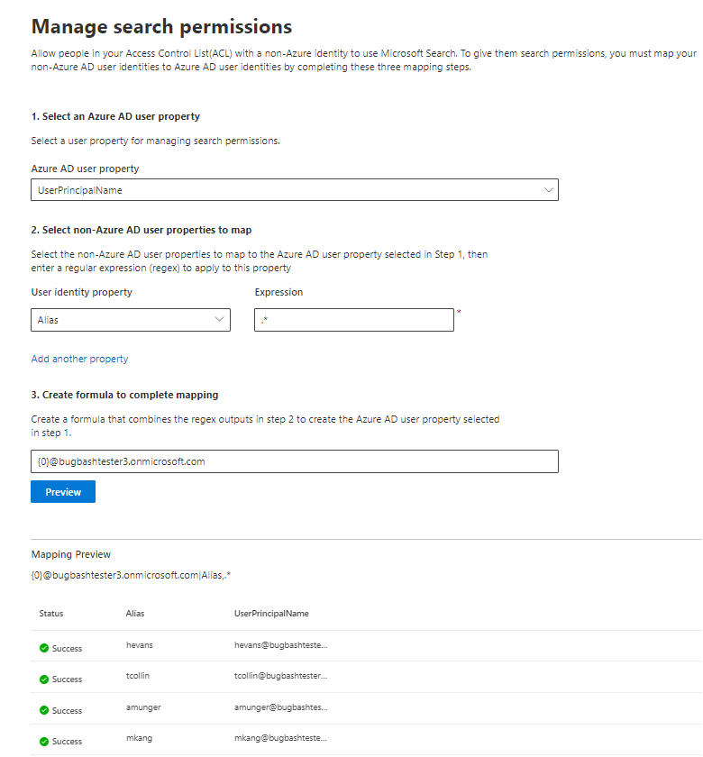

# Azure 以外のユーザー id をADする  

この記事では、Azure AD 以外の ID を Azure AD 以外の ID にマッピングし、Azure AD 以外の ID を持つアクセス制御リスト (ACL) のユーザーが対象範囲のコネクタ検索結果を表示する手順について説明します。

これらの手順は、「このデータ ソースにアクセスできるユーザーのみ」および ID タイプ "Non-AAD" の検索権限を持つ Microsoft による[Confluence](confluence-cloud-connector.md) [Cloud、ServiceNow Knowledge、ServiceNow](servicenow-knowledge-connector.md) [Catalog、](servicenow-catalog-connector.md)[または Salesforce](salesforce-connector.md)コネクタを設定している検索管理者にのみ関連します。

>[!NOTE]
>Salesforce コネクタをセットアップし、[検索アクセス許可] 画面で [このデータ ソースと ID タイプ **AAD** にアクセスできるユーザーのみ] を選択する場合は、「Azure AD ID をマップする方法」の記事 [「Azure AD Identity の](map-aad.md)マップ」を参照してください。  

## Azure 以外のプロパティをマッピングAD手順

### 1. Azure ユーザー プロパティAD選択する  

マッピングを作成する Azure ADユーザー プロパティを選択できます。 これは、Azure 以外のユーザー ID をマップADプロパティです。  

次のいずれかの Azure プロパティをADできます。

| Azure AD プロパティ    | 定義           | 例         |
| :------------------- | :------------------- |:--------------- |
| ユーザー プリンシパル名 (UPN)  | UPN は、UPN プレフィックス (ユーザー アカウント名) と UPN サフィックス (ユーザー 名) でDNS ドメインされます。 プレフィックスは、"@" 記号を使用して接尾辞で結合されます。 | us1@contoso.onmicrosoft.com |
| Azure AD ID                 | 特定のADの Azure ユーザー ID は、ユーザーの一意の GUID です。                 | 58006c96-9e6e-45ea-8c88-4a56851eefad            |
| Active Directory セキュリティ ID (SID)                  | SID (セキュリティ識別子) は、Active Directory がオブジェクトをセキュリティ プリンシパルとして識別するために使用する一意の識別子です。                  | S-1-5-21-453406510-812318184-4183662089             |

### 2. マップするユーザー プロパティAD Azure 以外のユーザー プロパティを選択する

データ ソースからプルされた Azure AD以外のプロパティを選択して、正規表現を適用できます。 データ ソースでこれらのプロパティを検索する場所の詳細については [、「Confluence Cloud](confluence-cloud-connector.md) [、ServiceNow Knowledge、ServiceNow](servicenow-knowledge-connector.md) [Catalog、Salesforce](servicenow-catalog-connector.md) ページ」を [参照](salesforce-connector.md) してください。  

ドロップダウンから Azure 以外のユーザー プロパティAD選択し、それらのユーザー プロパティの値に適用する正規表現を指定できます。

正規表現とその出力をサンプル文字列に適用する例を次に示します。 

| サンプル文字列                  | 正規表現                 | サンプル文字列の正規表現の出力           |
| :------------------- | :------------------- |:---------------|
| Alexis Vasquez  | .* | Alexis Vasquez |
| Alexis Vasquez                 | ..$                 | ez            |
| Alexis Vasquez                  | (\w+)$                  | バスケス             |

Azure 以外のユーザー プロパティはAD必要な数まで追加できます。 最終的な数式が保証する場合は、同じユーザー プロパティに異なる正規表現を適用できます。  

### 3. マッピングを完了する数式を作成する

Azure 以外の各ユーザー プロパティに適用される正規表現の出力AD組み合わせて、手順 1 で選択した Azure AD プロパティを形成できます。

数式ボックスの " " は、選択した最初の Azure 以外のプロパティに適用AD {0} に対応します。  " " は、選択した 2 番目の Azure 以外のプロパティに適用AD {1} 出力に対応します。  " は、Azure 以外の 3 番目のプロパティに適用される正規表現AD {2} に対応します。   

次に、正規表現出力と数式出力のサンプルを含む数式の例を示します。 

| サンプル数式                  | サンプル ユーザー {0} の値                 | サンプル ユーザー {1} の値           | 数式の出力                  |
| :------------------- | :------------------- |:---------------|:---------------|
| {0}.{1}@contoso.com  | firstname | lastname |firstname.lastname@contoso.com
| {0}@domain.com                 | userid                 |             |userid@domain.com

数式を指定した後、必要に応じて[プレビュー] をクリックして、それぞれのユーザー マッピングが適用されたデータ ソースから 5 人のランダム ユーザーのプレビューを表示できます。 プレビューの出力には、これらのユーザーに対して手順 2 で選択した Azure AD 以外のユーザー プロパティの値と、そのユーザーの手順 3 で示した最終数式の出力が含まれます。 また、数式の出力を "成功" または "Failed" アイコンを使用して、テナント内の Azure AD ユーザーに解決できるかどうかも示します。  

>[!NOTE]
>[プレビュー] をクリックした後に、1 つ以上のユーザー マッピングの状態が "Failed" の場合は、接続の作成を続行 **できます**。 プレビューには、データ ソースから 5 人のランダム なユーザーとそのマッピングが表示されます。 指定したマッピングですべてのユーザーがマップされない場合は、このケースが発生する可能性があります。

## Azure 以外のユーザー マッピングAD例

Azure 以外のマッピングのサンプルについては、以下のスナップショットADしてください。

## 制限事項  

- すべてのユーザーに対してサポートされているマッピングは 1 つのみです。 条件付きマッピングはサポートされていません。  

- 接続が公開された後は、マッピングを変更できません。  

- 現在、変換でサポートされているのは、AAD 以外のユーザー プロパティに対する正規表現ベースの式のみです。

- マップできる Azure AD ID は 3 つのみです (UPN、Azure AD ID、および SID ADします。