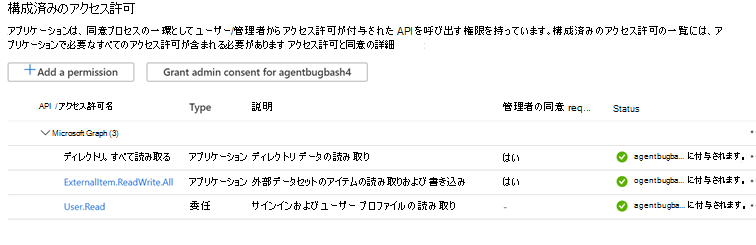
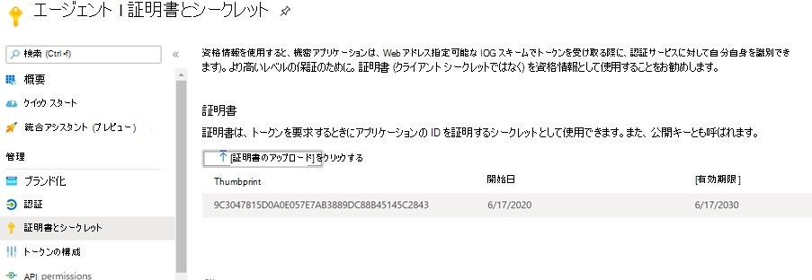
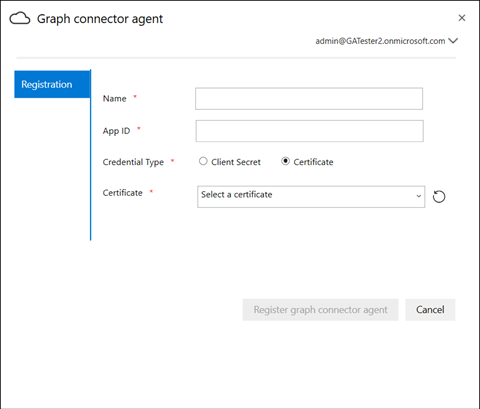

# オンプレミスエージェント

## グラフコネクタエージェント

オンプレミスのグラフコネクタでは、 *Graph connector エージェント* ソフトウェアをインストールする必要があります。 オンプレミスのデータとクラウドサービス間で、迅速かつ安全なデータ転送が可能になります。 この記事では、ソフトウェアのインストールと構成の手順について説明します。 構成すると、 [Microsoft 365 管理センター](https://admin.microsoft.com)からオンプレミスのデータソースへの接続を作成できるようになります。

## インストール

[このリンク](https://download.microsoft.com/download/d/d/e/dde18236-9c67-437d-a864-894a0a888ef2/AgentPackage.msi)を使用して、Graph connector エージェントの最新バージョンをダウンロードし、インストールウィザードを使用してソフトウェアをインストールします。 以下に示すコンピューターの推奨構成を使用すると、ソフトウェアは最大3つの接続をシームレスに処理できます。 その他の接続では、パフォーマンスが低下する可能性があります。

推奨される構成:

* Windows 10、Windows Server 2012 R2 以降
* 8コア、3GHz
* 16 GB の RAM、1GB のディスク容量
* 443を介したデータソースとインターネットへのネットワークアクセス

## エージェント用のアプリを作成する  

接続を作成する前に、エージェントインスタンスに重要なパラメーターをいくつか設定する必要があります。 これらのパラメーターには、Graph の取り込み Api を使用するために必要な認証の詳細が含まれています。  

エージェント用のアプリを作成する手順について説明します。

1. [Azure portal](https://portal.azure.com)に移動し、テナントの管理者の資格情報でサインインします。
2. ナビゲーションウィンドウから [ **Azure Active Directory** アプリの登録] に移動し、  ->  **App registrations** [**新規登録**] を選択します。
3. アプリの名前を指定して、[ **登録**] を選択します。
4. アプリケーション (クライアント) ID をメモしておきます。
5. ナビゲーションウィンドウから [ **API アクセス許可** ] を開き、[ **アクセス許可の追加**] を選択します。
6. [ **Microsoft Graph** ]、[ **アプリケーションのアクセス許可**] の順に選択します。
7. アクセス許可から "ExternalItem." および "all" を検索し、[ **アクセス許可の追加**] を選択します。
8. **[[TenantName] に管理者の同意を付与する**] を選択し、[**はい**] を選択して確定します。
9. 権限が許可されている状態であることを確認します。
     

## Graph connector エージェントを構成する

エージェント用のアプリを作成したら、適切な認証の詳細を使用してエージェントを構成する必要があります。

認証の詳細は、次のいずれかの形式で提供されます。

### 認証用にクライアントシークレットを構成する

1. [Azure portal](https://portal.azure.com)に移動し、テナントの管理者の資格情報でサインインします。
2. ナビゲーションウィンドウから **アプリの登録** を開いて、適切なアプリに移動します。 [ **管理**] で、[ **証明書とシークレット**] を選択します。
3. [ **新しいクライアントシークレット** ] を選択し、シークレットの有効期間を選択します。 生成されたシークレットをコピーして、再度表示されないため、保存します。
4. このクライアントシークレットをアプリケーション ID と共に使用して、エージェントを構成します。 エージェントの [ **名前** ] フィールドに空白文字を使用しないでください。 英数字を使用できます。

## 認証に拇印証明書を使用する

[認証のためにクライアントシークレットを構成](#configuring-the-client-secret-for-authentication)した後に認証の詳細を構成している場合は、[セットアップの概要](configure-connector.md)に直接ジャンプできます。

1. **アプリの登録** を開いて、ナビゲーションウィンドウから [**証明書とシークレット**] を選択します。 証明書の拇印をコピーします。

2. Graph connector エージェントを登録するには、クライアントシークレットまたは拇印のいずれかを使用します。

