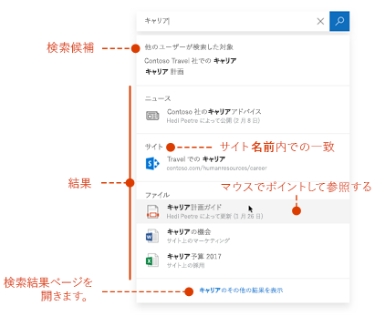

# Microsoft Search の概要Overview of Microsoft Search

Microsoft 検索を使用すると、作業を完了するために必要な情報を見つけることができます。Microsoft Search helps you find what you need to complete what you’re working on. 人、ファイル、組織図、サイト、またはよく寄せられる質問に対する回答を検索する場合でも、就業中に Microsoft Search を使用して回答を得ることができます。Whether you're searching for people, files, org charts, sites, or answers to common questions, you can use Microsoft Search throughout your workday to get answers.

Microsoft Search を使用すると、ユーザーは適切な回答、他のユーザー、コンテンツを見つけて、既に作業しているアプリでタスクを完了することができます。Microsoft Search helps users find the right answers, people, and content to complete their tasks in the app they’re already working in.

- 検索元のアプリの**コンテキスト**に応じた結果を取得できます。Users get results that are relevant in the **context** of the app they search from. たとえば、 [Microsoft Outlook](https://www.microsoft.com/outlook)で検索すると、 [SharePoint](http://sharepoint.com/)サイトではなくメールが検索されます。For example, when they search in [Microsoft Outlook](https://www.microsoft.com/outlook), they find emails, and not [SharePoint](http://sharepoint.com/) sites. SharePoint で検索すると、サイト、ページ、ファイルが見つかります。When they search in SharePoint, they find sites, pages, and files.
- ユーザーがどのアプリで作業していても、Microsoft Search は**個人用**です。Whichever app users are working in; Microsoft Search is **personal**. Microsoft Search では、 [Microsoft Graph](https://developer.microsoft.com/graph/)の洞察を使用して、各ユーザーに関連する結果を表示します。Microsoft Search uses insights from the [Microsoft Graph](https://developer.microsoft.com/graph/) to show results that are relevant to each user. 各ユーザーが同じ単語を検索しても、それぞれの結果は異なる可能性があります。Each user might see different results, even if they search for the same words. ユーザーには既にアクセス権のある結果のみが表示されます。Microsoft Search によってアクセス許可が変更されることはありません。They only see results that they already have access to, Microsoft Search doesn’t change permissions.
- 情報がある場所を覚えておく必要はありません。Users don’t need to remember where the information is located. たとえば、ユーザーが[Microsoft Word](https://products.office.com/word)で作業していて、自分の[OneDrive](https://onedrive.live.com/about/)から共有されている仕事仲間の情報を再利用する必要があるとします。For example, a user is working in [Microsoft Word](https://products.office.com/word) and wants to reuse information from a presentation that a colleague shared from their [OneDrive](https://onedrive.live.com/about/). この場合、OneDrive に切り替えて、そのプレゼンテーションを検索する必要はなく、Word から検索するだけで済みます。There’s no need to switch to OneDrive and search for that presentation, they can simply search from Word.
- [Bing](https://bing.com) を使用している場合、公開されている Web の検索結果に加えて組織内からの結果も取得できます。When in [Bing](https://bing.com), users get results from within their organization in addition to the public web results.

## ユーザーに対する表示What users see

[Bing](https://bing.com)では、ユーザーは web 検索と同じ検索ボックスを使用します。In [Bing](https://bing.com), users use the same search box as for web searches. Office アプリでは、ユーザーはヘッダーバーに Microsoft 検索ボックスを検索します。In the Office apps, users find the Microsoft Search box in the header bar. 次のように表示されます。It looks like this:

ユーザーが**検索**ボックスをクリックすると、Office 365 の以前のアクティビティに基づいて検索結果が表示され、組織内の傾向を示すコンテンツが検索されます。When users click in the **Search** box, search suggests results based on their previous activity in Office 365 and based on content that’s trending in your organization. 検索で考慮されるアクティビティには、ユーザーが最近作業していたファイルや最近使用したコマンドだけでなく、そのユーザーが共同作業している他のユーザーなどがあります。Files they were working on recently, commands they’ve used recently as well as people they collaborate with are examples of activity that search considers. ユーザーが**検索**ボックスへの入力を開始すると、提示された結果が更新されます。As users start typing in the **Search** box, the suggested results update. ユーザーは**検索ボックスから直接検索結果**を開くことができます。Users can open search results right from the **Search** box. [SharePoint](http://sharepoint.com/)での検索の例を次に示します。Here's an example of a search in [SharePoint](http://sharepoint.com/).

検索ボックスに表示されている候補がユーザーにとって期待していない場合は、次のように**入力して**、結果の完全なリストを開きます。If the suggestions in the search box aren’t what users are looking for, **Enter** opens the full list of results. アイテムの最終更新者、アイテムが保存された日時と場所などのメタデータを使用したり、メタデータをプレビューして、探しているものかどうかを判断したりできます。They can use metadata such as who last modified the item and when, where the items is located, as well as preview it to determine if it’s what they’re looking for.

## Microsoft Search のメリットBenefits of Microsoft Search

**すべての Microsoft Search ボックスから Microsoft 365 全体を検索** - どの Microsoft Search ボックスからでも検索を実行し、作業していたタスクにすばやく戻ることができます。**Search across Microsoft 365 from any Microsoft Search box** – Users can search from any Microsoft Search box and get quickly back to what they were doing. Microsoft Search では、 [SharePoint](http://sharepoint.com/)、 [Microsoft OneDrive For Business](https://onedrive.live.com/about/en-us/business/)、 [Microsoft Exchange Server](https://products.office.com/en-us/exchange/microsoft-exchange-server)など、Office 365 のデータソースからの結果がまとめられています。Microsoft Search brings together results from data sources in Office 365, including [SharePoint](http://sharepoint.com/), [Microsoft OneDrive for Business](https://onedrive.live.com/about/en-us/business/), and [Microsoft Exchange Server](https://products.office.com/en-us/exchange/microsoft-exchange-server).

**検索が容易**– Microsoft search では、Office 365 のユーザーの以前のアクティビティに基づいて**検索**ボックスに、結果が表示されます。**Easy to search** – Microsoft Search suggests results based on users’ previous activity in Office 365, right in the **Search** box.

**共有ファイルの検索** - Microsoft Search は高度なクエリ理解を利用して、共有ファイルの検索を容易にします。**Find shared files** – Microsoft Search uses advanced query understanding to make finding shared files simple. ユーザーは共同作業しているファイルを簡単に見つけることができます。Users can easily find files they’re collaborating on.

**関連コンテンツの表示** - ポリシー、利点、リソース、ツールなどのタスクの完了に必要な情報および回答をより詳細に提供しています。**Show relevant content** – Promote the information and answers your users need to complete tasks, for example policies, benefits, resources, tools, and more. また、新入社員、リモートワーカー、さまざまな地域など、特定のグループを対象にすることもできます。You can also target specific groups, like new hires, remote workers, or different geographies.

**すべてのアプリで管理可能** - Microsoft Search は既定で**オン**になっており、実行するあらゆる管理はすべてのアプリの Microsoft Search に適用されます。**Administer across all apps** – Microsoft Search is **on** by default and any administration you do applies to Microsoft Search in all the apps.

## 組織に合わせた Microsoft Search のカスタマイズTailoring Microsoft Search to your organization

管理者は、ユーザーに対して優れた Microsoft 検索機能を作成できます。As an administrator you can create and amazing Microsoft Search experience for your users. 

**有用なコンテンツを表示**–回答は、キーワードに基づいて検索クエリに高速で権限の高い結果を提供します。**Show useful content** – Answers provide fast, authoritative results to search queries based on keywords. [コンテンツを簡単に見つけられるように](make-content-easy-to-find.md)します。[Make content easy to find](make-content-easy-to-find.md).

**外部コンテンツを追加**する-Microsoft Graph コネクタを使用すると、外部コンテンツをインデックスに取り込むことができます。**Add external content** - Microsoft Graph Connectors allow you to bring external content into the index. コネクタを使用して、Microsoft 365 の外部からのデータとファイルの検索機能を強化します。Use connectors to enrich the search experience with data and files from outside of the Microsoft 365. [Microsoft Graph コネクタの概要Overview of Microsoft Graph connectors](connectors-overview.md)

**ユーザーの作業をカスタマイズ**する-業種およびその他の構成を使用してユーザーの作業をカスタマイズできます。**Customize the user experience** - You can customize the user experience through the use of verticals and other configurations. [Microsoft 検索ページをカスタマイズするCustomize the Microsoft Search page](customize-search-page.md)

## 検索されるコンテンツWhat content is searched?

Microsoft Search は、組織が Microsoft 365 に保存されているコンテンツ、またはコネクタ経由でインデックス付けされたコンテンツを示します。Microsoft Search shows the content that your organization has stored in Microsoft 365 or indexed through connectors. Microsoft Search では、複数のテナントを検索したり、他の組織によって共有されているコンテンツから結果を表示したりすることはありません。Microsoft Search does not search across tenants or show results from content that's shared by other organizations. 組織でクラウド ハイブリッド検索を使用してハイブリッド SharePoint 環境をセットアップすると、Microsoft Search は SharePoint Server 環境に接続している外部コンテンツを含む、オンラインおよびオンプレミスの両方の SharePoint コンテンツからの検索結果を返します。If your organization has set up a hybrid SharePoint environment using cloud hybrid search, Microsoft Search returns search results from both online and on-premises SharePoint content, including any external content you’ve connected to your SharePoint Server environment. [ハイブリッド検索環境の詳細については、こちらを参照してください](https://docs.microsoft.com/sharepoint/hybrid/learn-about-cloud-hybrid-search-for-sharepoint)。[Learn more about hybrid search environments](https://docs.microsoft.com/sharepoint/hybrid/learn-about-cloud-hybrid-search-for-sharepoint).

ユーザーは、他の場所から取得したのと同じエンタープライズ検索結果を取得し、インターネットからも結果を取得します。Users will get the same enterprise search results they get from other locations and will also get results from the internet.

## Microsoft Search はどのように機能するのですか?How does Microsoft Search work?

ユーザーが検索すると、Microsoft Search ではクエリを処理し、より大きいフレーズから検索意図が解析されます。これは人工知能 (AI) を使用して、ユーザーがクエリに追加した、ユーザーの検索意図に影響を与えない一般的な余分なフレーズを Microsoft Search が学習することで実現されています。When a user searches, Microsoft Search processes the query and parses search intent from larger phrases, using Artificial Intelligence (AI) to learn common superfluous phrases users add to their queries that don't impact their search intent. たとえば、ユーザーが、「パスワードを変更する方法」という検索を行うと、重要度の低い単語はクエリから取り除かれ、「パスワードを変更」などの関連性の高い単語に基づいてトリガーされます。For example, when a user searches for "how to change my password" we extract the less important words from the query and trigger based on the relevant ones like "change password".  
ユーザーが表示する**アクセス許可**を持っている検索結果は、検索結果ページに表示されます。The search results that the user has **permission** to see are presented on the search results page. Microsoft Search では、インテリジェント ランキング アルゴリズムを使用して、結果を関連性に従って順序付けします。Microsoft Search uses intelligent ranking algorithms to order results based on relevance.

## Bing の Microsoft Search でエンタープライズ検索を保護するMicrosoft Search in Bing protects enterprise searches

ユーザーが Bing の Microsoft Search で検索クエリを入力すると、次の2つの同時検索要求が発生します。When a user enters a search query in Microsoft Search in Bing, two simultaneous search requests occur:

- 組織の内部リソースの検索。A search of your organization’s internal resources.
- Bing.com からの公開結果を個別に検索します。A separate search of public results from Bing.com. 

エンタープライズ検索では機密になる可能性があるため、Microsoft Search では、公開結果`Bing.com`の個別の検索をどのように処理するかを記述する一連の信頼手段が実装されています。Because enterprise searches might be sensitive, Microsoft Search has implemented a set of trust measures that describe how the separate search of public results from `Bing.com` is handled.

### ログ記録Logging
 - Bing `Bing.com`トラフィックで Microsoft search に関連するすべての検索ログは、workplace identity から切り離されます。All `Bing.com` search logs that pertain to Microsoft Search in Bing traffic are disassociated from your workplace identity.
- クエリが特定の組織に固有ではないという確信を与える一連の制限または頻度のしきい値が満たされる場合、クエリは[プライバシーに関する声明](https://privacy.microsoft.com/privacystatement)の Bing サービス セクションで説明されているように処理されます。If a set of restrictions or frequency thresholds are met which give us confidence that the query is not specific to a particular organization, the query will be treated as described in the Bing services section of the [Privacy Statement](https://privacy.microsoft.com/privacystatement). たとえば、このようなクエリを使用して、autosuggest や関連する検索などのパブリック機能をモデル化し、トレーニングします。For example, such queries will be used to model and train public features, such as autosuggest or related searches.
- 一連の制限または頻度のしきい値を満たしていないクエリは、Microsoft Search 以外のパブリック トラフィックとは別に保存されます。Queries that do not meet the set of restrictions or frequency thresholds will be stored separately from public, non-Microsoft Search traffic.
### 広告Advertising 
[ `Bing.com`エンタープライズ検索に関連して表示される広告は、検索クエリのコンテンツにのみ関連しています。Advertising shown on `Bing.com` in connection with enterprise searches is solely related to the content of the search queries. 広告は、職場 ID に基づいてユーザーをターゲットにすることはありません。Ads are never targeted to users based on their workplace identity.

## 関連項目See also

[Microsoft Search のセットアップSet up Microsoft Search](setup-microsoft-search.md)

[簡単に見つけられるコンテンツMake content easy to find](make-content-easy-to-find.md)
