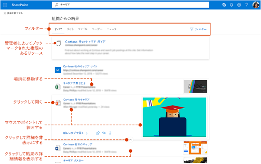

# Microsoft Search の概要

Microsoft Search作業を完了するために必要な情報を見つけるのに役立ちます。 ユーザー、ファイル、組織図、サイト、または一般的な質問に対する回答を検索する場合でも、Microsoft Search を使用して回答を取得できます。

Microsoft Searchは、ユーザーが既に作業しているアプリでタスクを完了するために適切な回答、ユーザー、およびコンテンツを見つけるのに役立ちます。

- 検索元のアプリの **コンテキスト** に応じた結果を取得できます。 たとえば、Microsoft Outlookで検索[すると](https://www.microsoft.com/outlook)、電子メールが見[SharePointされます。](http://sharepoint.com/) SharePoint で検索すると、サイト、ページ、ファイルが見つかります。
- ユーザーがどのアプリで作業していても、Microsoft Search は **個人用** です。 Microsoft Search[は、Microsoft](https://developer.microsoft.com/graph/) Graph分析情報を使用して、各ユーザーに関連する結果を表示します。 各ユーザーが同じ単語を検索しても、それぞれの結果は異なる可能性があります。 既にアクセスできる結果だけが表示されます。Microsoft Searchアクセス許可は変更されません。
- ユーザーは、情報がどこにあるのか覚えておく必要はない。 たとえば、ユーザーがプロジェクトで作業Microsoft Word、同僚が自分のグループから共有したプレゼンテーションの情報を再利用[OneDrive。](https://onedrive.live.com/about/)  プレゼンテーションに切り替えてそのプレゼンテーションOneDriveする必要はありません。Word から簡単に検索できます。
- [Bing](https://bing.com) を使用している場合、公開されている Web の検索結果に加えて組織内からの結果も取得できます。

## ユーザーに対する表示

この[Bing、](https://bing.com)ユーザーは Web 検索と同じ検索ボックスを使用します。 アプリのOffice、ユーザーはヘッダー バー Microsoft Searchボックスを見つける。 次のようになります：

![ヘッダー バーに [Microsoft Search] ボックスを含むアプリ ウィンドウのスクリーンショット。](media/Headings_520.png)

ユーザーが [検索] ボックス **をクリック** すると、検索結果は、Office 365 での以前のアクティビティに基づいて、および組織内で傾向にあるコンテンツに基づいて表示されます。 最近作業していたファイル、最近使用したコマンド、および共同作業を行うユーザーは、検索で考慮されるアクティビティの例です。 ユーザーが [検索] ボックスに入力 **を開始** すると、候補の結果が更新されます。 ユーザーは、[検索] ボックスから検索結果を **右に開** きます。 次に、検索の例を示[SharePoint。](http://sharepoint.com/)

検索ボックスの候補がユーザーが探している情報ではない場合は、 **結果** の完全な一覧が開きます。 アイテムを最後に変更したユーザー、アイテムの場所、アイテムの場所などのメタデータを使用し、アイテムをプレビューして、アイテムが何を探しているのかを判断できます。

![[結果] ページMicrosoft Searchスクリーンショット。](media/search_box.png)

## Microsoft Search のメリット

**すべての Microsoft Search ボックスから Microsoft 365 全体を検索** - どの Microsoft Search ボックスからでも検索を実行し、作業していたタスクにすばやく戻ることができます。 Microsoft Searchは、Office 365、SharePoint、Microsoft OneDrive for [Business、](https://onedrive.live.com/about/business/)および Microsoft Exchange Server などのデータソースからの結果[をまとめます](https://products.office.com/exchange/microsoft-exchange-server)。

**簡単に検索 –** Microsoft Searchボックスのユーザーの以前のアクティビティに基Office 365結果を **表示** できます。

**共有ファイルの検索** - Microsoft Search は高度なクエリ理解を利用して、共有ファイルの検索を容易にします。 ユーザーは共同作業しているファイルを簡単に見つけることができます。

**関連コンテンツの表示** - ポリシー、利点、リソース、ツールなどのタスクの完了に必要な情報および回答をより詳細に提供しています。 また、新入社員、リモート ワーカー、さまざまな地域など、特定のグループをターゲットにすることもできます。

**すべてのアプリで管理可能** - Microsoft Search は既定で **オン** になっており、実行するあらゆる管理はすべてのアプリの Microsoft Search に適用されます。

## 組織に合わせた Microsoft Search のカスタマイズ

管理者は、ユーザーに素晴らしいエクスペリエンスMicrosoft Search作成できます。

**有用なコンテンツを** 表示する - 回答は、キーワードに基づいて検索クエリに迅速かつ権限の高い結果を提供します。 [コンテンツを計画します](plan-your-content.md)。

**外部コンテンツを追加** する - Microsoft Graph コネクタを使用すると、外部コンテンツをインデックスに取り込みできます。 コネクタを使用して、外部からのデータとファイルで検索エクスペリエンスを強化Microsoft 365。 [Microsoft Graph コネクタの概要](connectors-overview.md)

**ユーザー エクスペリエンスをカスタマイズ** する – 垂直および他の構成を使用してユーザー エクスペリエンスをカスタマイズできます。 [Microsoft Search ページをカスタマイズする](customize-search-page.md)

## 検索されるコンテンツ

Microsoft Searchは、組織がコネクタに格納したコンテンツまたはコネクタMicrosoft 365インデックス付けされたコンテンツを表示します。 Microsoft Searchテナント間で検索したり、他の組織が共有しているコンテンツの結果を表示したりしない場合。 組織でクラウド ハイブリッド検索を使用してハイブリッド SharePoint 環境を設定している場合、Microsoft Search は、SharePoint Server 環境に接続した外部コンテンツを含む、オンラインコンテンツとオンプレミス SharePoint コンテンツの両方からの検索結果を返します。 [ハイブリッド検索環境の詳細については、こちらを参照してください](/sharepoint/hybrid/learn-about-cloud-hybrid-search-for-sharepoint)。

ユーザーは、他の場所から取得した検索結果と同じ検索結果を取得し、インターネットから結果を取得します。

## 機能Microsoft Search方法

ユーザーが検索すると、Microsoft Search ではクエリを処理し、より大きいフレーズから検索意図が解析されます。これは人工知能 (AI) を使用して、ユーザーがクエリに追加した、ユーザーの検索意図に影響を与えない一般的な余分なフレーズを Microsoft Search が学習することで実現されています。 たとえば、ユーザーが、「パスワードを変更する方法」という検索を行うと、重要度の低い単語はクエリから取り除かれ、「パスワードを変更」などの関連性の高い単語に基づいてトリガーされます。  
ユーザーが表示する **アクセス許可** を持っている検索結果は、検索結果ページに表示されます。 Microsoft Search では、インテリジェント ランキング アルゴリズムを使用して、結果を関連性に従って順序付けします。

## 会社Microsoft SearchをBingする方法

[セキュリティとプライバシー Microsoft SearchのBing](security-for-search.md)

## 関連項目

[Microsoft Search のセットアップ](setup-microsoft-search.md)