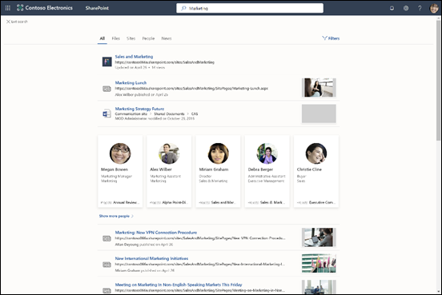
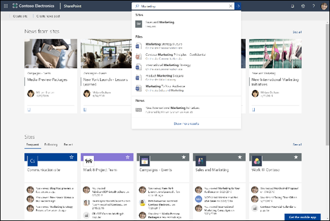

# Microsoft Search の概要Overview of Microsoft Search

Microsoft Search は、Microsoft 365 生産性アプリとより広範な Microsoft エコシステムにおける統合検索機能です。Microsoft Search is the unified search capability in the Microsoft 365 productivity apps and the broader Microsoft ecosystem. Microsoft Search は、Microsoft 365 全体のより多くのアプリで順次利用できるようになります。Over time Microsoft Search will be available in more and more apps across Microsoft 365.

Microsoft Search を使用すると、ユーザーは適切な回答、他のユーザー、コンテンツを見つけて、既に作業しているアプリでタスクを完了することができます。Microsoft Search helps users find the right answers, people, and content to complete their tasks in the app they’re already working in.

- 検索元のアプリの**コンテキスト**に応じた結果を取得できます。Users get results that are relevant in the **context** of the app they search from. たとえば、Outlook で検索すると、SharePoint のサイトではなくメールが見つかります。For example, when they search in Outlook, they find mails, not sites in SharePoint. SharePoint で検索すると、メールではなく、サイト、ページ、ファイルが見つかります。When they search in SharePoint, they find sites, pages, and files, not mails.
- ユーザーがどのアプリで作業していても、Microsoft Search は**個人用**です。Whichever app users are working in; Microsoft Search is **personal**.  Microsoft Search では、Microsoft Graph からの洞察を使用して、各ユーザーに関連性のある結果が表示されます。Microsoft Search uses insights from the Microsoft Graph to show results that are relevant to each user. 各ユーザーが同じ単語を検索しても、それぞれの結果は異なる可能性があります。Each user might see different results, even if they search for the same words. ユーザーには既にアクセス権のある結果のみが表示されます。Microsoft Search によってアクセス許可が変更されることはありません。They only see results that they already have access to, Microsoft Search doesn’t change permissions.
- 情報がある場所を覚えておく必要はありません。Users don’t need to remember where the information is located. たとえば、あるユーザーが Word で作業していて、同僚が自分の OneDrive から共有したプレゼンテーションの情報をそのユーザーが再利用する必要があるとします。For example, a user is working in Word and wants to reuse information from a presentation that a colleague shared from their OneDrive. この場合、OneDrive に切り替えて、そのプレゼンテーションを検索する必要はなく、Word から検索するだけで済みます。There’s no need to switch to OneDrive and search for that presentation, they can simply search from Word.  
- Bing を使用している場合、公開されている Web の検索結果に加えて組織内からも結果を取得できます。When in Bing, users get results from within their organization in addition to the public web results .

## ユーザーに対する表示What users see

Bing では、ユーザーは Web 検索用の検索ボックスを使用します。In Bing, users use the same search box as for web searches. Microsoft 365 アプリで Microsoft Search ボックスはヘッダー バーにあります。In the Microsoft 365 apps, users find the Microsoft Search box in the header bar. 次のように表示されます。It looks like this in OneDrive for Business.

ユーザーが検索ボックスをクリックすると、Office 365 での以前のアクティビティと組織内でよく使用されているコンテンツに基づいて、検索結果が表示されます。When users click in the search box, search suggests results based on their previous activity in Office 365 and based on content that’s trending in your organization. 検索で考慮されるアクティビティには、ユーザーが最近作業していたファイルや最近使用したコマンドだけでなく、そのユーザーが共同作業している他のユーザーなどがあります。Files they were working on recently, commands they’ve used recently as well as people they collaborate with are examples of activity that search considers. 検索ボックスに入力し始めると、候補の検索結果が更新されます。As users start typing in the search box, the suggested results update. 検索ボックスから直接検索結果を開くことができます。Users can open search results right from the search box. SharePoint での検索の例を示します。Here's an example of a search in SharePoint.

検索ボックスの候補が探しているものと異なる場合は、**Enter** キーを押すと結果の完全な一覧が表示されます。If the suggestions in the search box aren’t what they’re looking for, clicking Enter opens the full list of results. アイテムの最終更新者、アイテムが保存された日時と場所などのメタデータを使用したり、メタデータをプレビューして、探しているものかどうかを判断したりできます。They can use metadata such as who last modified the item and when, where the items is located, as well as preview it to determine if it’s what they’re looking for.

## Microsoft Search のメリットFeatures of Microsoft Search

**すべての Microsoft Search ボックスから Microsoft 365 全体を検索** - どの Microsoft Search ボックスからでも検索を実行し、作業していたタスクにすばやく戻ることができます。**Search across Microsoft 365 from any Microsoft Search box** – Users can search from any Microsoft Search box and get quickly back to what they were doing. Microsoft Search では、SharePoint、OneDrive for Business、Exchange など、Office 365 のデータ ソースからの結果が 1 つにまとめられています。Microsoft Search brings together results from data sources in Office 365, including SharePoint, OneDrive for Business, and Exchange - as well as from the public web.

**検索が簡単** - Microsoft Search では、Office 365 でのユーザーの以前のアクティビティに基づいて、検索ボックスに直接結果が表示されます。**Easy to search** - Microsoft Search suggests results based on users’ previous activity in Office 365, right in the search box.

**共有ファイルを検索可能** - Microsoft Search では、高度なクエリの知識を使用すると、共有ファイルの検索が容易になります。**Find shared files** - Microsoft Search uses advanced query understanding to make finding shared files simple. ユーザーは共同作業しているファイルを簡単に見つけることができます。Users can easily find files they’re collaborating on.

**関連コンテンツを表示** - ポリシー、利点、リソース、ツールなどのタスクの完了に必要な情報および回答をより詳細に提供しています。**Show relevant content** - Promote the information and answers your users need to complete tasks, for example policies, benefits, resources, tools, and more. 新入社員やリモート ワーカーなど、特定のグループを対象にすることもできます。You can also target specific groups, like new hires or remote workers.

**進化する Microsoft Search** - ユーザーが検索できるコンテンツの種類セットと検索ボックスのインテリジェンスは徐々に拡充されていきます。**Microsoft Search evolves** – The set of content types users can search for and the intelligence of the search box will grow over time.

**すべてのアプリで管理可能** - Microsoft Search は既定でオンになっており、実行するあらゆる管理はすべてのアプリの Microsoft Search に適用されます。**Administer across all apps** - Microsoft Search is on by default and any administration you do applies to Microsoft Search in all the apps.

## 現在 Microsoft Search が搭載されているアプリApps that currently have Microsoft Search

Microsoft Search は、Microsoft 365 全体のより多くのアプリで順次利用できるようになります。Over time Microsoft Search will be available in more and more apps across Microsoft 365. 現在、次の Office 365 アプリで Microsoft Search が提供されています。The following Office 365 apps currently offer Microsoft Search:

- SharePoint OnlineSharePoint Online
- OneDrive for BusinessOneDrive for Business
- Outlook on the webOutlook on the web
- Windows 上の Office アプリOffice apps on Windows

さらに、Microsoft Search は以下の場所にもあります。In addition, users find Microsoft Search in:

- BingBing
- Office.comOffice.com
- Word、Excel、PowerPoint Online の開始ページThe starting pages for Word, Excel, and PowerPoint Online

ユーザーは、Edge のアドレス バーから Bing で検索を開始することもできます。Users can also initiate a search in Bing from the Edge address bar.

## 要件Requirements

組織には、次のいずれかのサブスクリプションを持つ Office 365 テナントが必要です。Your organization must have an Office 365 tenant with one of the following subscriptions:

- Office 365 Business Essentials および Business PremiumOffice 365 Business Essentials and Business Premium
- Office 365 A1/A3/A5Office 365 A1/A3/A5
- Office 365 Education E1/E3Office 365 Education E1/E3
- Office 365 Enterprise E1/E3/E3 Developer/E5Office 365 Enterprise E1/E3/E3 developer/E5
- Office 365 F1Office 365 F1
- Microsoft 365 BusinessMicrosoft 365 Business
- Microsoft 365 A3/A5Microsoft 365 A3/A5
- Microsoft 365 F1/E3/E5Microsoft 365 F1/E3/E5

ユーザーと検索管理者の両方が、これらのサブスクリプションのいずれかでライセンスを取得している必要があります。Both users and search administrators must be licensed with one of these subscriptions. Microsoft Search を使用できるのは、アクティブなアカウントを持つユーザーのみであり、**サインイン**する必要があります。Only users with active accounts can use Microsoft Search, and they must be **signed in**.

## 組織に合わせた Microsoft Search のカスタマイズTailoring Microsoft Search to your organization

管理者は、ユーザーが自分の SharePoint スタート ページ、Office.com、Bing から検索すれば、組織固有の良い検索結果を簡単に得られるようにすることができます。As an admin you can make it easy for your users to get good organization-specific results when they search from their SharePoint start page, Office.com, or Bing. Microsoft Searchを Microsoft 365 管理センターで管理します。You administer Microsoft Search from the Microsoft Search section in the Microsoft 365 admin center.

**便利なコンテンツを表示** - 組織内の重要なツールやリソースはブックマークすることで見つけやすくなります。**Show useful content** - Help users find important tools and resources within your organization by bookmarking them. パブリック Web ページにブックマークを作成できるのと同様に、ユーザーが検索できるように、任意の内部 Web ページにブックマークを作成できます。Just as you can create a bookmark to a public webpage, you can create a bookmark for any internal webpage, which your users can search for. Power App をブックマークに統合することもできるので、ユーザーはブックマークから直接タスクを完了することができます。You can also integrate a Power App in the bookmark so users can complete their task directly from the bookmark.

**よく寄せられる質問に回答** - 組織で最もよく寄せられる質問に対する最善の回答を提供できます。**Offer answers to common questions** – Give the best answer for your the most frequently asked questions. 検索ボックスによくある質問を入力すると、Microsoft Search では Web ページへのリンクを提供するだけでなく、結果として回答が表示されます。When users enter a common question in the search box, Microsoft Search shows the answer as a result instead of just providing a link to the web page.

**便利な場所を表示** - マップの結果と組織の建物、オフィス、その他のワークスペースの住所情報をマップ上に表示します。**Show useful locations** - Show map results and address information for your organization's buildings, offices, and other workspaces on a map. ユーザーはマップを使用して、道順を調べたり、近くにあるものなどを確認したりできます。Users can use the maps to get directions, see what's nearby, and more.

## 検索されるコンテンツWhat content is searched?

Microsoft Search では、グローバル アドレス一覧や Office 365 グループのユーザーを含め、SharePoint Online、OneDrive for Business、Exchange に保存されているコンテンツ内を検索できます。Microsoft Search searches in content that’s stored in Outlook, OneDrive, and SharePoint Online, including people from the global address list and Office 365 groups. 組織でクラウド ハイブリッド検索を使用してハイブリッド SharePoint 環境をセットアップすると、Microsoft Search のユーザーは、SharePoint Server 環境に接続している外部コンテンツを含む、オンプレミスの SharePoint コンテンツからも結果を取得できます。If you use cloud hybrid search to set up a hybrid SharePoint environment, users of Microsoft Search can also get results from on-premises SharePoint content, including any external content you’ve connected to your SharePoint Server environment. [ハイブリッド検索環境の詳細については、こちらを参照してください](https://docs.microsoft.com/sharepoint/hybrid/learn-about-cloud-hybrid-search-for-sharepoint)。[Learn more about hybrid search environments](https://docs.microsoft.com/sharepoint/hybrid/learn-about-cloud-hybrid-search-for-sharepoint).

SharePoint スタートページまたは Office.com から検索すると、Microsoft Search では組織内のすべてのコンテンツが検索され、検出されたすべての結果が表示されます。When users search from the SharePoint start page or Office.com, Microsoft Search searches across their organization and presents all organizational results it finds. これは、**グローバル検索範囲**と呼ばれています。This is known as the global search scope.

ユーザが Bing から検索すると、**Web** の検索結果リストに埋め込まれた組織内のすべてのコンテンツから最も関連性の高い結果を取得することができます。When users search from Bing, users get the most relevant results from all the content in their organization embedded in the list of results from the **web**. 組織の**すべて**の結果を表示する必要がある場合は、たった 1 回クリックするだけでグローバル検索範囲を実行できます。If they need to see all organizational results, the global search scope is only a click away.

## ユーザーが検索できる結果の種類What types of results can users find?
ユーザーが検索すると、次のような検索結果が見つかります。Users find the following types of results when they search from:

**SharePoint**: ファイル、フォルダー、組織内のユーザー、組織図、サイト、サイト ページ、ニュース、リスト、リスト アイテム。**SharePoint**: Files, folders, people in your organization, organization charts, sites, site pages, news, lists and list items. 定義されている場合: よく寄せられる質問に対する回答、権限のある情報につながるブックマーク、位置、ツール。If defined, answers to common questions, bookmarks that lead to authoritative information, map locations, and tools. 
  [検索可能なファイルの種類を確認してください](https://docs.microsoft.com/ja-JP/SharePoint/technical-reference/default-crawled-file-name-extensions-and-parsed-file-types)。Learn which types of files you can find.

**Office.com、Word、Excel、PowerPoint Online のスタート ページ**: アプリ、ファイル、フォルダー、ユーザー、組織図、SharePoint サイト、サイト ページ、リスト、リスト アイテム。**Office.com and Word, Excel, and PowerPoint Online start pages**: Apps, files, folders, people, organization charts, SharePoint sites, site pages, lists and list items. 定義されている場合: よく寄せられる質問に対する回答、権限のある情報につながるブックマーク、位置、ツール。If defined, answers to common questions, bookmarks that lead to authoritative information, map locations, and tools. SharePoint 内にあるものと同じ種類のファイルを見つけることができます。OneDrive: Files of the same type as in SharePoint can be found.

**Bing**: パブリック Web 上のコンテンツ、ファイル、Office 365 グループ、ユーザー、Yammer と Teams の会話、組織図、SharePoint サイト。**Bing**: Content on the public web, files, Office 365 groups, people, Yammer and Teams conversations, organization charts, SharePoint sites. 定義されている場合: よく寄せられる質問に対する回答、権限のある情報につながるブックマーク、位置、ツール。If defined, answers to common questions, bookmarks that lead to authoritative information, map locations, and tools.  Word、Excel、PowerPoint、Visio、OneNote、PDF の各ファイルを見つけることができます。Word, Excel, PowerPoint, OneNote, and PDF files can be found.

**Outlook**: メール、添付ファイル、組織内のユーザー。**Outlook**: Emails, attachments, and people in your organization.

**Windows の Office アプリ**: アプリ内のアクション、組織内と Web 上のユーザー、ファイル、単語の説明、ファイル内またはヘルプ コンテンツ内のクエリの一致、Web 上のコンテンツ。**Office apps on Windows**: Actions in the app, people in your organization and on the public web, files, word explanations, matches for the query inside the file or in help content, content on the public web. Word、Excel、PowerPoint、Visio、OneNote の各ファイルを見つけることができます。Word, Excel, PowerPoint, Visio, and OneNote files can be found.

**OneDrive**: SharePoint 内にあるものと同じ種類のファイルを見つけることができます。**OneDrive**: Files of the same type as in SharePoint can be found.

## Microsoft Search はどのように機能するのですか?How does Microsoft Search work?

ユーザーが検索すると、Microsoft Search ではクエリを処理し、より大きいフレーズから検索意図が解析されます。これは人工知能 (AI) を使用して、ユーザーがクエリに追加した、ユーザーの検索意図に影響を与えない一般的な余分なフレーズを Microsoft Search が学習することで実現されています。When a user searches, Microsoft Search processes the query and parses search intent from larger phrases, using Artificial Intelligence (AI) to learn common superfluous phrases users add to their queries that don't impact their search intent. たとえば、ユーザーが、「パスワードを変更する方法」という検索を行うと、重要度の低い単語はクエリから取り除かれ、「パスワードを変更」などの関連性の高い単語に基づいてトリガーされます。For example, when a user searches for "tell me more about how to change my password please" we extract the less important words from the query and trigger based on the relevant ones like "change password".  

ユーザーが表示する**アクセス許可**を持っている検索結果は、検索結果ページに表示されます。The search results that the user has permission to see are presented on the search results page. Microsoft Search では、インテリジェント ランキング アルゴリズムを使用して、結果を関連性に従って順序付けします。Microsoft Search uses intelligent ranking algorithms to order results based on relevance.

## SharePoint での Microsoft SearchMicrosoft Search in SharePoint

SharePoint の Microsoft Search とは、SharePoint Online のモダン検索エクスペリエンスです。Microsoft Search is the modern search experience in SharePoint Online. また、SharePoint Online では、クラシック検索エクスペリエンスも使用できます。SharePoint Online also offers a classic search experience. 両方のエクスペリエンスが既定で有効になっており、両方とも同じコンテンツを検索します。Both experiences are on by default and both search the same content. 検索管理者は、SharePoint Online でどちらのエクスペリエンスも有効にできません。As a search administrator you can’t turn on either experience in SharePoint Online. ユーザーに提供される検索エクスペリエンスは、ユーザーがどこから検索するかによって異なります。Which search experience your users get depends on where they search from:

- ユーザーには、SharePoint スタート ページ、ハブ サイト、コミュニケーション サイトおよび最新のチーム サイトで Microsoft Search ボックスが表示されます。Users get the Microsoft Search box on the SharePoint start page, hub sites, communication sites, and modern team sites.
- 発行サイト、クラシック チーム サイト、検索センターから検索すると、クラッシック検索ボックスが表示されます。Users get the classic search box on publishing sites, classic team sites, and in the Search Center.

クラシック検索エクスペリエンスはカスタマイズできます。たとえば、検索結果ページにユーザー設定の絞り込み条件に追加したり、特定の結果の種類をそれぞれ表示したりする方法があります。You can customize the classic search experience, for example by adding custom refiners to the search results page or displaying a certain type of result differently. そのように SharePoint で Microsoft Search エクスペリエンスをカスタマイズすることはできません。You can’t customize the Microsoft Search experience in SharePoint like that. 従来の検索用に行ったカスタマイズの中では、SharePoint の Microsoft Search に影響を与える場合があります。Some of the customizations you make for classic search might impact Microsoft Search in SharePoint. 組織で SharePoint の両方の検索エクスペリエンスを使用する場合は、[違いと SharePoint での Microsoft Search への影響を回避する方法の詳細を参照してください](https://docs.microsoft.com/ja-JP/sharepoint/differences-classic-modern-search)。If your organization will use both search experiences in SharePoint, [learn about the differences and how to avoid impacting Microsoft Search in SharePoint](https://docs.microsoft.com/en-us/sharepoint/differences-classic-modern-search).

## Bing での Microsoft SearchMicrosoft Search in Bing

職務に関連する検索は機密性が求められる場合があるため、Microsoft Search では、Bing の一般の Web の検索結果部分でのそうした検索の取り扱いに関する一連の信頼性対策が使用されています。Because work-related searches may be sensitive, Microsoft Search has implemented a set of trust measures for how these are handled by the public web results part of Bing.

ユーザーのクエリに返された応答に職務に関連する結果が含まれるかどうかに関わらず、次の対策がとられます。Regardless of whether a user query contains one or more work results in the returned response, the following measures are taken:

**ログ** - Microsoft Search トラフィックに関するすべての検索ログは匿名化され、Microsoft Search トラフィック以外の一般のトラフィックとは別に保管されます。**Logging** - All search logs pertaining to Microsoft Search traffic are de-identified and stored separately from public, non-Microsoft Search traffic. 検索ログは 18 か月間保持され、デバッグの目的以外にはアクセスできません。They're retained for 18 months, and access is restricted for debugging purposes only. これらのログのクエリは、一般の Web 検索のためのモデルや自動検索候補や関連検索などの一般検索用の機能の学習には使われません。The queries in these logs are not used to model or train public features such as autosuggest or related searches for the public web. アクセス制限は、セキュリティ グループおよびエンジニアリング システム内の他のレイヤーなどのさまざまなセキュリティ メカニズムを通して管理されます。Restricted access is managed via various secure mechanisms, including security groups and other layers within the engineering system.

**検索履歴** - 職場または学校のアカウントでサインインした場合、他のコンピューターまたはデバイスからユーザーの検索履歴へアクセスすることはできません。**Search history** - When signed in with a work or school account, a user's search history won't be available on other computers or devices.

**広告** - エンタープライズ検索クエリが広告業者と共有されたり、広告業者に通知されたりすることはありません。**Advertising** - Enterprise search queries are never shared with or suggested to advertisers.
Microsoft Search に関係する検索広告のログは、一般のトラフィックとは別に保管されます。Search Ads logs pertaining to Microsoft Search are stored separately from public traffic.
ユーザーの職場 ID または組織を基にユーザーが広告のターゲットになることはありません。Ads are never targeted to a user based on their work identity or organization.

## 関連項目See also

[Microsoft Search のセットアップSet up Microsoft Search](setup-microsoft-search.md)

[簡単に見つけられるコンテンツMake content easy to find](make-content-easy-to-find.md)