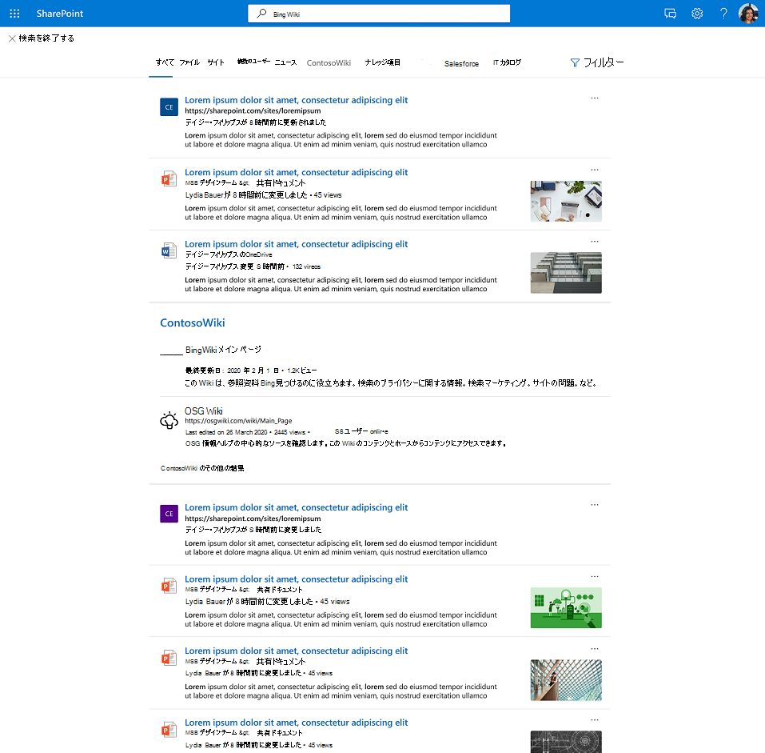

# Graphコネクタの結果クラスター

## コネクタの結果Graphクラスターの概要  

Graph コネクタの結果クラスターを使用すると、企業は既定のビューでサード パーティのデータ ソースからコンテンツを検索できます。SharePoint、Office.com、および Bing の Microsoft Search タブ。

結果クラスターは、ユーザーがすべてのサード パーティコンテンツを 1 か所で検出するのに役立ちます。 結果クラスターに表示される結果は、検索の垂直方向の構成に基づいてグループ化されます。

## コネクタの結果を選択して表示する方法

結果クラスターで提供されるコネクタの結果は、コネクタ コンテンツを含む個々の検索バーティカルから派生します。 各検索バーティカルは、候補の結果クラスターとなる関連する結果のセットを提供します。 関連する結果は、各アイテムの "title" プロパティと "content" プロパティに基づいて選択されます。 content プロパティは、スキーマで *isContent=true* としてマークされます。

検索バーティカルからのコンテンツの検出を確実に行う場合は、アイテムに意味のあるタイトルを提供することをお勧めします。 これは、結果クラスター候補の調停と、結果クラスターにコンテンツが表示される可能性にプラスの影響を与える。 たとえば、ユーザーがコンテンツを検索するために ID を使用しない限り、プロパティ "title" の値として ID を使用しないようにします。

結果クラスターが表示される頻度は、構成する検索バーティカルの数やコンテンツの種類などの要因によって異なります。 結果クラスターを操作または無視することで、ユーザーは時間の間にトリガーを調整するヒントを暗黙的に提供します。

結果クラスターに表示されるコネクタ アイテムの検索結果エクスペリエンスでは、ユーザーが定義 [した結果の種類](./customize-search-page.md#create-your-own-result-type) を使用します。 結果の種類が構成されていない場合は、 [システムによって生成されたレイアウトが](./customize-search-page.md#default-search-result-layout) 使用されます。

検索結果のタイトルとして "title" プロパティ、検索の説明として "content" プロパティを使用することをお勧めします。 これにより、結果クラスターの正確なトリガーとクラスター内の最も関連性の高い結果を通じて、ユーザーにとって最適なエクスペリエンスが提供されます。

結果クラスターは、[すべての垂直] のページの中央に表示されます。 たとえば、"MediaWiki" 垂直からの結果クラスターが下に表示されます。

## 結果クラスターの既定の設定
  
結果のクラスター エクスペリエンスは既定でオンになっています。  

無効にする場合は、次の手順に従って組織レベルでのエクスペリエンスをオフにします。

1. [バーティ [Microsoft 365 管理センター](https://admin.microsoft.com)に [**移動します**](https://admin.microsoft.com/Adminportal/Home#/MicrosoftSearch/verticals)。
1. [すべての垂直 **] を** 選択し、[コネクタの **結果を非表示にする] を有効にします**。

次の手順に従って、サイト レベルでエクスペリエンスSharePointします。

1. サイトの **設定** に移動SharePointします。
2. [サイト情報 **] [** > **すべてのサイト設定を表示する] に移動します**。
3. [サイト コレクション] セクションMicrosoft Search、このサイト コレクション **の [Microsoft Search構成] を選択します**。
4. ナビゲーション ウィンドウで、[カスタム エクスペリエンス] に **移動し**、[垂直] **を選択します**。
5. [すべての垂直 **] を** 選択し、[コネクタの **結果を非表示にする] を有効にします**。
