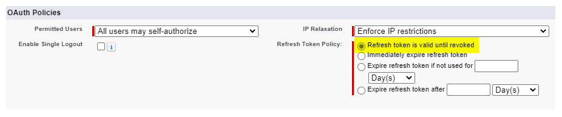
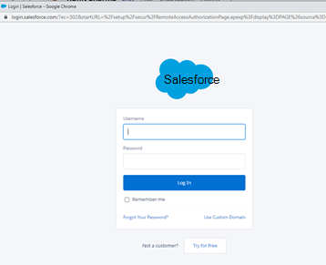
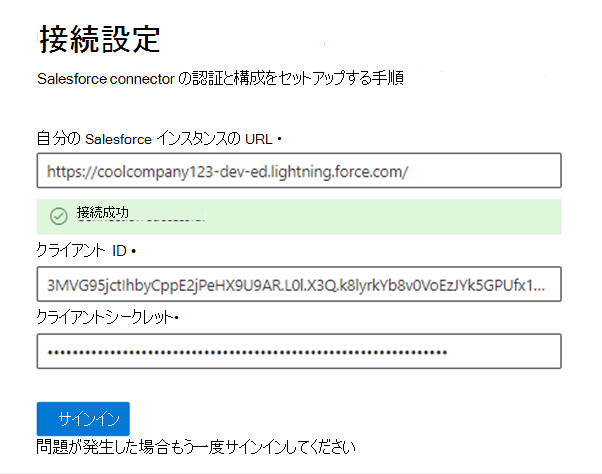
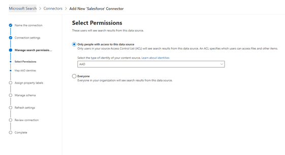

<!---Previous ms.author: rusamai --->

# Salesforce Graph コネクタ (プレビュー)Salesforce Graph connector (preview)

Salesforce Graphコネクタを使用すると、組織は Salesforce インスタンスの連絡先、機会、見込み客、およびアカウント オブジェクトをインデックス化できます。The Salesforce Graph connector, allows your organization to index Contacts, Opportunities, Leads, and Accounts objects in your Salesforce instance. Salesforce からコネクタとインデックス コンテンツを構成した後、エンド ユーザーは任意の Microsoft Search クライアントからそれらのアイテムを検索できます。After you configure the connector and index content from Salesforce, end users can search for those items from any Microsoft Search client.

> [!NOTE]
> 一般的な [**コネクタのセットアップGraph**](configure-connector.md) Graphについては、「Graphコネクタのセットアップ」をご覧ください。Read the [**Setup for your Graph connector**](configure-connector.md) article to understand the general Graph connectors setup instructions.

この記事は、Salesforce クライアント コネクタを構成、実行、および監視するGraphです。This article is for anyone who configures, runs, and monitors a Salesforce Graph connector. これは、一般的なセットアップ プロセスを補足し、Salesforce アプリケーション コネクタにのみ適用される手順Graphします。It supplements the general setup process, and shows instructions that apply only for the Salesforce Graph connector. この記事には、制限に関する [情報も含まれています](#limitations)。This article also includes information about [Limitations](#limitations).

>[!IMPORTANT]
>Salesforce Graphコネクタは現在、Summer '19 以降をサポートしています。The Salesforce Graph connector currently supports Summer '19 or later.

## 使用を開始する前にBefore you get started

Salesforce インスタンスに接続するには、OAuth 認証用の Salesforce インスタンス URL、クライアント ID、およびクライアント シークレットが必要です。To connect to your Salesforce instance, you need your Salesforce instance URL, the Client ID, and Client Secret for OAuth authentication. 次の手順では、自分または Salesforce 管理者が Salesforce アカウントからこの情報を取得する方法について説明します。The following steps explain how you or your Salesforce administrator can get this information from your Salesforce account:

- Salesforce インスタンスにログインし、[セットアップ] に移動します。Log in to your Salesforce instance and go to Setup

- [アプリ] ->に移動します。Navigate to Apps -> App Manager.

- [新 **しい接続アプリ] を選択します**。Select **New connected app**.

- 次のように API セクションを完了します。Complete the API section as follows:

    - [Oauth を有効にする **] チェック ボックスをオン設定。**Select the checkbox for **Enable Oauth Settings**.

    - コールバック URL を次のように指定します。 [https://gcs.office.com/v1.0/admin/oauth/callback](https://gcs.office.com/v1.0/admin/oauth/callback)Specify the Callback URL as: [https://gcs.office.com/v1.0/admin/oauth/callback](https://gcs.office.com/v1.0/admin/oauth/callback)

    - これらの必須の OAuth スコープを選択します。Select these required OAuth scopes.

        - データへのアクセスと管理 (api)Access and manage your data (api)

        - いつでも代理で要求を実行する (refresh_token、offline_access)Perform requests on your behalf at any time (refresh_token, offline_access)

    - [Web サーバー フローにシークレット **を要求する] チェック ボックスをオンにします**。Select the checkbox for **Require secret for web server flow**.

    - アプリを保存します。Save the app.
    
      > [!div class="mx-imgBorder"]
      > 

- コンシューマー キーとコンシューマー シークレットをコピーします。Copy the consumer key and the consumer secret. この情報は、管理ポータルで 設定 コネクタの接続設定 Graphを構成するときに、クライアント ID とクライアント シークレットMicrosoft 365されます。This information will be used as the Client ID and the Client Secret when you configure the Connection Settings for your Graph Connector in the Microsoft 365 admin portal.

  > [!div class="mx-imgBorder"]
  > 
  
- Salesforce インスタンスを閉じる前に、次の手順に従って更新トークンの有効期限が切れなかってください。Before closing your Salesforce instance, follow these steps to ensure that refresh tokens don't expire:
    - [アプリ] -> マネージャーに移動します。Go to Apps -> App Manager
    - 作成したアプリを見つけて、右側のドロップダウンを選択します。Find the app you created and select the drop-down on the right. [管理] **の選択**Select **Manage**
    - ポリシー **の編集を選択する**Select **edit policies**
    - 更新トークン ポリシーの場合、[更新トークン **は失効するまで有効です] を選択します。**For refresh token policy, select **Refresh token is valid until revoked**

  > [!div class="mx-imgBorder"]
  > 

[これで、M365 管理センターを](https://admin.microsoft.com/)使用して、このコネクタのセットアップ プロセスの残りのGraphできます。You can now use the [M365 Admin Center](https://admin.microsoft.com/) to complete the rest of the setup process for your Graph connector.

## 手順 1: 管理センター GraphコネクタをMicrosoft 365するStep 1: Add a Graph connector in the Microsoft 365 admin center

一般的なセットアップ [手順に従います](./configure-connector.md)。Follow the general [setup instructions](./configure-connector.md).
<!---If the above phrase does not apply, delete it and insert specific details for your data source that are different from general setup instructions.-->

## 手順 2: 接続に名前を付けStep 2: Name the connection

一般的なセットアップ [手順に従います](./configure-connector.md)。Follow the general [setup instructions](./configure-connector.md).
<!---If the above phrase does not apply, delete it and insert specific details for your data source that are different from general setup instructions.-->

## 手順 3: 接続設定を構成するStep 3: Configure the connection settings

インスタンス URL の場合は、https://[domain].my.salesforce.com を使用します。ドメインは組織の Salesforce ドメインになります。For the Instance URL, use https://[domain].my.salesforce.com where domain would be the Salesforce domain for your organization.

Salesforce インスタンスから取得したクライアント ID とクライアント シークレットを入力し、[サインイン] を選択します。Enter the Client ID and Client Secret you obtained from your Salesforce instance and select Sign in.

これらの設定で初めてサインインしようとすると、管理者のユーザー名とパスワードを使用して Salesforce にログインするためのポップアップが表示されます。The first time you've attempted to sign in with these settings, you'll get a pop-up asking you to log in to Salesforce with your admin username and password. 次のスクリーンショットは、ポップアップを示しています。The screenshot below shows the popup. 資格情報を入力し、[ログイン] を選択します。Enter your credentials and select "Log In".

  

  >[!NOTE]
  >ポップアップが表示されない場合は、ブラウザーでブロックされている可能性があります。ポップアップとリダイレクトを許可する必要があります。If the pop up does not appear, it might be getting blocked in your browser, so you must allow pop-ups and redirects.

下のスクリーンショットに示すように、「接続が成功しました」という緑色のバナーを検索して、接続が成功したと確認します。Check that the connection was successful by searching for a green banner that says "Connection successful" as show in the screenshot below.

  > [!div class="mx-imgBorder"]
  > The green banner that says "Connection successful" is located under the field for your Salesforce Instance URL](media/salesforce-connector/sf5.png)

## 手順 4: 検索アクセス許可を管理するStep 4: Manage search permissions

このデータ ソースから検索結果を表示するユーザーを選択する必要があります。You'll need to choose which users will see search results from this data source. 特定のユーザー (Azure Azure Active Directory) AD または非 Azure AD ユーザーに検索結果の表示のみを許可する場合は、ID をマップしてください。If you allow only certain Azure Active Directory (Azure AD) or Non-Azure AD users to see the search results, make sure you map the identities.

### 手順 4.a: アクセス許可の選択Step 4.a: Select permissions

Salesforce インスタンスからアクセス制御リスト (ACL) を取り込むか、組織内のすべてのユーザーにこのデータ ソースからの検索結果を表示できます。You can choose to ingest Access Control Lists (ACLs) from your Salesforce instance, or allow everyone in your organization to see search results from this data source. ACL には、Azure Active Directory (AAD) ID (Azure AD から Salesforce にフェデレーションされているユーザー)、Azure AD 以外の ID (Azure AD で対応する ID を持つネイティブ Salesforce ユーザー)、または両方が含まれます。ACLs can include Azure Active Directory (AAD) identities (users who are federated from Azure AD to Salesforce), non-Azure AD identities (native Salesforce users who have corresponding identities in Azure AD), or both.

>[!NOTE]
>Ping ID や secureAuth などのサードパーティ ID プロバイダーを使用する場合は、ID の種類として "非 AAD" を選択する必要があります。If you use a third-party Identity Provider like Ping ID or secureAuth, you should select "non-AAD" as the identity type.

> [!div class="mx-imgBorder"]
> ![管理者が完了した [アクセス許可] 画面を選択します。管理者は[このデータ ソースにアクセスできるユーザーのみ] オプションを選択し、ID の種類のドロップダウン メニューから [AAD] も選択しています。](media/salesforce-connector/sf6.png)

Salesforce インスタンスから ACL を取り込み、ID の種類として [非 AAD] を選択した場合は、「Id のマッピング方法については [、「Map your Azure AD Identitys」](map-non-aad.md) を参照してください。If you chose to ingest an ACL from your Salesforce instance and selected "non-AAD" for the identity type, see [Map your non-Azure AD Identities](map-non-aad.md) for instructions on mapping the identities.

### 手順 4.b: AAD ID のマップStep 4.b: Map AAD identities

Salesforce インスタンスから ACL を取り込み、ID の種類として [AAD] を選択した場合は、「Id のマッピング方法については [、「Map your Azure AD Identitys」](map-aad.md) を参照してください。If you chose to ingest an ACL from your Salesforce instance and selected "AAD" for the identity type, see [Map your Azure AD Identities](map-aad.md) for instructions on mapping the identities. Azure AD SSO を設定する方法については、このチュートリアルを参照 [してください](/azure/active-directory/saas-apps/salesforce-tutorial)。To learn how to set up Azure AD SSO for Salesforce, see this [tutorial](/azure/active-directory/saas-apps/salesforce-tutorial).

### ユーザー マッピングを適用して、Salesforce ID を Azure ID AD同期するApply user mapping to sync your Salesforce identities to Azure AD identities

このビデオでは、Salesforce インスタンスに対する認証プロセスを確認し、Azure Active Directory 以外の ID を Azure Active Directory ID に同期し、適切なセキュリティ トリミングを Salesforce アイテムに適用できます。In this video you can see the process to authenticate to your Salesforce instance, sync your non-Azure Active Directory identities to your Azure Active Directory identities, and apply the proper security trimmings to your Salesforce items.

> [!VIDEO https://www.youtube.com/watch?v=SZYiFxZMKcM]

## 手順 5: プロパティ ラベルを割り当てるStep 5: Assign property labels

各ラベルにソース プロパティを割り当てるには、オプションのメニューから選択します。You can assign a source property to each label by choosing from a menu of options. この手順は必須ではありませんが、一部のプロパティ ラベルを使用すると、検索の関連性が向上し、エンド ユーザーの検索結果が向上します。While this step is not mandatory, having some property labels will improve the search relevance and ensure better search results for end users. 既定では、"Title"、"URL"、"CreatedBy"、"LastModifiedBy" のような一部のラベルには、ソース プロパティが既に割り当て済みです。By default, some of the Labels like "Title," "URL," "CreatedBy," and  "LastModifiedBy" have already been assigned source properties.

## 手順 6: スキーマを管理するStep 6: Manage schema

インデックスを作成するソース プロパティを選択して、検索結果に表示できます。You can select what source properties should be indexed so that they show up in search results. 既定では、接続ウィザードは、一連のソース プロパティに基づいて検索スキーマを選択します。The connection wizard by default selects a search schema based on a set of source properties. 検索スキーマ ページの各プロパティと属性のチェック ボックスをオンにすると、変更できます。You can modify it by selecting the check boxes for each property and attribute in the search schema page. 検索スキーマ属性には、検索、クエリ、取得、絞り込みがあります。Search schema attributes include Search, Query, Retrieve, and Refine.
絞り込みでは、後で検索エクスペリエンスでカスタム絞り込み条件またはフィルターとして使用できるプロパティを定義できます。Refine allows you to define the properties that can be later used as custom refiners or filters in the search experience.  

> [!div class="mx-imgBorder"]
> The options are Query, Search, Retrieve, and Refine](media/salesforce-connector/sf9.png)

## 手順 7: 更新スケジュールを設定するStep 7: Set the refresh schedule

Salesforce コネクタは現在、フル クロールの更新スケジュールのみをサポートしています。The Salesforce connector only supports refresh schedules for full crawls currently.

>[!IMPORTANT]
>フル クロールでは、削除されたオブジェクトと、以前に Microsoft Search インデックスに同期されたユーザーが検索されます。A full crawl finds deleted objects and users that were previously synced to the Microsoft Search index.

推奨されるスケジュールは、フル クロールの場合は 1 週間です。The recommended schedule is one week for a full crawl.

## 手順 8: 接続の確認Step 8: Review connection

一般的なセットアップ [手順に従います](./configure-connector.md)。Follow the general [setup instructions](./configure-connector.md).
<!---If the above phrase does not apply, delete it and insert specific details for your data source that are different from general setup instructions.-->

<!---## Troubleshooting-->
<!---Insert troubleshooting recommendations for this data source-->

## 制限事項Limitations

- 現在Graphは、Salesforce の個人グループを使用した、地域ベースの Apex ベースの共有と共有をサポートしています。The Graph connector doesn't currently support Apex based, territory-based sharing and sharing using personal groups from Salesforce.
- Salesforce API には、Graph コネクタが使用する既知のバグがあります。この場合、現在、リードのプライベート組織全体の既定値は適用されません。There's a known bug in the Salesforce API the Graph connector uses, where the private org-wide defaults for leads aren't honored currently.  
- フィールドにプロファイルに対してフィールド レベルセキュリティ (FLS) が設定されている場合、Graph コネクタは、その Salesforce 組織のプロファイルに対してそのフィールドを取り込む必要があります。その結果、ユーザーはそれらのフィールドの値を検索したり、結果に表示したりしなかることができます。If a field has field level security (FLS) set for a profile, the Graph connector won't ingest that field for any profiles in that Salesforce org. As a result, users won't be able to search on values for those fields, nor will it show up in the results.  
- [スキーマの管理] 画面で、これらの一般的な標準プロパティ名が 1 回表示され、オプションは **クエリ**、**検索**、取得、絞り込み、すべてまたはなしに適用されます。In the Manage Schema screen these common standard property names are listed once, the options are **Query**, **Search**, **Retrieve**, and **Refine**, and apply to all or none.
    - 名前Name
    - UrlUrl
    - 説明Description
    - FAXFax
    - PhonePhone
    - MobilePhoneMobilePhone
    - メールEmail
    - 型Type
    - タイトルTitle
    - AccountIdAccountId
    - AccountNameAccountName
    - AccountUrlAccountUrl
    - AccountOwnerAccountOwner
    - AccountOwnerUrlAccountOwnerUrl
    - 所有者Owner
    - OwnerUrlOwnerUrl
    - CreatedByCreatedBy
    - CreatedByUrlCreatedByUrl
    - LastModifiedByLastModifiedBy
    - LastModifiedByUrlLastModifiedByUrl
    - LastModifiedDateLastModifiedDate
    - ObjectNameObjectName
