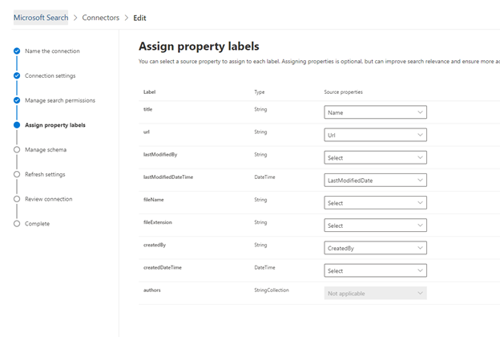

# Salesforce コネクタ

Salesforce Graph コネクタを使用すると、組織は Salesforce インスタンスの連絡先、営業案件、潜在顧客、およびアカウントのオブジェクトにインデックスを作成できます。 Salesforce からコネクタとインデックスコンテンツを構成すると、エンドユーザーは任意の Microsoft 検索クライアントからこれらのアイテムを検索できるようになります。

この記事は、 [Microsoft 365](https://www.microsoft.com/microsoft-365) 管理者、または Salesforce コネクタを構成、実行、および監視するユーザーを対象としています。 コネクタとコネクタの機能、制限事項、およびトラブルシューティングの手法を構成する方法について説明します。

>[!IMPORTANT]
>現在、Salesforce Graph コネクタは、夏の ' 20、Spring ' 20、冬 ' 20、およびサマー ' 19 バージョンをサポートしています。

## 接続設定

Salesforce インスタンスに接続するには、Salesforce インスタンスの URL、クライアント ID、および OAuth 認証のクライアントシークレットが必要です。 次の手順では、ユーザーまたは Salesforce 管理者が Salesforce アカウントからこの情報を取得する方法について説明します。

- Salesforce インスタンスにログインして、[セットアップ] に移動します。

- [アプリ-> App Manager に移動します。

- [ **新しい接続済みアプリ** ] を選択します。

- API セクションを次のように入力します。

    - [ **Oauth 設定を有効にする** ] のチェックボックスをオンにします。

    - コールバック URL を次のように指定します。 [https://gcs.office.com/v1.0/admin/oauth/callback](https://gcs.office.com/v1.0/admin/oauth/callback)

    - 必要な OAuth スコープを選択します。 

        - データにアクセスして管理する (api) 

        - 任意のタイミングで (refresh_token、offline_access)、自分の代理で要求を実行する 

    - [ **Web サーバーフローにシークレットを必要と** する] のチェックボックスをオンにします。

    - アプリを保存します。
    
      

- コンシューマーキーとコンシューマーシークレットをコピーします。 これらは、Microsoft 365 管理ポータルで Graph コネクタの接続設定を構成する際に、クライアント ID とクライアントシークレットとして使用されます。

  ![管理者が必要なすべての構成を送信した後に、Salesforce インスタンスの [API] セクションによって返された結果。 Consumer キーは左列の上にあり、コンシューマーシークレットは右列の上にあります。](media/salesforce-connector/clientsecret.png)
- Salesforce インスタンスを閉じる前に、次の手順を実行して、更新トークンの有効期限が切れないようにします。 
    - [アプリ-> アプリマネージャー] に移動します。
    - 作成したばかりのアプリを見つけ、右側のドロップダウンを選択します。 [ **管理** ] を選択します。
    - [ **ポリシーの編集** ] を選択する
    - 更新トークンポリシーの場合、[ **トークンの更新は取り消されるまで有効です** ] を選択します。

  ![[更新トークンは取り消されるまで有効です] という名前の更新トークンポリシーを選択します。](media/salesforce-connector/oauthpolicies.png)

[M365 管理センター](https://admin.microsoft.com/)を使用して、Graph connector のセットアッププロセスを完了することができるようになりました。  

Graph connector の接続設定を次のように構成します。

- インスタンス URL の場合は、https を使用します。ここで、domain は組織の Salesforce ドメインになります。 
- Salesforce インスタンスから取得したクライアント ID とクライアントシークレットを入力し、[サインイン] を選択します。
- この設定を使用して初めてサインインを試みた場合は、管理者のユーザー名とパスワードを使用して、Salesforce にログインするように求めるポップアップが表示されます。 次のスクリーンショットは、ポップアップを示しています。 資格情報を入力して、[ログイン] を選択します。

  

  >[!NOTE]
  >ポップアップが表示されない場合は、ブラウザーでブロックされる可能性があるので、ポップアップとリダイレクトを許可する必要があります。

  >[!NOTE]
  >組織でシングルサインオン (SSO) を使用している場合は、ログインインターフェイスの右下隅にある [ **カスタムドメインの使用** ] を選択することができます。 ドメインを入力し、[ **続行** ] を選択します。 これにより、SSO を使用してログインするオプションを持つ、組織固有のログインページに移動します。

- 次のスクリーンショットに示されているように、「接続が成功しました」という緑色のバナーを検索して、接続が成功したことを確認します。

  ![成功したログインのスクリーンショット。 [接続成功] という緑色のバナーは、[Salesforce インスタンス URL] のフィールドの下にあります。](media/salesforce-connector/sf5.png)

## 検索アクセス許可を管理する
このデータソースからの検索結果を表示するユーザーを選択する必要があります。 特定の Azure Active Directory (AAD) または非 AAD ユーザーのみが検索結果を表示できるようにする場合は、id をマップする必要があります。

### アクセス許可の選択
アクセス制御リスト (Acl) を Salesforce インスタンスから取り込み、または組織内のすべてのユーザーがこのデータソースからの検索結果を表示できるようにすることができます。 Acl には、Azure Active Directory (AAD) id、非 AAD id、またはその両方を含めることができます。

![管理者によって完了したアクセス許可の選択画面。管理者が [このデータソースへのアクセス権を持つユーザーのみ] オプションを選択し、さらに id タイプのドロップダウンメニューから [AAD] を選択しました。](media/salesforce-connector/sf6.png)

### AAD 以外の id をマップする 
Salesforce インスタンスから ACL を取り込み、id の種類として "非 AAD" を選択した場合は、id のマッピングの手順について「 [非 AZURE AD id をマップ ](map-non-aad.md) する」を参照してください。

### AAD id をマップする
Salesforce インスタンスから ACL を取り込み、id の種類として "AAD" を選択した場合は、id のマッピングの手順について「 [AZURE AD id をマップ](map-aad.md) する」を参照してください。

## プロパティのラベルを割り当てる 
各ラベルに source プロパティを割り当てるには、オプションのメニューから選択します。 この手順は必須ではありませんが、いくつかのプロパティラベルを使用することで、検索の関連性が向上し、エンドユーザーの検索結果がより正確になります。 既定では、"Title"、"url"、"Last/送信者" などの一部のラベルには、既に source プロパティが割り当てられています。

## スキーマを管理する
インデックスを作成するソースプロパティを選択して、検索結果に表示することができます。 接続ウィザードは、既定で、ソースプロパティのセットに基づいて検索スキーマを選択します。 [検索スキーマ] ページで各プロパティと属性のチェックボックスをオンにすることによって、これを変更できます。 検索スキーマの属性には、検索、クエリ、取得、および絞り込みがあります。 [絞り込み] 検索機能でカスタムの絞り込み条件またはフィルターとして後で使用できるプロパティを定義できます。  

## 更新スケジュールを設定する

Salesforce コネクタは、現在、フルクロールの更新スケジュールのみをサポートします。

>[!IMPORTANT]
>フルクロールでは、削除されたオブジェクトと、以前に Microsoft 検索インデックスに同期されたユーザーが検索されます。

推奨されるスケジュールは、フルクロールで1週間です。

## 制限事項

- Graph connector は現在、Salesforce からの個人グループを使用した Apex ベースの領土ベースの共有と共有をサポートしていません。
- Salesforce API に既知のバグがあります。グラフコネクタで使用されるのは、潜在顧客に対するプライベートな組織全体の既定値が現在有効になっていない場合です。  
- フィールドがプロファイルに対してフィールドレベルセキュリティ (FLS) が設定されている場合、Graph connector は、その Salesforce 組織のプロファイルに対してそのフィールドを取り込みません。そのため、ユーザーは、これらのフィールドの値を検索することはできません。結果には表示されません。  
- FLS セットアップは、コネクタの完全同期時に有効になります。
- [スキーマの管理] 画面には、これらの共通の標準プロパティの名前が1回表示され、それらをクエリ可能にするために実行した選択内容、検索可能で取得可能です。すべてまたはなしに適用されます。
    - 名前
    - Url 
    - 説明
    - FAX
    - Phone
    - MobilePhone
    - メール
    - 型
    - Title
    - AccountId
    - AccountName
    - AccountUrl
    - AccountOwner
    - AccountOwnerUrl
    - 所有者
    - OwnerUrl
    - CreatedBy 
    - 新規の Url 
    - LastModifiedBy 
    - LastModifiedByUrl 
    - LastModifiedDate
    - ObjectName 
