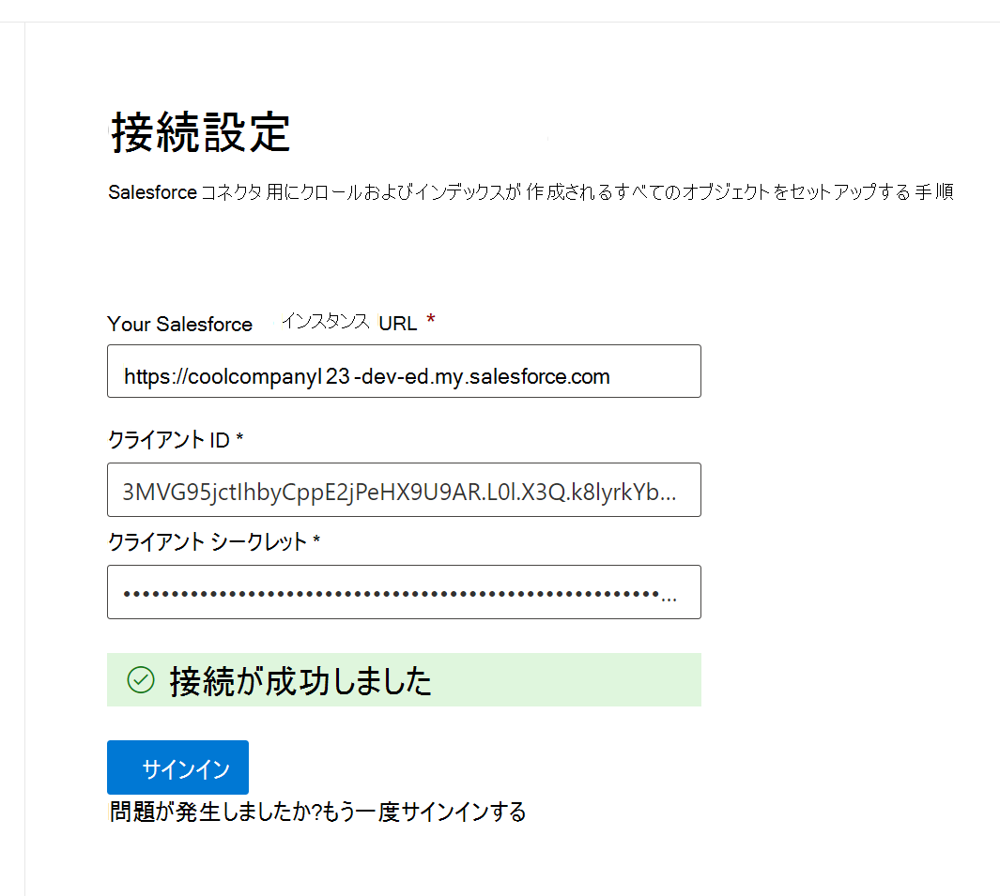

<!---Previous ms.author: rusamai --->

# Salesforce Graph コネクタ

Salesforce Graphコネクタを使用すると、組織は Salesforce インスタンスの連絡先、機会、見込み顧客、ケース、および Accounts オブジェクトのインデックスを作成できます。 Salesforce からコネクタとインデックス コンテンツを構成した後、エンド ユーザーは任意のクライアントからそれらのアイテムMicrosoft Searchできます。

> [!NOTE]
> 一般的な [**コネクタのセットアップGraph**](configure-connector.md) Graphについては、「Graphコネクタのセットアップ」をご覧ください。

この記事は、Salesforce クライアント コネクタを構成、実行、および監視するGraphです。 これは、一般的なセットアップ プロセスを補足し、Salesforce アプリケーション コネクタにのみ適用される手順Graphします。 この記事には、制限に関する [情報も含まれています](#limitations)。

>[!IMPORTANT]
>Salesforce Graphコネクタは現在、Summer '19 以降をサポートしています。

## 使用を開始する前に

Salesforce インスタンスに接続するには、OAuth 認証用の Salesforce インスタンス URL、クライアント ID、およびクライアント シークレットが必要です。 次の手順では、自分または Salesforce 管理者が Salesforce アカウントからこの情報を取得する方法について説明します。

- Salesforce インスタンスにログインし、[セットアップ] に移動します。

- [アプリ] ->に移動します。

- [新 **しい接続アプリ] を選択します**。

- 次のように API セクションを完了します。

    - [Oauth を有効にする **] チェック ボックスをオン設定。**

    - コールバック URL を次のように指定します。 [https://gcs.office.com/v1.0/admin/oauth/callback](https://gcs.office.com/v1.0/admin/oauth/callback)

    - これらの必須の OAuth スコープを選択します。

        - データへのアクセスと管理 (api)

        - いつでも代理で要求を実行する (refresh_token、offline_access)

    - [Web サーバー フローにシークレット **を要求する] チェック ボックスをオンにします**。

    - アプリを保存します。
    
      > [!div class="mx-imgBorder"]
      > 

- コンシューマー キーとコンシューマー シークレットをコピーします。 この情報は、管理ポータルで 設定 コネクタの接続設定 Graphを構成するときに、クライアント ID とクライアント シークレットMicrosoft 365されます。

  > [!div class="mx-imgBorder"]
  > 
  
- Salesforce インスタンスを閉じる前に、次の手順に従って更新トークンの有効期限が切れなかってください。
    - [アプリ] -> マネージャーに移動します。
    - 作成したアプリを見つけて、右側のドロップダウンを選択します。 [管理] **の選択**
    - ポリシー **の編集を選択する**
    - 更新トークン ポリシーの場合、[更新トークン **は失効するまで有効です] を選択します。**

  > [!div class="mx-imgBorder"]
  > 

これで、Microsoft 365 管理[センター](https://admin.microsoft.com/)を使用して、コネクタのセットアップ プロセスの残りのGraphできます。

## 手順 1: Graphコネクタを追加Microsoft 365 管理センター

一般的なセットアップ [手順に従います](./configure-connector.md)。
<!---If the above phrase does not apply, delete it and insert specific details for your data source that are different from general setup instructions.-->

## 手順 2: 接続に名前を付け

一般的なセットアップ [手順に従います](./configure-connector.md)。
<!---If the above phrase does not apply, delete it and insert specific details for your data source that are different from general setup instructions.-->

## 手順 3: 接続設定を構成する

インスタンス URL の場合は、https://[domain].my.salesforce.com を使用します。ドメインは組織の Salesforce ドメインになります。

Salesforce インスタンスから取得したクライアント ID とクライアント シークレットを入力し、[サインイン] を選択します。

これらの設定で初めてサインインしようとすると、管理者のユーザー名とパスワードを使用して Salesforce にログインするためのポップアップが表示されます。 次のスクリーンショットは、ポップアップを示しています。 資格情報を入力し、[ログイン] を選択します。

  

  >[!NOTE]
  >ポップアップが表示されない場合は、ブラウザーでブロックされている可能性があります。ポップアップとリダイレクトを許可する必要があります。

下のスクリーンショットに示すように、「接続が成功しました」という緑色のバナーを検索して、接続が成功したと確認します。

  > [!div class="mx-imgBorder"]
  > 

## 手順 4: プロパティの選択

コネクタでクロールして検索結果に含める Salesforce オブジェクトを選択します。 [連絡先] が選択されている場合は、[アカウント] も自動的に選択されます。

>[!NOTE]
>フィールドにプロファイルに対してフィールド レベルセキュリティ (FLS) が設定されている場合、コネクタは、その Salesforce 組織のプロファイルに対してそのフィールドを取り込む必要があります。その結果、ユーザーはそれらのフィールドの値を検索したり、結果に表示したりしなかることができます。

## 手順 5: 検索アクセス許可を管理する

このデータ ソースから検索結果を表示するユーザーを選択する必要があります。 特定のユーザー (Azure Azure Active Directory) AD または非 Azure AD ユーザーに検索結果の表示のみを許可する場合は、ID をマップしてください。

### 手順 5.a: アクセス許可の選択

Salesforce インスタンスからアクセス制御リスト (ACL) を取り込むか、組織内のすべてのユーザーにこのデータ ソースからの検索結果を表示できます。 ACL には、Azure Active Directory (AAD) ID (Azure AD から Salesforce にフェデレーションされているユーザー)、Azure AD 以外の ID (Azure AD で対応する ID を持つネイティブ Salesforce ユーザー)、または両方が含まれます。

>[!NOTE]
>Ping ID や secureAuth などのサードパーティ ID プロバイダーを使用する場合は、ID の種類として "非 AAD" を選択する必要があります。

> [!div class="mx-imgBorder"]
> ![管理者が完了した [アクセス許可] 画面を選択します。管理者は[このデータ ソースにアクセスできるユーザーのみ] オプションを選択し、ID の種類のドロップダウン メニューから [AAD] も選択しています。](media/salesforce-connector/sf6.png)

Salesforce インスタンスから ACL を取り込み、ID の種類として [非 AAD] を選択した場合は、「Id のマッピング方法については [、「Map your Azure AD Identitys」](map-non-aad.md) を参照してください。

### 手順 5.b: AAD ID のマップ

Salesforce インスタンスから ACL を取り込み、ID の種類として [AAD] を選択した場合は、「Id のマッピング方法については [、「Map your Azure AD Identitys」](map-aad.md) を参照してください。 Azure AD SSO を設定する方法については、このチュートリアルを参照 [してください](/azure/active-directory/saas-apps/salesforce-tutorial)。

### ユーザー マッピングを適用して、Salesforce ID を Azure ID AD同期する

このビデオでは、Salesforce インスタンスに対する認証プロセスを確認し、Azure Active Directory 以外の ID を Azure Active Directory ID に同期し、適切なセキュリティ トリミングを Salesforce アイテムに適用できます。

> [!VIDEO https://www.youtube-nocookie.com/embed/SZYiFxZMKcM]

## 手順 6: プロパティ ラベルを割り当てる

各ラベルにソース プロパティを割り当てるには、オプションのメニューから選択します。 この手順は必須ではありませんが、一部のプロパティ ラベルを使用すると、検索の関連性が向上し、エンド ユーザーの検索結果が向上します。 既定では、"Title"、"URL"、"CreatedBy"、"LastModifiedBy" のような一部のラベルには、ソース プロパティが既に割り当て済みです。

## 手順 7: スキーマの管理

インデックスを作成するソース プロパティを選択して、検索結果に表示できます。 既定では、接続ウィザードは、一連のソース プロパティに基づいて検索スキーマを選択します。 検索スキーマ ページの各プロパティと属性のチェック ボックスをオンにすると、変更できます。 検索スキーマ属性には、検索、クエリ、取得、絞り込みがあります。
絞り込みでは、後で検索エクスペリエンスでカスタム絞り込み条件またはフィルターとして使用できるプロパティを定義できます。  

> [!div class="mx-imgBorder"]
> 

## 手順 8: 更新スケジュールを設定する

Salesforce コネクタは現在、フル クロールの更新スケジュールのみをサポートしています。

>[!IMPORTANT]
>フル クロールでは、削除されたオブジェクトと、以前に同期されたユーザーが削除済みインデックスMicrosoft Searchします。

推奨されるスケジュールは、フル クロールの場合は 1 週間です。

## 手順 9: 接続の確認

一般的なセットアップ [手順に従います](./configure-connector.md)。

>[!TIP]
>**既定の結果の種類**
>* コネクタが発行された後、Salesforce [コネクタは自動的](./customize-search-page.md#step-2-create-result-types) に結果の種類を登録します。 結果の種類は、手順 3 で選択したフィールドに基づいて動的に生成された結果レイアウトを使用します。 
>* 結果の種類を管理するには、次のページの [**[結果**](https://admin.microsoft.com/Adminportal/Home#/MicrosoftSearch/resulttypes)の種類] に [Microsoft 365 管理センター。](https://admin.microsoft.com) 既定の結果の種類には"Default" という名前が `ConnectionId` 付けられます。 たとえば、接続 ID がである場合、結果レイアウトの名前は `Salesforce` "SalesforceDefault" になります。
>* また、必要に応じて、独自の結果の種類を作成できます。
<!---If the above phrase does not apply, delete it and insert specific details for your data source that are different from general setup instructions.-->

<!---## Troubleshooting-->
<!---Insert troubleshooting recommendations for this data source-->

## 制限事項

- 現在Graphは、Salesforce の個人グループを使用した、地域ベースの Apex ベースの共有と共有をサポートしています。
- Salesforce API には、Graph コネクタが使用する既知のバグがあります。この場合、現在、リードのプライベート組織全体の既定値は適用されません。  
- フィールドにプロファイルに対してフィールド レベルセキュリティ (FLS) が設定されている場合、Graph コネクタは、その Salesforce 組織のプロファイルに対してそのフィールドを取り込む必要があります。その結果、ユーザーはそれらのフィールドの値を検索したり、結果に表示したりしなかることができます。  
- [スキーマの管理] 画面で、これらの一般的な標準プロパティ名が 1 回表示され、オプションは **クエリ**、**検索**、取得、絞り込み、すべてまたはなしに適用されます。
    - 名前
    - Url
    - 説明
    - FAX
    - Phone
    - MobilePhone
    - メール
    - Type
    - 役職
    - AccountId
    - AccountName
    - AccountUrl
    - AccountOwner
    - AccountOwnerUrl
    - Owner
    - OwnerUrl
    - CreatedBy
    - CreatedByUrl
    - LastModifiedBy
    - LastModifiedByUrl
    - LastModifiedDate
    - ObjectName
