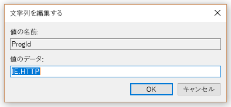
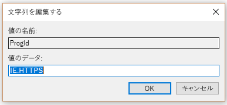

# セットの既定のブラウザーSet default browser

既定のブラウザー、既定の検索エンジン、および既定のホーム ページを構成するがように、Microsoft 検索機能、複数の使用法をお勧めを見つけてより滑らかなエクスペリエンスを提供します。Configuring the default browser, default search engine, and default homepage will help your users discover Microsoft Search capabilities, encourage more usage, and provide a smoother experience.
  
組織の既定のブラウザーを設定するのには以下の手順を実行します。To set the default browser for your organization, follow the steps below.
  
## Windows 8 以降Windows 8 and above

既定のブラウザーとして Internet Explorer または Microsoft のエッジを設定するには、次の手順を実行します。To set Internet Explorer or Microsoft Edge as the default browser, follow these steps:
  
### デフォルトの関連付けファイルを作成します。Create default associations file

1. 管理の PowerShell コンソールを開きます。Open an administrative PowerShell console.
    
2.  `New-Item -Path "\\$env:USERDOMAIN\SYSVOL\$env:USERDNSDOMAIN" -Type Directory -Name "Settings"`
    
3.  `$SettingsPath="\\$env:USERDOMAIN\SYSVOL\$env:USERDNSDOMAIN\Settings"`
    
4.  `Start-Process Dism.exe -PassThru "/Online /Export-DefaultAppAssociations:$SettingsPath\AppAssoc.xml"`
    
次の手順は、ドメイン コント ローラーの SYSVOL フォルダーの既定の関連付けのファイルを作成してください。These steps try and create the default associations file in the SYSVOL folder of the domain controller.
  
### 追加または既定の関連付けのファイルを編集します。Add or edit the default associations file

1. `Notepad "$SettingsPath\AppAssoc.xml"`
    
2. (.Htm、.html、http、https) は、次のエントリを編集し、必要ない場合は、他のエントリを削除します。Edit the following entries (.htm, .html, http, https), and remove other entries if they're not needed.
    
  - **Microsoft Edge****Microsoft Edge**
    
     `<Association Identifier=".htm" ProgId="AppX4hxtad77fbk3jkkeerkrm0ze94wjf3s9" ApplicationName="Microsoft Edge" />`
  
     `<Association Identifier=".html" ProgId="AppX4hxtad77fbk3jkkeerkrm0ze94wjf3s9" ApplicationName="Microsoft Edge" />`
  
     `<Association Identifier="http" ProgId="AppXq0fevzme2pys62n3e0fbqa7peapykr8v" ApplicationName="Microsoft Edge" />`
    
  - **Internet Explorer****Internet Explorer**
    
     `<Association Identifier=".htm" ProgId="htmlfile" ApplicationName="Internet Explorer" />`
  
     `<Association Identifier=".html" ProgId="htmlfile" ApplicationName="Internet Explorer" />`
  
     `<Association Identifier="http" ProgId="IE.HTTP" ApplicationName="Internet Explorer" />`
  
     `<Association Identifier="https" ProgId="IE.HTTPS" ApplicationName="Internet Explorer" />`
    
3. グループ ポリシー管理コンソール (gpmc.msc) を開き、任意の既存のポリシーを編集または新規に作成するのに切り替えます。Open Group Policy Management Console (gpmc.msc) and switch to editing any existing policy or creating a new one.
    
1. **コンピューターの構成 \ 管理用テンプレート Components\File エクスプ ローラー**に移動します。Navigate to **Computer Configuration\Administrative Templates\Windows Components\File Explorer**
    
2. **既定の関連付けの構成ファイルの設定**] をダブルクリック、 **[有効**] に設定し、AppAssoc.xml へのパスを入力 (たとえば %USERDOMAIN%\SYSVOL\%USERDNSDOMAIN%\Settings\AppAssoc.xml)Double-click **Set a default associations configuration file**, set it to **Enabled**, and enter the path to AppAssoc.xml (for example %USERDOMAIN%\SYSVOL\%USERDNSDOMAIN%\Settings\AppAssoc.xml)
    
4. 適切なドメインにリンクすることによって、結果の GPO を適用します。Enforce the resultant GPO by linking it to the appropriate domain.
    
ユーザーはこのポリシーを設定した後にブラウザーを変更することになります。Users will be able to change the browser after this policy is set.
  
## Windows 7Windows 7

1. GPO の設定を使用するローカル コンピューターを構成します。Configure the local machine that will be used to set the GPO.
    
1. **コントロール Panel\Programs\Default Programs\Set の既定のプログラム**を開くし、Internet Explorer を既定として設定します。Open **Control Panel\Programs\Default Programs\Set Default Programs** and set Internet Explorer as the default. 
    
2. グループ ポリシー管理コンソール (gpmc.msc) を開き、任意の既存のポリシーを編集または新規に作成するのに切り替えます。Open Group Policy Management Console (gpmc.msc) and switch to editing any existing policy or creating a new one.
    
1. 移動**\<コンピューター/ユーザー\> Configuration\Policies\Preferences\Windows 設定**。Navigate to **\<Computer/User\> Configuration\Policies\Preferences\Windows Settings**.
    
2. **Registry\New**を右クリックし、[**レジストリ ウィザード**] を選択します。Right-click on **Registry\New** and select **Registry Wizard**.
    
3. レジストリのブラウザーのウィンドウからは、**ローカル コンピューター**を選択し、[**次へ**] をクリックします。From the Registry Browser window, select **Local Computer** and click **Next**.
    
4. **HKEY_CURRENT_USER\Software\Microsoft\Windows\Shell\Associations\UrlAssociations\https**に移動し、ProgId の値を選択します。値は次のような外観を確認します。Navigate to **HKEY_CURRENT_USER\Software\Microsoft\Windows\Shell\Associations\UrlAssociations\https** and select the ProgId value. Make sure the value looks like the one below: 
    
    
  
5. **HKEY_CURRENT_USER\Software\Microsoft\Windows\Shell\Associations\UrlAssociations\https**に移動し、ProgId の値を選択します。行います。 値が、いずれかのようになっていることを確認して下Navigate to **HKEY_CURRENT_USER\Software\Microsoft\Windows\Shell\Associations\UrlAssociations\https** and select the ProgId value. Make sure that the value looks like the one below: 
    
    
  
3. 適切なドメインにリンクすることによって、結果の GPO を適用します。Enforce the resultant GPO by linking it to the appropriate domain.
    
ユーザーはこのポリシーを設定した後にブラウザーを変更することになります。Users will be able to change the browser after this policy is set.