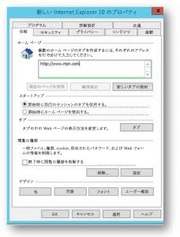

# 既定のホーム ページの設定

既定のブラウザー、検索エンジン、ホーム ページを構成すると、ユーザーが Microsoft Search 機能を把握したり、使用を促進したり、円滑なエクスペリエンスを提供したりするのに役立ちます。
  
組織の既定のホーム ページを設定するには、以下の手順を実行します。
  
## Internet Explorer

### Internet Explorer 5.0 以降

1. グループ ポリシー管理コンソール (gpmc.msc) を開き、既存のポリシーの編集または新しいポリシーの作成を行います。
    
2. **[ユーザーの構成]、[基本設定]、[コントロール パネルの設定]、[インターネットの設定]** の順に移動します。
    
3. **[インターネットの設定]** を右クリックして、**[Internet Explorer 10]** を選択します。
    
    > [!NOTE]
    > Internet Explorer 11 には Internet Explorer 10 と同じ設定が適用されるため、Internet Explorer 11 に適用するオプションは Internet Explorer 10 で選択する必要があります。 
  
4. 赤い下線が引かれた設定はターゲット マシンで構成されていていないことを意味し、緑色の下線が引かれた設定はターゲット マシンで構成されていることを意味します。下線を変更するには、次のファンクション キーを使用します。
    
    F5 キー: 現在のタブのすべての設定を有効にする
    
    F6 キー: 現在選択されている設定を有効にする
    
    F7 キー: 現在選択されている設定を無効にする
    
    F8 キー: 現在のタブのすべての設定を無効にする
    
5. **F8** キーを押して、構成を行う前にすべての設定を無効にします。画面は次のようになります。 
    
    
  
6. ホーム ページの設定で **F6** キーを押して、「`https://www.bing.com/business?form=BFBSPR`」と入力します。
    
7. 作成された GPO を適切なドメインにリンクさせて適用します。
    
> [!NOTE]
> ユーザーは、このポリシーを設定後にホーム ページを変更できます。 
  
## Microsoft Edge

### Windows 10 バージョン 1511 以降

1. グループ ポリシー管理コンソール (gpmc.msc) を開き、既存のポリシーの編集または新しいポリシーの作成を行います。
    
2. **[管理用テンプレート]、[Windows コンポーネント]、[Microsoft Edge]** の順に移動します。
    
1. **[スタート ページを構成する]** をダブルクリックして **[Enabled (有効)]** に設定し、「`https://www.bing.com/business`」と入力します
    
3. 作成された GPO を適切なドメインにリンクさせて適用します。
    
> [!CAUTION]
> ユーザーは、このポリシーを設定後に検索プロバイダーを変更することはできません。 
  
## Google Chrome

### Windows XP SP2 以降

異なるバージョンの Windows に関する ADMX ファイルと最新の ADMX ファイルの管理方法を記載した Windows サポート記事については、[Microsoft サポート](https://support.microsoft.com/ja-JP/help/3087759/how-to-create-and-manage-the-central-store-for-group-policy-administra)をご確認ください。

また、最新の Google ポリシー ファイルについては [Google Chrome エンタープライズ ヘルプ](https://support.google.com/chrome/a/answer/187202)を参照してください。
  
このセクションに示されている設定が GPMC 内に見つからない場合、適切な ADMX をダウンロードし、[中央ストア](https://docs.microsoft.com/ja-JP/previous-versions/windows/it-pro/windows-vista/cc748955%28v%3dws.10%29)にコピーします。コントローラーの中央ストアは 1 つのフォルダーで、以下の名前付け規則を使用します。
  
 **%systemroot%\sysvol\\<domain\>\policies\PolicyDefinitions**
  
コントローラーが処理するドメインごとに異なるフォルダーが必要です。以下のコマンドを使用すると、コマンド プロンプトから ADMX ファイルをコピーできます。
  
 `Copy <path_to_ADMX.ADMX> %systemroot%\sysvol\<domain>\policies\PolicyDefinitions`
  
1. グループ ポリシー管理コンソール (gpmc.msc) を開き、既存のポリシーの編集または新しいポリシーの作成を行います。
    
2. *[ユーザーの構成] と [コンピューターの構成]* の両方の **[管理用テンプレート]** セクションに [Google Chrome] フォルダーと [Google Chrome - 既定の設定] フォルダー (ユーザーによる上書き可能) が表示されていることを確認します。
    
   - 最初のセクションの設定は固定されているため、ローカル管理者は設定を変更することはできません。
    
   - ポリシーの後半のセクションの設定は、ユーザーがブラウザーの設定で変更できます。ユーザーが既定の設定を上書き可能かどうかを決定する必要があります。次の手順で、組織のポリシーとニーズに対応するフォルダーの設定を変更します。以下の手順では、既定で [Google Chrome - 既定の設定] を使用します。
    
3. **&lt;[コンピューターの構成] または [ユーザーの構成]&gt;、[管理用テンプレート]、[Google Chrome - 既定の設定]、[ホーム ページ]** の順に移動します。
    
4. **[Use New Tab Page as homepage (新しいタブ ページをホーム ページとして使用する)]** をダブルクリックして、**[Enabled (有効)]** に設定します。
    
5. **&lt;[コンピューターの構成] または [ユーザーの構成]&gt;、[管理用テンプレート]、[Google Chrome - 既定の設定]、[新しいタブ ページ]** の順に移動します。
    
6. **[Configure the New Tab Page URL (新しいタブ ページを URL として構成する)]** をダブルクリックして、**[Enabled (有効)]** に設定し、「`https://www.bing.com/business?form=BFBSPR`」と入力します
    
7. 作成された GPO を適切なドメインにリンクさせて適用します。
    
ユーザーは、このポリシーを設定後にホーム ページを変更することができます。