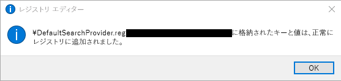

# 既定の検索エンジンの設定Set default search engine

既定のブラウザー、検索エンジン、ホームページを構成すると、ユーザーが Microsoft Search 機能を把握したり、使用を促進したり、円滑なエクスペリエンスを提供したりするのに役立ちます。Configuring the default browser, default search engine, and default homepage will help your users discover Microsoft Search capabilities, encourage more usage, and provide a smoother experience.
  
組織の既定の検索エンジンを設定するには、以下の手順を実行します。To set the default search engine for your organization, follow the steps below.
  
## Internet ExplorerInternet Explorer

### Internet Explorer 11Internet Explorer 11

ユーザーは、このポリシーを設定後に検索プロバイダーを変更できます。Users will be able to change the search provider after this policy is set.
  
#### 1. GPO を設定するのに使用するローカル マシンを構成します1. Configure the local machine that will be used to set the GPO

以下のテキストを reg(\*.reg) ファイルに貼り付けます。Paste the following text into a reg(\*.reg) file.
  
Windows レジストリ エディター バージョン 5.00Windows Registry Editor Version 5.00
  
<pre>[HKEY_CURRENT_USER\Software\Microsoft\Internet Explorer\SearchScopes]
"DefaultScope"="{D54CD0C8-C007-4BC4-B2DD-1E4896B8406D}"
[HKEY_CURRENT_USER\Software\Microsoft\Internet Explorer\SearchScopes\{D54CD0C8-C007-4BC4-B2DD-1E4896B8406D}]
"Codepage"=dword:0000fde9
"DisplayName"="Microsoft Search in Bing"
"OSDFileURL"="https://www.bing.com/sa/osd/bfb.xml"
"FaviconURL"="https://www.bing.com/sa/simg/bb.ico"
"SuggestionsURL_JSON"="https://business.ing.com/api/v2/browser/suggest?q={searchTerms}&amp;form=BFBSPA"
"ShowSearchSuggestions"=dword:00000001
"URL"="https://www.bing.com/business/search?q={searchTerms}&amp;form=BFBSPR"</pre>
  
作成されたファイルをダブルクリックし、そのファイルをインポートするための手順を実行します。インポートが成功すると、以下のダイアログが表示されます。Double-click the file created and follow the steps to import the file. A successful import should result in the following dialog:
  

  
#### 2. グループ ポリシー管理コンソール (gpmc.msc) を開き、既存のポリシーの編集または新しいポリシーの作成を行います2. Open the Group Policy Management Console (gpmc.msc) and switch to editing an existing policy or creating a new one

1. **[ユーザーの構成]、[ポリシー]、[基本設定]、[Windows の設定]** と移動します。Navigate to **User Configuration\Policies\Preferences\Windows Settings**.
    
2. **[レジストリ]\[新規]** で右クリックし、**[レジストリ ウィザード]** を選択します。[レジストリ ブラウザー] ウィンドウで、**[ローカル コンピューター]** を選択し、**[次へ]** をクリックします。Right-click on **Registry\New** and select **Registry Wizard**. From the Registry Browser window, select **Local Computer** and click **Next**.
    
3. **HKEY_CURRENT_USER\SOFTWARE\Microsoft\Internet Explorer\SearchScopes** と移動します。Navigate to **HKEY_CURRENT_USER\SOFTWARE\Microsoft\Internet Explorer\SearchScopes**.
    
4. このキーで、[DefaultScope] が選択されていることを確認します。From this key, make sure to select DefaultScope.
    
    ![[DefaultScope] が選択されている [レジストリ ブラウザー]](media/ec5a450d-0cba-4e9c-acba-1a09e8e90bad.png)
  
5. Bing における Microsoft Search の GUID が含まれるすべてのサブキーと、対象キーのすべての値 (ユーザー プロファイルのパス以外) を選択状態にします。下方向にスクロールして、他の項目を選択します。Check all sub keys containing the GUID for Microsoft Search in Bing and every value under the key except any path to user profiles. Scroll down to select other items.
    
    ![他の値が選択されている [レジストリ ブラウザー]](media/7eef7690-8bc5-46cf-9cd8-bd134fc77a02.png)
  
6. [終了] をクリックして、この構成を完了します。Click Finish to complete this configuration.
    
#### 3. User Preferences を設定して、DefaultScope 検索が実行される場合にユーザーが取得する可能性がある警告をなくします3. Set up User Preferences to help eliminate a warning the user may get when DefaultScope search is enforced

この警告は仕様で、プログラムの設定変更が行われようとしていることをユーザーに通知します。This warning is by design and alerts users of a program trying to modify their settings.
  
1. 同じ GPO で **[レジストリ]\[新規]** を右クリックし、**[レジストリ ウィザード]** を選択します。Within the same GPO, right click on **Registry\New** and select **Registry Wizard**.
    
2. **HKEY_CURRENT_USER\SOFTWARE\Microsoft\Internet Explorer\User Preferences** と移動します。Navigate to **HKEY_CURRENT_USER\SOFTWARE\Microsoft\Internet Explorer\User Preferences**.
    
3. **User Preference** キーを選択します。Select the **User Preference** key.
    
4. [**完了**] をクリックします。Click **Finish**.
    
5. 新しく作成されたオブジェクトをクリックします。右側のウィンドウで User Preferences オブジェクトをダブルクリックし、**[アクション]** を **[削除および保存]** に変更します。Click on the newly created object. On the right-side pane double click on the User Preferences object, change the **Action** to **Delete and Save**.
    
作成された GPO を適切なドメインにリンクさせて適用します。Enforce the resultant GPO by linking it to the appropriate domain.
  
## Microsoft EdgeMicrosoft Edge

### Windows 10 バージョン 1703 以降Windows 10, Version 1703 or later

ユーザーは、このポリシーを設定後に検索プロバイダーを変更できます。Users will be able to change the search provider after this policy is set.
  
各種バージョンの Windows の最新 ADMX ファイルについては、「[Windows でグループ ポリシー管理テンプレート用に中央ストアを作成および管理する方法](https://support.microsoft.com/ja-JP/help/3087759/how-to-create-and-manage-the-central-store-for-group-policy-administra)」を参照してください。For the latest ADMX files for various versions of Windows, see [How to create and manage the Central Store for Group Policy Administrative Templates in Windows](https://support.microsoft.com/ja-JP/help/3087759/how-to-create-and-manage-the-central-store-for-group-policy-administra).
  
このセクションに記述されている設定が GPMC 内に見つからない場合、適切な ADMX をダウンロードし、中央ストアにコピーします。詳しくは、「[ADMX ファイルを使用してドメイン ベースの GPO を編集する](https://docs.microsoft.com/ja-JP/previous-versions/windows/it-pro/windows-vista/cc748955%28v%3dws.10%29)」をご覧ください。コントローラーの中央ストアは 1 つのフォルダーで、以下の名前付け規則を使用します。If the setting described in this section cannot be found inside of GPMC, download the appropriate ADMX and copy them to the central store. For more information, see [Editing Domain-Based GPOs Using ADMX Files](https://docs.microsoft.com/ja-JP/previous-versions/windows/it-pro/windows-vista/cc748955%28v%3dws.10%29). Central store on the controller is a folder with the following naming convention:
  
 **%systemroot%\sysvol\\<domain\>\policies\PolicyDefinitions****%systemroot%\sysvol\\<domain\>\policies\PolicyDefinitions**
  
コントローラーが処理するドメインごとに異なるフォルダーが必要です。以下のコマンドを使用すると、コマンド プロンプトから ADMX ファイルをコピーできます。Each domain that your controller handles should get a separate folder. The following command can be used to copy the ADMX file from the command prompt:
  
 `Copy <path_to_ADMX.ADMX> %systemroot%\sysvol\<domain>\policies\PolicyDefinitions`
  
1. グループ ポリシー管理コンソール (gpmc.msc) を開き、既存のポリシーの編集または新しいポリシーの作成を行います。Open the Group Policy Management Console (gpmc.msc) and switch to editing an existing policy or creating a new one.
    
2. **&lt;[コンピューター/ユーザーの構成]&gt;、[管理用テンプレート]、[Windows コンポーネント]、[Microsoft Edge]** と移動します。Navigate to **&lt;Computer/User Configuration&gt;\Administrative Templates\Windows Components\Microsoft Edge**.
    
1. **[既定の検索エンジンの設定]** をダブルクリックし、**[有効]** に設定して `https://www.bing.com/sa/osd/bfb.xml` と入力しますDouble-click **Set default search engine**, set to **Enabled**, and enter `https://www.bing.com/sa/osd/bfb.xml`
    
3. 作成された GPO を適切なドメインにリンクさせて適用します。Enforce the resultant GPO by linking it to the appropriate domain.
    
## Google ChromeGoogle Chrome

### Windows XP SP2 以降Windows XP SP2 or later

ユーザーは、このポリシーを設定後に検索プロバイダーを変更することはできません。Users won't be able to change the search provider after this policy is set.
  
Chrome には独自の一連のグループ ポリシー設定が備わっていて、[Google Chrome Enterprise ヘルプ](https://support.google.com/chrome/a/answer/187202)から ADMX ファイル形式でダウンロードできます。Windows Vista/Server 2008 以降のオペレーティング システムを使用してドメインの GPO を管理している場合、このパッケージで提供される ADMX ファイルは Windows XP SP2 以降の Chrome 設定に対して有効です。Chrome comes with its own set of group policy settings which can be downloaded in the form of an ADMX file from [Google Chrome Enterprise Help](https://support.google.com/chrome/a/answer/187202). If operating systems Windows Vista/Server 2008 or later are used to manage GPO's for the domain, the ADMX file provided in this package takes care of Chrome settings on Windows XP SP2 or later.
  
テンプレート ファイルを、ドメイン コントローラー上の ADMX ファイルの中央ストアにコピーします。詳しくは、「[ADMX ファイルを使用してドメイン ベースの GPO を編集する](https://docs.microsoft.com/ja-JP/previous-versions/windows/it-pro/windows-vista/cc748955%28v%3dws.10%29)」をご覧ください。コントローラーの中央ストアは 1 つのフォルダーで、以下の名前付け規則を使用します。Copy the template file to a central store for ADMX files on the domain controller. For more information, see [Editing Domain-Based GPOs Using ADMX Files](https://docs.microsoft.com/ja-JP/previous-versions/windows/it-pro/windows-vista/cc748955%28v%3dws.10%29). Central store on the controller is a folder with the following naming convention:
  
 **%systemroot%\sysvol\\<domain\>\policies\PolicyDefinitions****%systemroot%\sysvol\\<domain\>\policies\PolicyDefinitions**
  
コントローラーが処理するドメインごとに異なるフォルダーが必要です。以下のコマンドを使用すると、コマンド プロンプトから ADMX ファイルをコピーできます。Each domain that your controller handles should get a separate folder. The following command can be used to copy the ADMX file from the command prompt:
  
 `Copy <path_to_Chrome.ADMX> %systemroot%\sysvol\<domain>\policies\PolicyDefinitions`
  
1. グループ ポリシー管理コンソール (gpmc.msc) を開き、既存のポリシーの編集または新しいポリシーの作成を行います。Open the Group Policy Management Console (gpmc.msc) and switch to editing any existing policy or creating a new one.
    
2. [ユーザーの構成]/[コンピューターの構成] の両方の [管理用テンプレート] セクションに [Google Chrome] フォルダーと [Google Chrome - 既定の設定] フォルダーが表示されていることを確認します。Make sure the following folders appear in the Administrative Templates section of both User/Computer Configuration: Google Chrome and Google Chrome - Default Settings.
    
  - 最初のセクションの設定は固定されているため、ローカル管理者はブラウザーで設定を変更することはできません。The settings of the first section are fixed and local administrators won't be able to change them in the browser.
    
  - ポリシーの後半のセクションの設定は、ブラウザー設定でユーザーが変更できます。The settings of the latter section of policies can be changed by users in the browser settings.
    
3. [**\<コンピューター/ユーザー\> の構成]、[管理用テンプレート]、[Google Chrome]、[既定の検索プロバイダー (Default search provider)]** と移動しますNavigate to **\<Computer/User\> Configuration\Administrative Templates\Google Chrome\Default search provider**
    
4. **[既定の検索プロバイダーを有効にする (Enable the default search provider)]** をダブルクリックし、**[有効]** に設定します。Double-click **Enable the default search provider**, and set it to **Enabled**.
    
5. **[既定の検索プロバイダー (Default search provider)] アイコン**をダブルクリックし、**[有効]** に設定して、`https://www.bing.com/sa/simg/bb.ico` と入力しますDouble-click **Default search provider icon**, set it to **Enabled**, and enter `https://www.bing.com/sa/simg/bb.ico`
    
6. **[既定の検索プロバイザー インスタンス URL (Default search provider instant URL)]** をダブルクリックし、`https://www.bing.com/business/search?q={searchTerms}&amp;form=BFBSPR` と入力しますDouble-click **Default search provider instant URL**, and enter `https://www.bing.com/business/search?q={searchTerms}&amp;form=BFBSPR`
    
7. **[既定の検索プロバイダー名 (Default search provider name)]** をダブルクリックし、[有効] に設定して、「Microsoft Search in Bing」と入力しますDouble-click **Default search provider name**, set it to Enabled, and enter 'Microsoft Search in Bing'
    
8. **[既定の検索プロバイダー検索 URL (Default search provider search URL)]** をダブルクリックし、**[有効]** に設定して、`https://www.bing.com/business/search?q={searchTerms}&amp;form=BFBSPR` と入力しますDouble-click **Default search provider search URL**, set it to **Enabled**, and enter `https://www.bing.com/business/search?q={searchTerms}&amp;form=BFBSPR`
    
9. **[既定の検索プロバイダー サジェスト URL (Default search provider suggest URL)]** をダブルクリックし、**[有効]** に設定して、`https://business.bing.com/api/v2/browser/suggest?q={searchTerms}&amp;form=BFBSPA` と入力しますDouble-click **Default search provider suggest URL**, set it to **Enabled**, and enter `https://business.bing.com/api/v2/browser/suggest?q={searchTerms}&amp;form=BFBSPA`
    
10. 作成された GPO を適切なドメインにリンクさせて適用します。Enforce the resultant GPO by linking it to the appropriate domain.
    
既定の検索エンジンを設定すると、ブラウザーのアドレス バーに Microsoft Search 検索サジェスト機能が追加されます。現在、この機能がサポートしているのはブックマークのみです。アドレス バーに入力すると、パブリックの Web サジェストの上に 2 つのブックマーク サジェストが表示されます。Setting the default search engine will add the Microsoft Search search suggestions feature in the browser address bar. Currently, this supports bookmarks only. Users will see the top two bookmark suggestions above public web suggestions as they type in the address bar.