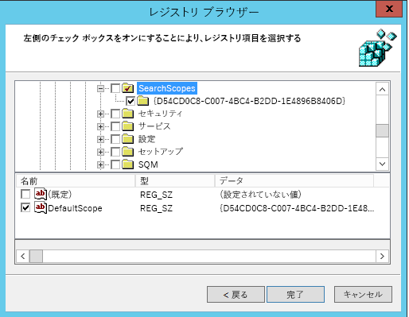

# 既定の検索エンジンの設定Set default search engine

既定のブラウザー、既定の検索エンジン、および既定のホーム ページを構成するがように、Microsoft 検索機能、複数の使用法をお勧めを見つけてより滑らかなエクスペリエンスを提供します。Configuring the default browser, default search engine, and default homepage will help your users discover Microsoft Search capabilities, encourage more usage, and provide a smoother experience.
  
組織の既定の検索エンジンを設定するのには以下の手順を実行します。To set the default search engine for your organization, follow the steps below.
  
## Internet ExplorerInternet Explorer

### Internet Explorer 11Internet Explorer 11

ユーザーはこのポリシーを設定した後検索プロバイダーを変更することになります。Users will be able to change the search provider after this policy is set.
  
#### 1. GPO の設定を使用するローカル コンピューターを構成します。1. Configure the local machine that will be used to set the GPO

レジストリに次のテキストを貼り付ける (\*.reg) ファイルです。Paste the following text into a reg(\*.reg) file.
  
Windows Registry Editor Version 5.00Windows Registry Editor Version 5.00
  
<pre>[HKEY_CURRENT_USER\Software\Microsoft\Internet Explorer\SearchScopes]
"DefaultScope"="{D54CD0C8-C007-4BC4-B2DD-1E4896B8406D}"
[HKEY_CURRENT_USER\Software\Microsoft\Internet Explorer\SearchScopes\{D54CD0C8-C007-4BC4-B2DD-1E4896B8406D}]
"Codepage"=dword:0000fde9
"DisplayName"="Microsoft Search in Bing"
"OSDFileURL"="https://www.bing.com/sa/osd/bfb.xml"
"FaviconURL"="https://www.bing.com/sa/simg/bb.ico"
"SuggestionsURL_JSON"="https://business.ing.com/api/v2/browser/suggest?q={searchTerms}&amp;form=BFBSPA"
"ShowSearchSuggestions"=dword:00000001
"URL"="https://www.bing.com/business/search?q={searchTerms}&amp;form=BFBSPR"</pre>
  
作成されたファイルをダブルクリックし、ファイルをインポートする手順を実行します。次のダイアログ ボックスでインポートを成功させるが得られます。Double-click the file created and follow the steps to import the file. A successful import should result in the following dialog:
  

  
#### 2. グループ ポリシー管理コンソール (gpmc.msc) を開くし、既存のポリシーを編集または新規に作成するのに切り替える2. Open the Group Policy Management Console (gpmc.msc) and switch to editing an existing policy or creating a new one

1. **ユーザー Configuration\Policies\Preferences\Windows の設定**に移動します。Navigate to **User Configuration\Policies\Preferences\Windows Settings**.
    
2. **Registry\New**を右クリックし、[**レジストリ ウィザード**] を選択します。レジストリのブラウザーのウィンドウからは、**ローカル コンピューター**を選択し、[**次へ**] をクリックします。Right-click on **Registry\New** and select **Registry Wizard**. From the Registry Browser window, select **Local Computer** and click **Next**.
    
3. **します Explorer\SearchScopes**に移動します。Navigate to **HKEY_CURRENT_USER\SOFTWARE\Microsoft\Internet Explorer\SearchScopes**.
    
4. このキーから、DefaultScope を選択してください。From this key, make sure to select DefaultScope.
    
    
  
5. Bing とすべての値を除くすべてのパスをユーザー プロファイルのキーの下で、Microsoft Search の GUID を含むすべてのサブキーを確認します。その他の項目を選択するのには下にスクロールします。Check all sub keys containing the GUID for Microsoft Search in Bing and every value under the key except any path to user profiles. Scroll down to select other items.
    
    
  
6. この構成を完了するには、[完了] をクリックします。Click Finish to complete this configuration.
    
#### 3. DefaultScope 検索が適用されるユーザーを得る可能性があります警告を解決するユーザーの基本設定を設定します。3. Set up User Preferences to help eliminate a warning the user may get when DefaultScope search is enforced

この警告は仕様であり、プログラムの設定を変更しようとしてのユーザーに警告します。This warning is by design and alerts users of a program trying to modify their settings.
  
1. 同じ GPO 内では、 **Registry\New**を右クリックし、**レジストリ ウィザード**] を選択します。Within the same GPO, right click on **Registry\New** and select **Registry Wizard**.
    
2. **します Explorer\User の環境設定**に移動します。Navigate to **HKEY_CURRENT_USER\SOFTWARE\Microsoft\Internet Explorer\User Preferences**.
    
3. **ユーザー設定**キーを選択します。Select the **User Preference** key.
    
4. [ **完了**] をクリックします。Click **Finish**.
    
5. 新しく作成されたオブジェクトをクリックします。右側のペインで、ユーザー設定オブジェクトをダブルクリックします。**を削除**し、保存**操作**を変更します。Click on the newly created object. On the right-side pane double click on the User Preferences object, change the **Action** to **Delete and Save**.
    
適切なドメインにリンクすることによって、結果の GPO を適用します。Enforce the resultant GPO by linking it to the appropriate domain.
  
## Microsoft EdgeMicrosoft Edge

### Windows 10、1703 またはそれ以降のバージョンWindows 10, Version 1703 or later

ユーザーはこのポリシーを設定した後検索プロバイダーを変更することになります。Users will be able to change the search provider after this policy is set.
  
さまざまなバージョンの Windows 用の最新の ADMX ファイルを[作成し、Windows のグループ ポリシーの管理用テンプレートの中央のストアを管理する方法](https://support.microsoft.com/en-us/help/3087759/how-to-create-and-manage-the-central-store-for-group-policy-administra)を参照してください。For the latest ADMX files for various versions of Windows, see [How to create and manage the Central Store for Group Policy Administrative Templates in Windows](https://support.microsoft.com/en-us/help/3087759/how-to-create-and-manage-the-central-store-for-group-policy-administra).
  
GPMC 内でこのセクションで説明されている設定が見つからない場合は、適切な ADMX をダウンロードして、中央ストアにコピーします。詳細については、 [ADMX ファイルを使用して Gpo](https://docs.microsoft.com/en-us/previous-versions/windows/it-pro/windows-vista/cc748955%28v%3dws.10%29)を参照してください。コント ローラー上の中央のストアは、次の命名規則を含むフォルダーです。If the setting described in this section cannot be found inside of GPMC, download the appropriate ADMX and copy them to the central store. For more information, see [Editing Domain-Based GPOs Using ADMX Files](https://docs.microsoft.com/en-us/previous-versions/windows/it-pro/windows-vista/cc748955%28v%3dws.10%29). Central store on the controller is a folder with the following naming convention:
  
 **%systemroot%\sysvol\\<domain\>\policies\PolicyDefinitions****%systemroot%\sysvol\\<domain\>\policies\PolicyDefinitions**
  
各ドメイン コント ローラーを処理する別のフォルダーが表示されます。コマンド ・ プロンプトから ADMX ファイルをコピーするのには、次のコマンドを使用できます。Each domain that your controller handles should get a separate folder. The following command can be used to copy the ADMX file from the command prompt:
  
 `Copy <path_to_ADMX.ADMX> %systemroot%\sysvol\<domain>\policies\PolicyDefinitions`
  
1. グループ ポリシー管理コンソール (gpmc.msc) を開き、既存のポリシーを編集または新規に作成するのに切り替えます。Open the Group Policy Management Console (gpmc.msc) and switch to editing an existing policy or creating a new one.
    
2. 移動**&lt;コンピューターとユーザーの構成&gt;\Administrative Templates\Windows Components\Microsoft エッジ**。Navigate to **&lt;Computer/User Configuration&gt;\Administrative Templates\Windows Components\Microsoft Edge**.
    
1. **既定の検索エンジンの設定**をダブルクリックして、 **[有効**] に設定を入力してください。`https://www.bing.com/sa/osd/bfb.xml`Double-click **Set default search engine**, set to **Enabled**, and enter `https://www.bing.com/sa/osd/bfb.xml`
    
3. 適切なドメインにリンクすることによって、結果の GPO を適用します。Enforce the resultant GPO by linking it to the appropriate domain.
    
## Google ChromeGoogle Chrome

### Windows XP SP2 またはそれ以降Windows XP SP2 or later

ユーザーはこのポリシーを設定した後検索プロバイダーを変更することはできません。Users won't be able to change the search provider after this policy is set.
  
クロムは、 [Google Chrome のエンタープライズのヘルプ](https://support.google.com/chrome/a/answer/187202)から ADMX ファイルの形式でダウンロードできるグループ ポリシー設定の独自のセットが付属しています。オペレーティング システム Windows Vista の場合/2008 またはそれ以降のサーバーがドメインの GPO を管理するために使用されると、クロムの設定で Windows XP SP2 またはそれ以降の処理、ADMX ファイルがこのパッケージで提供されています。Chrome comes with its own set of group policy settings which can be downloaded in the form of an ADMX file from [Google Chrome Enterprise Help](https://support.google.com/chrome/a/answer/187202). If operating systems Windows Vista/Server 2008 or later are used to manage GPO's for the domain, the ADMX file provided in this package takes care of Chrome settings on Windows XP SP2 or later.
  
テンプレート ファイルをドメイン コント ローラーの ADMX ファイルの中央ストアにコピーします。詳細については、 [ADMX ファイルを使用して Gpo](https://docs.microsoft.com/en-us/previous-versions/windows/it-pro/windows-vista/cc748955%28v%3dws.10%29)を参照してください。コント ローラー上の中央のストアは、次の命名規則を含むフォルダーです。Copy the template file to a central store for ADMX files on the domain controller. For more information, see [Editing Domain-Based GPOs Using ADMX Files](https://docs.microsoft.com/en-us/previous-versions/windows/it-pro/windows-vista/cc748955%28v%3dws.10%29). Central store on the controller is a folder with the following naming convention:
  
 **%systemroot%\sysvol\\<domain\>\policies\PolicyDefinitions****%systemroot%\sysvol\\<domain\>\policies\PolicyDefinitions**
  
各ドメイン コント ローラーを処理する別のフォルダーが表示されます。コマンド ・ プロンプトから ADMX ファイルをコピーするのには、次のコマンドを使用できます。Each domain that your controller handles should get a separate folder. The following command can be used to copy the ADMX file from the command prompt:
  
 `Copy <path_to_Chrome.ADMX> %systemroot%\sysvol\<domain>\policies\PolicyDefinitions`
  
1. グループ ポリシー管理コンソール (gpmc.msc) を開き、任意の既存のポリシーを編集または新規に作成するのに切り替えます。Open the Group Policy Management Console (gpmc.msc) and switch to editing any existing policy or creating a new one.
    
2. 両方のユーザーまたはコンピューターの構成の管理用テンプレート] セクションで次のフォルダーが表示されるかどうかを確認: Google Chrome と Google Chrome を既定の設定です。Make sure the following folders appear in the Administrative Templates section of both User/Computer Configuration: Google Chrome and Google Chrome - Default Settings.
    
  - 最初のセクションの設定が固定されており、ローカルの管理者は、ブラウザーでは変更できません。The settings of the first section are fixed and local administrators won't be able to change them in the browser.
    
  - 後者のポリシーのセクションの設定は、ブラウザーの設定でユーザーが変更できます。The settings of the latter section of policies can be changed by users in the browser settings.
    
3. **に移動\<コンピューター/ユーザー\> Templates\Google Chrome\Default の構成管理用テンプレートの検索プロバイダー**Navigate to **\<Computer/User\> Configuration\Administrative Templates\Google Chrome\Default search provider**
    
4. 、**既定の検索プロバイダーを有効にする**] をダブルクリックし、それが**有効**に設定します。Double-click **Enable the default search provider**, and set it to **Enabled**.
    
5. **既定の検索プロバイダーのアイコン**をダブルクリックして、 **[有効**] に設定し、入力`https://www.bing.com/sa/simg/bb.ico`Double-click **Default search provider icon**, set it to **Enabled**, and enter `https://www.bing.com/sa/simg/bb.ico`
    
6. **インスタントの検索プロバイダーの URL を既定値**をダブルクリックし、入力`https://www.bing.com/business/search?q={searchTerms}&amp;form=BFBSPR`Double-click **Default search provider instant URL**, and enter `https://www.bing.com/business/search?q={searchTerms}&amp;form=BFBSPR`
    
7. **既定の検索プロバイダーの名前**をダブルクリックして、それが有効に設定および 'Microsoft は Bing の検索' を入力してください。Double-click **Default search provider name**, set it to Enabled, and enter 'Microsoft Search in Bing'
    
8. **既定の検索プロバイダーの検索の URL**をダブルクリックして、 **[有効**] に設定を入力してください。`https://www.bing.com/business/search?q={searchTerms}&amp;form=BFBSPR`Double-click **Default search provider search URL**, set it to **Enabled**, and enter `https://www.bing.com/business/search?q={searchTerms}&amp;form=BFBSPR`
    
9. **既定の検索プロバイダーの URL を提案する**をダブルクリックし、 **[有効**] に設定し、入力`https://business.bing.com/api/v2/browser/suggest?q={searchTerms}&amp;form=BFBSPA`Double-click **Default search provider suggest URL**, set it to **Enabled**, and enter `https://business.bing.com/api/v2/browser/suggest?q={searchTerms}&amp;form=BFBSPA`
    
10. 適切なドメインにリンクすることによって、結果の GPO を適用します。Enforce the resultant GPO by linking it to the appropriate domain.
    
既定の検索エンジンを設定すると、ブラウザーのアドレス バーに Microsoft Search の検索候補機能が追加されます。現在、これだけのブックマークをサポートします。アドレス バーに入力するときは、パブリック web 提案上トップの 2 つのブックマーク候補が表示されます。Setting the default search engine will add the Microsoft Search search suggestions feature in the browser address bar. Currently, this supports bookmarks only. Users will see the top two bookmark suggestions above public web suggestions as they type in the address bar.