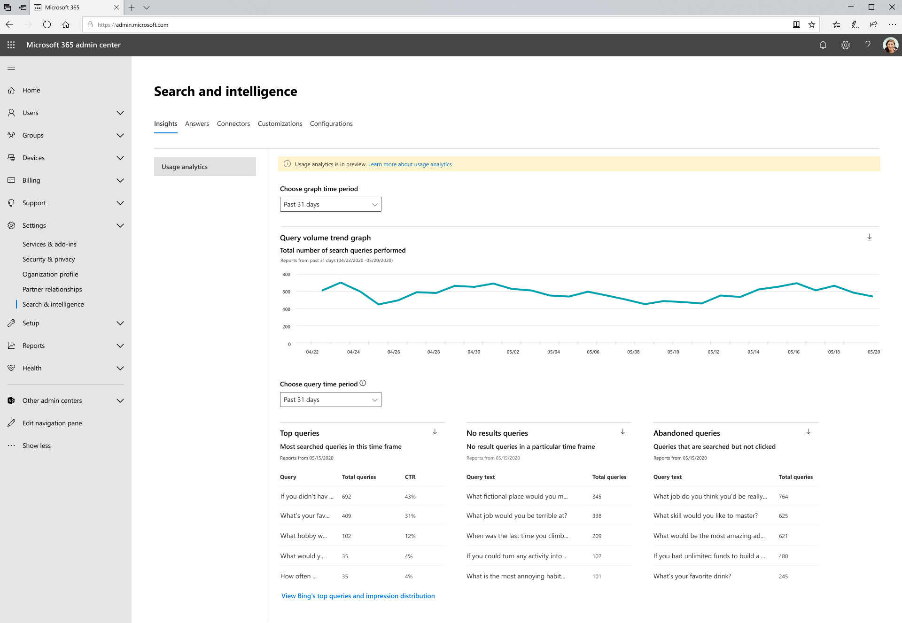

# Microsoft Search利用状況レポートMicrosoft Search Usage Reports

検索利用状況レポートを使用すると、組織内での検索の機能を理解できます。Search usage reports enable you to gain more understanding of how search is functioning in your organization. これらのレポートから生成された分析情報は、コンテンツを簡単に見つけてアクションを実行し、ユーザーにとって検索をより便利で楽しいエクスペリエンスにするのに役立ちます。The insights generated from these reports will help you [make content easy to find](./make-content-easy-to-find.md) and take actions that will make search a more useful and delightful experience for your users.

> [!IMPORTANT]
> Microsoft Searchレポートは現在プレビュー中ですMicrosoft Search usage reports are currently in preview

Microsoft Search[使用状況](https://admin.microsoft.com/Adminportal/Home?#/MicrosoftSearch/insights)レポートには、SharePoint Home、Office.com、および Bing 検索ボックスで Microsoft Search から実行される検索から生成されたグラフとテーブルが含まれます。The [Microsoft Search usage reports](https://admin.microsoft.com/Adminportal/Home?#/MicrosoftSearch/insights) include graphs and tables generated from searches that are executed from SharePoint Home, Office.com, and Microsoft Search in Bing search boxes. 過去 31 日、1 日、または前の年の月次のデータを確認できます。You can see data from the past 31 days, per day, or monthly for the previous year. これらのレポートは展開されているだけなので、履歴データの発生に時間がかかっています。These reports are just rolling out so it will take time to accrue the historical data.

このページの以前のバージョンには、Microsoft Search.com のBing検索Bing含まれていました。A previous version of this page included data from searches executed only for Microsoft Search in Bing on Bing.com. このデータは、これらのレポートに統合されました。ページの下部にあるリンクをクリックして、ページのトップ クエリとインプレッション配布Bingを表示 **できます。**That data is now integrated into these reports; you can still see the old page by clicking the link at the bottom of the page to **View Bing's top queries and impression distribution**. このリンクと古いページは近日削除されます。This link and the old page will be removed soon.

> [!div class="mx-imgBorder"]
> 

## 検索レポートの概要Overview of search reports

| レポートReport | 説明Description |
|:-----|:-----|
|クエリ ボリュームQuery Volume|このレポートには、実行された検索クエリの数が表示されます。This report shows the number of search queries performed. このレポートを使用して、検索クエリのボリュームの傾向を特定し、検索アクティビティの高い期間と低い期間を決定します。Use this report to identify search query volume trends and to determine periods of high and low search activity.|
|よく使用されるクエリTop Queries|このレポートには、最も人気の高い検索クエリが表示されます。This report shows the most popular search queries. クエリは、結果をクリックして少なくとも 3 回検索すると、このレポートに追加されます。A query is added to this report when it is searched at least three times with a click on a result. このレポートを使用して、ユーザーが検索している情報の種類を把握します。Use this report to understand what types of information your users are searching for.|
|破棄されたクエリAbandoned Queries|このレポートには、低クリックスルーを受け取る一般的な検索クエリが表示されます。This report shows popular search queries that receive low click-through. このレポートを使用して、ユーザー満足度の低い可能性のある検索クエリを特定し、コンテンツの検出可能性を改善します。Use this report to identify search queries that might create user dissatisfaction and to improve the discoverability of content. その後、ブックマークのような回答を作成するか、新しいコンテンツを新しいコネクタを介して取り込Graphが正しいアクションかどうかを判断できます。You can then determine if creating an answer, like a Bookmark, or ingesting new content through a Graph connector is the right action.|
|結果クエリなしNo Results Queries|このレポートには、結果を返さなかった人気の高い検索クエリが表示されます。This report shows popular search queries that returned no results. このレポートを使用して、ユーザー満足度の低い可能性のある検索クエリを特定し、コンテンツの検出可能性を改善します。Use this report to identify search queries that might create user dissatisfaction and to improve the discoverability of content. その後、ブックマークのような回答を作成するか、新しいコンテンツを新しいコネクタを介して取り込Graphが正しいアクションかどうかを判断できます。You can then determine if creating an answer, like a Bookmark, or ingesting new content through a Graph connector is the right action.|

>[!NOTE]
>現在、ブックマークのような回答で満たされたクエリが放棄されたクエリとしてカウントされる既知の問題があります。There is currently a known issue where queries satisfied by an answer like a Bookmark are counted as an abandoned query.

## レポートの表示Viewing reports

[利用状況レポート] ページに移動すると、すべてのレポートを表示できます。When you navigate to the usage reports page, all the reports are available to view. 日付フィルターを使用して、表示する特定の日または月を選択できます。You can use the date filter to pick a specific day or month to view.

レポートをダウンロードすると、より広範な時間からレポートを表示できます。Downloading a report will allow you to see reports from a broader range of time. ダウンロード矢印をクリックして、 **過去 31** 日または過去 **12 か月を選択します**。Click on the download arrow and select **past 31 days** or **past 12 months**. レポートは、スプレッドシートとしてExcelされます。The report downloads as an Excel spreadsheet. 過去 31 日間を選択した場合、スプレッドシートには各日の個別のタブがあります。If you selected past 31 days, the spreadsheet will have an individual tab for each day. 過去 12 か月のダウンロードには、各月のタブがあります。The past 12 months download will have a tab for each month.

ユーザーのBingとインプレッション配布レポートを表示するには、ページのリンクをクリックします。To view Bing’s top queries and impression distribution reports click on the link on the page.

## よく寄せられる質問Frequently asked questions

**過去 31 日間または過去 12 か月を選択した場合、特定の日または特定の月を選択する必要がある理由。****When I select past 31 days or past 12 months, why do I then have to choose a specific day or specific month.**

今日の Microsoft 検索利用状況レポートの予定表ビューは、2 段階のプロセスです。The calendar view, today, in Microsoft search usage reports is a two-step process. 最初にドロップダウン (過去 31 日または過去 12 か月) から日付範囲を選択し、開始日または月を選択します。First select the date range from the dropdown (past 31 days or past 12 months) and then select the start day or month.

上位、破棄、および失敗したクエリ テーブルには、選択した日または月の結果が表示されます。The top, abandoned, and failed query tables show results from either the day or the month you choose.

**過去 7 日間、過去 30 日間の集計データが表示される場合などです。Bingのトップ クエリ レポートのように?****When will I see aggregate data for past 7 days, past 30 days, and so on...like Bing’s top queries reports?**

この種類の集約を検討し、将来のバージョンのこれらのレポートのデータ範囲フィルター処理を簡略化しています。We are considering this type of aggregation and simplifying the data range filtering for future versions of these reports.

**異なるアプリ (ソース) による利用状況レポートの内訳が表示できない理由****Why can’t I see a breakdown of usage reports by different apps (sources)?**

現在、ソースによるフィルター処理は使用できません。Currently, filtering by source is not available. レポートは、ホーム と SharePoint.com からのOfficeを組み合わせます。The reports combine searches from SharePoint Home and Office.com. 次のリリースでは、ソース フィルターが含まれるので、各アプリケーションに固有の指標を確認できます。Our next release will include source filtering so you can see metrics specific to each application.

**利用状況レポートのその他のフィルター処理が予定されていますか?****What other filtering for usage reports is coming?**

組織のより詳細なレベルで検索の使用状況を知るのに役立つ追加のフィルターに取り組み中です。We are working on additional filters that will help make sense of search usage at a more granular level of your organization. たとえば、特定の地域または部署のクエリ ボリュームを表示できます。For example, you will be able to see query volume for a specific geography or department.
